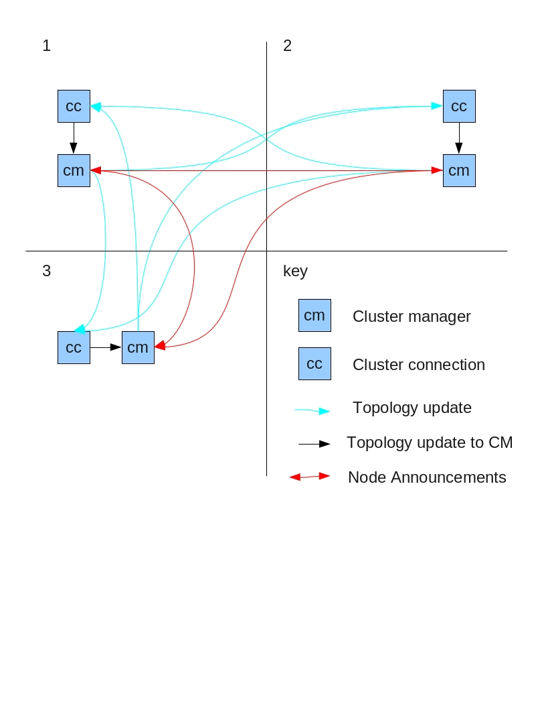

Getting Started
===============

This chapter discusses the architecture behind clustering

Discovery
=========

Discovery is done in 2 steps, initial discovery where the server locates
another node in the cluster and topology discovery where the node finds
out about all other nodes in the cluster

Initial Discovery
-----------------

blah blah blah, UDP, static connectors etc etc

Topology Discovery
------------------

blah blah blah, topology etc

