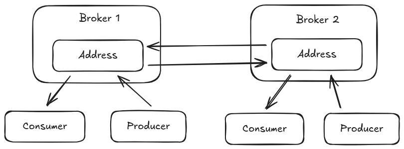
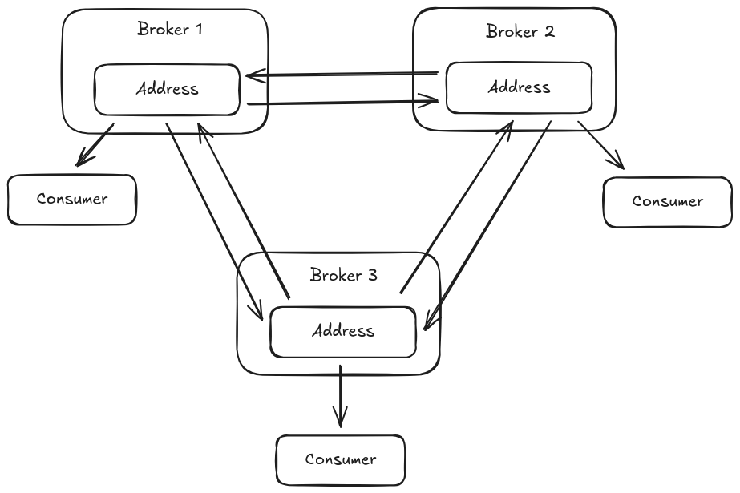
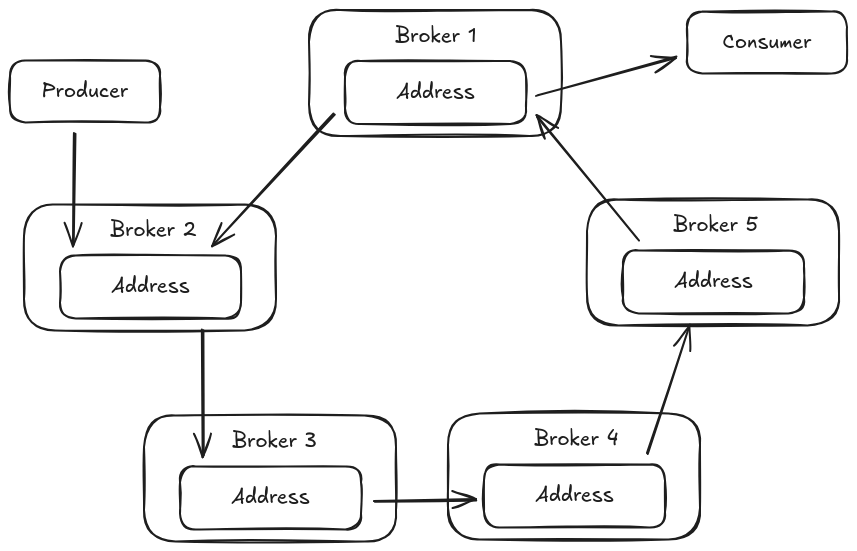
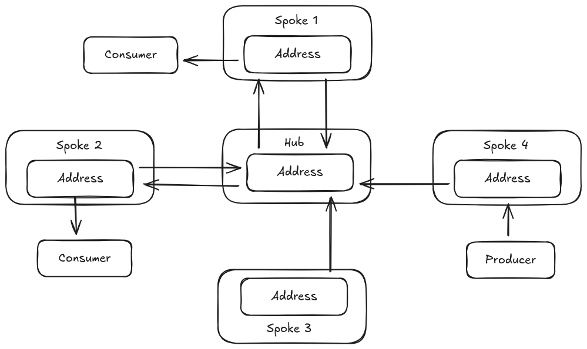

= Address Federation
:idprefix:
:idseparator: -
:docinfo: shared

Address federation can be thought of as full multicast over the connected brokers.
Every message sent to address on `Broker-1` will be delivered to every queue bound to that address on that broker, but also will be delivered to the matching address on `Broker-2`, `Broker-3` ... `Broker-N` and all the queues bound to that address.

Address federation creates consumers that read messages from the matching address on the remote peer when demand is detected on a local address that matches a specific federation address policy. On the remote peer a queue binding is created on the federated address which will store and forward messages sent to that address back to the initiating broker. Once a message arrives at the federation address consumer on the initiating broker it is then published into the local address which routes the message into each of the queues bound to that address.

Address federation can be configured to operate in a single direction between peers or can configured to operate in both directions between peers allowing message to flow in both directions delivering messages to consumers on either broker that were sent to the matching address on the opposing broker instance.

image::images/amqp-federation-address-concept.png[]

== Common Address Federation topologies

The sections that follow discuss some common address federation topologies and some configuration considerations specific to those topologies.

=== Two way Address Federation

This is a common case where consumers on either broker should receive messages sent from producers both on the local broker and on the remote broker. Messages only cross the federation connection if a consumer exists on the remote address otherwise messages do not leave the local broker.

This configuration can be setup by adding a federation policy on both broker instances that configure the address to federate and a connection URI pointing to the opposing broker.

[,xml]
----
<broker-connections>
  <amqp-connection uri="tcp://HOST:PORT" name="federation-example">
    <federation>
       <local-address-policy name="example-local-address-policy">
         <include address-match="a.federated-address.#" />
       </local-address-policy>
    </federation>
  </amqp-connection>
</broker-connections>
----

It is also possible to configure this on only one of the two brokers using a remote address federation policy in the broker connection configuration.

[,xml]
----
<broker-connections>
  <amqp-connection uri="tcp://HOST:PORT" name="federation-example">
    <federation>
       <local-address-policy name="example-local-address-policy">
         <include address-match="a.federated-address.#" />
       </local-address-policy>
       <remote-address-policy name="example-remote-address-policy">
         <include address-match="a.federated-address.#" />
       </remote-address-policy>
    </federation>
  </amqp-connection>
</broker-connections>
----

In either of these two configurations the federation implementation will protect itself from looping messages so unlike other implementations you do not need to configure a `max-hops` setting.

=== Three Broker Mesh

An expansion of the previous configuration is a three broker mesh where each broker creates an address federation for the same address on each of the other two brokers when local demand is present. In this scenario any message published on an address on one of the brokers will be sent to consumers on that address that are active on the other two brokers.

Because this configuration now creates a loop with more than two brokers the configuration must add a `max-hops` value to ensure that the messages sent to one of the brokers does not propagate beyond the two closest neighbors in the loop otherwise the messages would loop forever amongst the three brokers.

[,xml]
----
<broker-connections>
  <amqp-connection uri="tcp://HOST-1:PORT" name="federation-example-to-1">
    <federation>
       <local-address-policy name="example-local-address-policy-1" max-hops="1">
         <include address-match="a.federated-address.#" />
       </local-address-policy>
    </federation>
  </amqp-connection>
  <amqp-connection uri="tcp://HOST-2:PORT" name="federation-example-to-2">
    <federation>
       <local-address-policy name="example-local-address-policy-2" max-hops="1">
         <include address-match="a.federated-address.#" />
       </local-address-policy>
    </federation>
  </amqp-connection>
</broker-connections>
----

By configuring each of the brokers with a `max-hops` value as above the message will be stopped from moving beyond the neighboring broker that receives it and no message looping occurs.

=== Address Federation Ring

Another less common configuration is a good demonstration of a case where using the `max-hops` settings is critical for preventing an infinite loop of message federation. This is also known as a ring and involves creating an address federation configuration that connects to a neighboring broker amongst three or more broker instances. In this scenario the configuration must set a `max-hops` value of N-1 where N is the number of brokers in the ring.

To achieve this configuration each broker would need to add a broker connection for its neighbor as follows. Note the `max-hops=4` in this case since there are five brokers in the diagram, this ensures a federated message never cross back through the originating broker and thus cannot create an message loop.

[,xml]
----
<broker-connections>
  <amqp-connection uri="tcp://HOST-1:PORT" name="federation-example-to-1">
    <federation>
       <local-address-policy name="example-local-address-policy-1" max-hops="4">
         <include address-match="a.federated-address.#" />
       </local-address-policy>
    </federation>
  </amqp-connection>
  </amqp-connection>
</broker-connections>
----

=== Hub and Spoke Address Federation

Another configuration that allows consumers on brokers to read messages produced on any other broker peer is a hub and spoke configuration. In this configuration spoke brokers connect to a central hub and message traffic between the spokes passes through that hub broker which centralizes communication and allows the spokes to only need to know about one other broker, the hub broker.

This is configured on the spoke brokers much the same as dual address federation where a local and remote policy is configured both sides to listen for demand on the given address and federate messages when demand is detected. This setup allows the hub to now sense demand and federate from the spoke as needed and since each spoke mirrors this configuration the message can travel in either direction based on which spoke a consumer has subscribed to the federated address and which spoke a producer sends to the address. There is no need to configure a `max-hops` value in this configuration since the federation implementation prevents a loop in this case in the same manner it does for dual federation configurations.

[,xml]
----
<broker-connections>
  <amqp-connection uri="tcp://HUB-HOST:PORT" name="federation-example">
    <federation>
       <local-address-policy name="example-local-address-policy">
         <include address-match="a.federated-address.#" />
       </local-address-policy>
       <remote-address-policy name="example-remote-address-policy">
         <include address-match="a.federated-address.#" />
       </remote-address-policy>
    </federation>
  </amqp-connection>
</broker-connections>
----

While this is not the only configuration that can create this setup it does represent a simple and flexible configuration where spoke can be added without making configuration changes on the hub.
