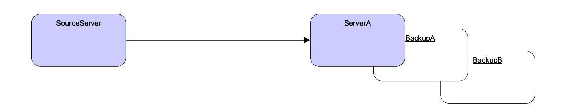
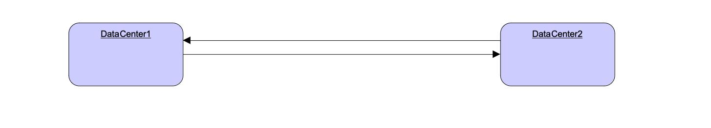
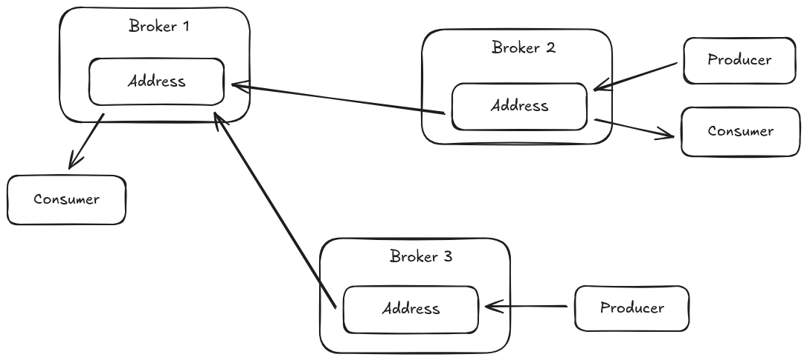

= Broker Connections
:idprefix:
:idseparator: -
:docinfo: shared

Instead of waiting for clients to connect, a broker can also initiate a connection to another server.

Broker connections are configured by the `<broker-connections>` XML element in the `broker.xml` configuration file.

[,xml]
----
<broker-connections>
  ...
</broker-connections>
----

== AMQP Server Connections

The broker can initiate connections using the AMQP protocol.
This means that the broker can connect to another AMQP server (not necessarily {project-name-short}) and create elements on that connection.

To define an AMQP broker connection, add an `<amqp-connection>` element within the `<broker-connections>` element in the `broker.xml` configuration file.
For example:

[,xml]
----
<broker-connections>
  <amqp-connection uri="tcp://HOST:PORT" name="other-server" retry-interval="100" reconnect-attempts="-1" user="john" password="doe">
    ...
  </amqp-connection>
</broker-connections>
----

uri::
tcp://host:myport[?options] (this is a required argument)
name::
Name of the connection used for management purposes
user::
Username with which to connect to the endpoint (this is an optional argument)
password::
Password with which to connect to the endpoint (this is an optional argument)
retry-interval::
Time, in milliseconds to wait before retrying a connection after an error.
The default value is `5000`.
reconnect-attempts::
default is -1 meaning infinite
auto-start::
Should the broker connection start automatically with the broker. Default is `true`.
If `false` it is necessary to call a management operation to start it.

NOTE: The connection URI options for transport settings, such as enabling and configuring TLS, are common with other broker connector URIs.
See xref:configuring-transports.adoc#configuring-netty-ssl[the transport doc] for more.
An example configuration for a TLS AMQP broker-connection can be found in the broker xref:examples.adoc[examples] at _./examples/features/broker-connection/amqp-sending-overssl_.

NOTE: If auto-start is disabled on the broker connection, the start of the broker connection will only happen after the management method `startBrokerConnection(connectionName)` is called on the ServerController.

IMPORTANT: The target endpoint needs permission for all operations that are configured.
Therefore, if a security manager is being used, ensure that you perform the configured operations with a user with sufficient permissions.

== AMQP Server Connection Operations

The following types of operations are supported on an AMQP server connection:

* Mirrors
** The broker uses an AMQP connection to another broker and duplicates messages and sends acknowledgements over the wire.
* Federation
** Broker federation allows the local broker to create remote receivers for addresses or queues that have local demand.
Conversely it can also send federation configuration to the remote broker causing it to create receivers on the local broker based on remote demand on an address or queue over this same connection.
* Bridges
** The broker uses a set of configured policies to either send messages to or receive messages from a remote AMQP peer for addresses and queues on the local broker.
* Senders
** Messages received on specific queues are transferred to another endpoint.
* Receivers
** The broker pulls messages from another endpoint.

* Peers
** The broker creates both senders and receivers on another endpoint that knows how to handle them.
This is currently implemented by Apache Qpid Dispatch.

== Reconnecting and Failover

It is possible to determine how reconnection will happen on a broker connection.

These are the attributes that are available on the amqp-connection XML element:

reconnect-attempts:: default is -1 (infinite).
How many attempts will be done after a failed connection
retry-interval:: default is 5000, in milliseconds, the wait between each retry of a connection

It is also possible to specify alternate hosts on a broker connection by appending a comma separated list after a `#` at the end of the URI.
The broker connection would keep trying on the alternate list until one of the targets is available to connect.

For example, a backup broker can be specified like this:

[,xml]
----
<broker-connections>
  <amqp-connection uri="tcp://ServerA:5672#tcp://BackupA:5672" name="MyBrokerConnection" reconnect-attempts="-1" retry-interval="5000">
    ...
  </amqp-connection>
</broker-connections>
----

To specify more than 2 elements use a comma separated list after the first pair, e.g.:

[,xml]
----
<broker-connections>
  <amqp-connection uri="tcp://ServerA:5672#tcp://BackupA:5672,tcp://BackupB:5672" name="MyBrokerConnection" reconnect-attempts="-1" retry-interval="5000">
    ...
  </amqp-connection>
</broker-connections>
----
.Broker Connection - Reconnecting and Failover

The previous example portrays a case of connection failure towards ServerA.
The system would try to connect to ServerA, BackupA, and BackupB until it successfully connects to one of these nodes.

WARNING: For failover on mirrored brokers, all nodes in the list must be high-available (HA) failover nodes.
Specifying independents nodes in the mirror list can cause consistency issues between the message
sent to the mirror and the acknowledgements received on the mirror.

== Mirroring

Mirroring will reproduce any operation that happened on the source brokers towards a target broker.

The following events are sent through mirroring:

* Message sending
** Messages sent to one broker will be "replicated" to the target broker.
* Message acknowledgement
** Acknowledgements removing messages at one broker will be sent to the target broker.
** Note that if the message is pending for a consumer on the target mirror, the ack will not succeed and the message might be delivered by both brokers.
* Queue and address creation.
* Queue and address deletion.

By default, every operation is sent asynchronously without blocking any clients.
However, if you set `sync=true` on the mirror configuration the clients will always wait for the mirror on every blocking operation.

=== Mirror configuration

Add a `<mirror>` element within the `<amqp-connection>` element to configure mirroring to the target broker.

The following optional arguments can be utilized:

message-acknowledgements::
Specifies whether message acknowledgements are sent.
The default value is `true`.
queue-creation::
Specifies whether a queue- or address-creation event is sent.
The default value is `true`.
queue-removal::
Specifies whether a queue- or address-removal event is sent.
The default value is `true`.
address-filter::
An optional comma-separated list of inclusion and/or exclusion filter entries used to govern which addresses (and related queues) mirroring events will be created for on this broker-connection.
That is, events will only be mirrored to the target broker for addresses that match the filter.
An address is matched when it begins with an inclusion entry specified in this field, unless the address is also explicitly excluded by another entry.
+
An exclusion entry is prefixed with `!` to denote any address beginning with that value does not match.
If no inclusion entry is specified in the list, all addresses not explicitly excluded will match.
If the address-filter attribute is not specified, then all addresses (and related queues) will match and be mirrored.
+
Examples:

* `eu` matches all addresses starting with `eu`
* `!eu` matches all address except for those starting with `eu`
* `eu.uk,eu.de` matches all addresses starting with either `eu.uk` or `eu.de`
* `eu,!eu.uk` matches all addresses starting with `eu` but not those starting with `eu.uk`

+
[NOTE]
====
* Address exclusion will always take precedence over address inclusion.
* Address matching on mirror elements is prefix-based and does not support wild-card matching.
====
sync::
If set to `true` any client blocking operation will be held until the mirror has confirmed receiving the operation.
Default is `false`.
* Notice that a disconnected node would hold all operations from the client.
If you set `sync=true` you must reconnect a mirror before performing any operations.

An example of a mirror configuration is shown below:

[,xml]
----
<broker-connections>
  <amqp-connection uri="tcp://HOST:PORT" name="mirror">
    <mirror/>
  </amqp-connection>
</broker-connections>
----

=== Store and Forward Queue

Mirror events are always stored on a local queue prefixed as `$ACTIVEMQ_ARTEMIS_MIRROR_` and then concatenated with the broker connection's configured name.

So, in the following configuration, mirror events will be stored on a queue named `$ACTIVEMQ_ARTEMIS_MIRROR_brokerB`.

[,xml]
----
<broker-connection>
  <amqp-connection uri="tcp://brokerB:5672" name="brokerB">
    <mirror/>
  </amqp-connection>
</broker-connection>
----

These messages are then transferred to _brokerB:5672_.
A producer to the address `$ACTIVEMQ_ARTEMIS_MIRROR_brokerB` will be created towards _brokerB_.
If there is a security manager configured, security roles must be provided to the user on the broker connection.

Notice the queue `$ACTIVEMQ_ARTEMIS_MIRROR_brokerB` will not actually exist on _brokerB_ and so it will not be visible on the administration console.
The target broker will treat these messages accordingly as mirror events and perform the appropriate operations at the target broker.

=== Pre Existing Messages

The broker will only mirror messages arriving from the point in time the mirror was configured.
Previously existing messages will not be forwarded to other brokers.

== Dual Mirror (Disaster Recovery)

Automatic fallback mirroring is supported.
Every sent message and every acknowledgement is asynchronously replicated to the mirrored broker.

On the following diagram there will be two servers called _DataCenter1_, and _DataCenter2_.
In order to have a dual mirror configuration it is necessary to add the mirror broker connection on each `broker.xml`:

 Figure 2.
Broker Connection - Disaster Recovery.

On _DataCenter1_ the following code should be added on `broker.xml`:

[,xml]
----
<broker-connections>
   <amqp-connection uri="tcp://DataCenter2:5672" name="DC2">
      <mirror/>
   </amqp-connection>
</broker-connections>
----

The following xml snippet should be added on _DataCenter2_'s `broker.xml`:

[,xml]
----
<broker-connections>
   <amqp-connection uri="tcp://DataCenter1:5672" name="DC1">
      <mirror/>
   </amqp-connection>
</broker-connections>
----

The broker connections will replicate sends and acknowledgements to the other broker, no matter where they originated.
If messages are sent on DC1 (_DataCenter1_) these will be automatically transferred to DC2 (_DataCenter2_).
Message acknowledgements received on DC2 will be automatically related back to DC1.

The only exception to that rule would be if there were already consumers with pending messages on any server, where a mirrored acknowledgement will not prevent the message being consumed by both consumers.
[NOTE]
====
It is recommended to not have active consumers on both servers.
====

=== Example

There is an example as part of the broker xref:examples.adoc[examples] showing dual broker configuration (or disaster recovery) in `./examples/features/broker-connection/disaster-recovery`.

On the provided example above, two brokers are configured to mirror each other and whatever happens in one broker is immediately copied over to the other broker.

== Senders and Receivers

It is possible to connect a broker to another AMQP endpoint simply by creating a `sender` or `receiver` element.

For a `sender`, the broker creates a message consumer on a queue that sends messages to another AMQP endpoint.

For a `receiver`, the broker creates a message producer on an address that receives messages from another AMQP endpoint.

Both elements function as a message bridge.
However, there is no additional overhead required to process messages.
Senders and receivers behave just like any other consumer or producer.

Specific queues can be configured by senders or receivers.
Wildcard expressions can be used to match senders and receivers to specific addresses or _sets_ of addresses.
When configuring a sender or receiver, the following properties can be set:

address-match::
Match the sender or receiver to a specific address or *set* of addresses, using a wildcard expression.
queue-name::
Configure the sender or receiver for a specific queue.

=== Examples

Using address expressions:

[,xml]
----
<broker-connections>
  <amqp-connection uri="tcp://HOST:PORT" name="other-server">
    <sender address-match="queues.#"/>
    <!-- notice the local queues for remotequeues.# need to be created on this broker -->
    <receiver address-match="remotequeues.#"/>
  </amqp-connection>
</broker-connections>

<addresses>
  <address name="remotequeues.A">
    <anycast>
      <queue name="remoteQueueA"/>
    </anycast>
  </address>
  <address name="queues.B">
    <anycast>
      <queue name="localQueueB"/>
    </anycast>
  </address>
</addresses>
----

Using queue names:

[,xml]
----
<broker-connections>
  <amqp-connection uri="tcp://HOST:PORT" name="other-server">
    <receiver queue-name="remoteQueueA"/>
    <sender queue-name="localQueueB"/>
  </amqp-connection>
</broker-connections>

<addresses>
   <address name="remotequeues.A">
     <anycast>
       <queue name="remoteQueueA"/>
     </anycast>
   </address>
   <address name="queues.B">
     <anycast>
       <queue name="localQueueB"/>
     </anycast>
   </address>
</addresses>
----

IMPORTANT: Receivers can only be matched to a local queue that already exists.
Therefore, if receivers are being used, ensure that queues are pre-created locally.
Otherwise, the broker cannot match the remote queues and addresses.

IMPORTANT: Do not create a sender and a receiver to the same destination.
This creates an infinite loop of sends and receives.

== Peers

The broker can be configured as a peer which connects to the https://qpid.apache.org/components/dispatch-router/[Apache Qpid Dispatch Router] and instructs it that the broker will act as a store-and-forward queue for a given AMQP waypoint address configured on the router.
In this scenario, clients connect to a router to send and receive messages using a waypointed address, and the router routes these messages to or from the queue on the broker.

The `peer` configuration causes the broker to create a sender and receiver pair for each destination matched in the broker-connection configuration, with these carrying special configuration to let Qpid Dispatch know to collaborate with the broker.
This replaces the traditional need of a router-initiated connection and auto-links.

Qpid Dispatch Router offers a lot of advanced networking options that be used together with the broker.

With a peer configuration, the same properties are present as when there are senders and receivers.
For example, a configuration where queues with names beginning `queue.` act as storage for the matching router waypoint address would be:

[,xml]
----
<broker-connections>
  <amqp-connection uri="tcp://HOST:PORT" name="router">
    <peer address-match="queues.#"/>
  </amqp-connection>
</broker-connections>

<addresses>
   <address name="queues.A">
     <anycast>
       <queue name="queues.A"/>
     </anycast>
   </address>
   <address name="queues.B">
     <anycast>
       <queue name="queues.B"/>
     </anycast>
   </address>
</addresses>
----

There must be a matching address waypoint configuration on the router instructing it that the particular router addresses the broker attaches to should be treated as waypoints.
For example, a similar prefix- based router address configuration would be:

----
address {
    prefix: queue
    waypoint: yes
}
----

For more information refer to the "brokered messaging" documentation for https://qpid.apache.org/components/dispatch-router/[Apache Qpid Dispatch Router].

IMPORTANT: Do not use this feature to connect to another broker, otherwise any message sent will be immediately ready to consume creating an infinite echo of sends and receives.

IMPORTANT: It is not necessary to configure the router with a connector or auto-links to communicate with the broker.
The brokers peer configuration replaces these aspects of the router waypoint usage.

== Address Consideration

It is highly recommended that `address name` and `queue name` are the same.
When a queue with its distinct name (as in the following example) is used senders and receivers will always use the `address` `name` when creating the remote endpoint.

[,xml]
----
<broker-connections>
  <amqp-connection uri="tcp://HOST:PORT" name="other-server">
    <sender address-match="queues.#"/>
  </amqp-connection>
</broker-connections>
<addresses>
  <address name="queues.A">
    <anycast>
      <queue name="distinctNameQueue.A"/>
    </anycast>
  </address>
</addresses>
----

The above example would create an AMQP sender towards `queues.A`.

IMPORTANT: To avoid confusion it is recommended that `address` `name` and `queue` `name` are kept the same.

== Federation

Broker federation allows the local broker to create remote receivers for addresses or queues that have local demand.
Conversely, the broker connection can send connection scoped federation configuration to the remote broker causing it to create receivers on the local broker based on remote demand on an address or queue over this same connection.

Add a `<federation>` element within the `<amqp-connection>` element to configure federation to the broker instance.
The `<amqp-connection>` contains all the configuration for authentication and reconnection handling.
See above sections to configure those values.

The broker connection federation configuration consists of one or more policies that define either local or remote federation configurations for addresses or queues.

[,xml]
----
<broker-connections>
  <amqp-connection uri="tcp://HOST:PORT" name="federation-example">
    <federation>
       <local-address-policy name="example-local-address-policy">
         <include address-match="local-address.#" />
         <exclude address-match="local-address.excluded" />
       </local-address-policy>
       <local-queue-policy name="example-local-queue-policy">
         <include address-match="address" queue-match="local-queue" />
       </local-queue-policy>
       <remote-address-policy name="example-remote-address-policy">
         <include address-match="remote-address" />
       </remote-address-policy>
       <remote-queue-policy name="example-remote-queue-policy">
         <include address-match="#" queue-match="remote-queue" />
         <exclude address-match="excluded.#" queue-match="remote-queue-excluded" />
       </remote-queue-policy>
    </federation>
  </amqp-connection>
</broker-connections>
----

=== Address federation

Address federation can be thought of as full multicast over a set of loosely coupled brokers. Every message sent to address on `Broker-1` will be delivered to every queue bound to that address on that broker, but also will be delivered to the matching address on `Broker-2`, `Broker-3` ... `Broker-N` and all the queues bound to that address.

.Address Federation

For further details please see the xref:amqp-address-federation.adoc#address-federation[Address Federation] documentation.

=== Queue federation

Queue federation offers a means of load balancing message queues across multiple broker instances. Messages sent to a queue on `Broker-1` will be consumed and sent to the matching queue on `Broker-2` if there is no local consumer available to consume the message.

.Queue Federation
image::images/amqp-federation-queue-concept.png[]

For further details please see the xref:amqp-queue-federation.adoc#queue-federation[Queue Federation] documentation.

== Bridges

AMQP Bridges allows the local broker to create remote receivers for addresses or queues that have local demand and match configured policy constraints. Conversely the broker can create remote senders for addresses or queues that exist on the local broker and match configured policy constraints.

Add a `<bridge>` element within the `<amqp-connection>` element to configure AMQP bridge to the broker instance.
The `<amqp-connection>` contains all the configuration for authentication and reconnection handling.
See above sections to configure those values.

The broker connection bridge configuration consists of one or more policies that define either send-to or receive-from bridge configurations for addresses or queues.

[,xml]
----
<broker-connections>
  <amqp-connection uri="tcp://HOST:PORT" name="bridge-example">
    <bridge name="example-bridge">
       <bridge-from-address name="example-bridge-from-address-policy">
         <include address-match="local-address.#" />
         <exclude address-match="local-address.excluded" />
       </bridge-from-address>
       <bridge-from-queue name="example-bridge-from-queue-policy">
         <include address-match="address" queue-match="local-queue" />
       </bridge-from-queue>
       <bridge-to-address name="example-bridge-to-address-policy">
         <include address-match="outgoing-address" />
       </bridge-to-address>
       <bridge-to-queue name="example-bridge-to-queue-policy">
         <include address-match="#" queue-match="outbound-queue" />
         <exclude address-match="#" queue-match="local-queue-excluded" />
       </bridge-to-queue>
    </bridge>
  </amqp-connection>
</broker-connections>
----

=== Bridging from remote addresses and queues

Bridging from a remote address or queue involves monitoring a local address or queue for demand and reacting when demand is added or removed. When demand exists the bridge will create a receiver on the matching address or queue on the opposing AMQP peer. Because the receivers are created on addresses and queues on the opposing peer, the authentication credentials supplied to the broker connection must have sufficient access to the bridged address or queue on the remote peer in order to consume messages from them.

An example of AMQP address and queue bridge from configurations are shown below.

[,xml]
----
<broker-connections>
  <amqp-connection uri="tcp://HOST:PORT" name="bridge-example">
    <bridge name="example-bridge">
       <bridge-from-address name="example-bridge-from-address-policy" priority="-2">
         <include address-match="local-address.#" />
         <exclude address-match="local-address.excluded" />
       </bridge-from-address>
       <bridge-from-queue name="example-bridge-from-queue-policy">
         <include address-match="address" queue-match="local-queue" />
       </bridge-from-queue>
    </bridge>
  </amqp-connection>
</broker-connections>
----

The set of common policy attributes for bridge from address and queue policies:

name::
The name of the policy. These names should be unique within a broker connection's bridge policy elements.
priority::
A configured priority value which if set is applied remote receiver created by this bridge policy, this value is added to the receiver link properties and if supported will influence the priority assigned on the remote.
priority-adjustment::
When bridge receivers are created this value can be used to ensure that those bridge receivers have a lower priority value than other receivers on the same address or queue. The default is `-1`.
includeDivertBindings::
Should the bridge from address policy include divert bindings in the checks that control if a remote receiver is created to bridge from an address.
filter::
Optional filter string that is validated as a JMS selector string and is applied to the receiver that is bridging messages from and address or queue on the remote peer.
remoteAddress::
An optional override of address that is set as the address in the Source configuration of the AMQP receiver that is bridging messages from the remote peer. The default action is to assign either the address or queue name depending on whether the policy is bridging an address or queue.
remoteAddressPrefix::
An optional address prefix that is set on the address in the Source configuration of the AMQP receiver that is bridging messages from the remote peer. The default value is `null` and no prefix is applied to the source address.
remoteAddressSuffix::
An optional address suffix that is set on the address in the Source configuration of the AMQP receiver that is bridging messages from the remote peer. The default value is `null` and no suffix is applied to the source address.
remoteTerminusCapabilities::
Optional set of remote source capabilities that are set on the receiver when bridging an address or queue from the remote peer. The capabilities are configured as a comma delimited list whose default value is `null`.

Policy attributes that apply to AMQP bridge from address policies only:

enable-divert-bindings::
Instructs the receive from address policy to look at diverts that matching address would forward to and check for demand on those diverts when processing demand on the matched address. By default this option is `false` and diverts are not checked.
use-durable-subscriptions::
Instructs the receive from address policy that it should use an JMS over AMQP mapped durable subscription to create the remote receiver which is meant to result in a durable address subscription being created for receivers on addresses that have local demand. By adding a durable subscription the remote will accumulate messages when the broker connection if down and will recover stored messages if the remote server is shutdown and restarted. By default this option is set to `false` to avoid unwanted accumulation of remote messages and if enabled intervention may be needed from remote management to remove old subscriptions or clear space as needed.

Configuration policy elements of which more than one entry per policy is allowed:

include::
The address-match or queue-match pattern to use to match included addresses and queues. Multiple of these can be set but if none is set then no matches would be made.
exclude::
The address-match or queue-match pattern to use to match excluded addresses and queues. Multiple of these can be set, or it can be omitted if no excludes are needed.

=== Bridging to remote addresses and queues

Bridging to a remote address or queue involves monitoring for the existence of a local address or queue amd reacting when one is added or removed. When the target address or queue exists the bridge will create a sender on the matching address or queue on the opposing AMQP peer. Because the senders are created on addresses and queues on the opposing peer, the authentication credentials supplied to the broker connection must have sufficient access to the bridged address or queue on the remote peer in order to produce messages to them.

An example of AMQP address and queue bridge to configurations are shown below.

[,xml]
----
<broker-connections>
  <amqp-connection uri="tcp://HOST:PORT" name="bridge-example">
    <bridge name="example-bridge">
       <bridge-to-address name="example-bridge-to-address-policy">
         <include address-match="outgoing-address" />
       </bridge-to-address>
       <bridge-to-queue name="example-bridge-to-queue-policy" priority="1">
         <include address-match="#" queue-match="outbound-queue" />
         <exclude address-match="#" queue-match="local-queue-excluded" />
       </bridge-to-queue>
    </bridge>
  </amqp-connection>
</broker-connections>
----

The set of common policy attributes for bridge to address and queue policies:

name::
The name of the policy. These names should be unique within a broker connection's bridge policy elements.
priority::
A configured priority value which if set is applied local receiver created by this bridge policy, this value is added to the receiver link properties and if supported will influence the priority assigned on the local server.
priority-adjustment::
When bridge senders are created this value can be used to ensure that those bridge senders have a lower priority value than other senders on the same address or queue. The default is `-1`.
filter::
Optional filter string that is validated as a JMS selector string and is applied to the sender that is bridging messages to an address or queue on the remote peer.
remoteAddress::
An optional override of address that is set as the address in the Target configuration of the AMQP sender that is bridging messages to the remote peer. The default action is to assign either the address or queue name depending on whether the policy is bridging an address or queue.
remoteAddressPrefix::
An optional address prefix that is set on the address in the Target configuration of the AMQP sender that is bridging messages to the remote peer. The default value is `null` and no prefix is applied to the target address.
remoteAddressSuffix::
An optional address suffix that is set on the address in the Target configuration of the AMQP sender that is bridging messages to the remote peer. The default value is `null` and no suffix is applied to the target address.
remoteTerminusCapabilities::
Optional set of remote target capabilities that are set on the sender when bridging an address or queue to the remote peer. The capabilities are configured as a comma delimited list whose default value is `null`.

Policy attributes that apply to AMQP bridge to address policies only:

use-durable-subscriptions::
Instructs the send to address policy that bindings created on local addresses that match the configured policy includes should create a durable address binding which will be reloaded on server restart and will store messages that were sent to the address while the broker connection is down. The option is `false` by default and a volatile binding is created on the local address that is deleted whenever the broker connection is down so that messages are not retained.

Configuration policy elements of which more than one entry per policy is allowed:

include::
The address-match or queue-match pattern to use to match included addresses and queues. Multiple of these can be set but if none is set then no matches would be made.
exclude::
The address-match or queue-match pattern to use to match excluded addresses and queues. Multiple of these can be set, or it can be omitted if no excludes are needed.

=== Examples

A number of examples for using the federation functionality in a variety of situations can be found in the broker xref:examples.adoc[examples] under directory _./examples/features/broker-connection_.
