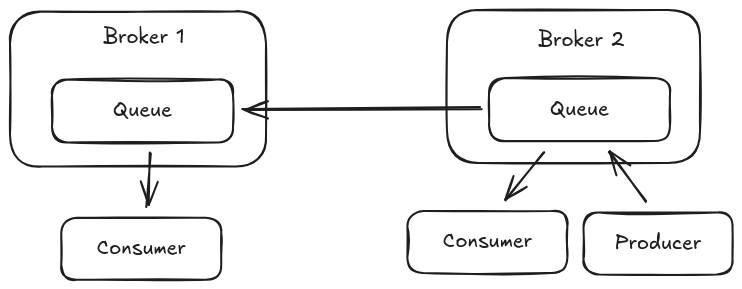
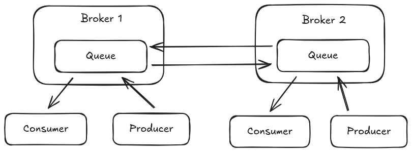
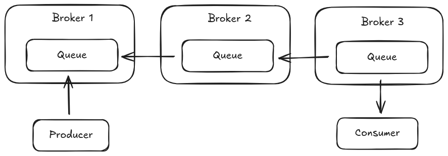

= Queue Federation
:idprefix:
:idseparator: -
:docinfo: shared

Queue federation offers a means of load balancing message queues across multiple broker instances. Messages sent to a queue on `Broker-1` can be consumed and sent to the matching queue on `Broker-2` via a federation consumer if there is no local consumer available to consume the message.

Queue federation creates consumers that consume messages from the matching queue on the remote peer when demand is detached on the local queue that matches a specific queue federation policy. The federation consumer acts as an addition consumer on the target remote queue competing with consumers on that remote queue for messages. Federation queue consumers can be configured to always have lower priority than the local queue consumers and also can be configured to only pull messages from the remote queue if there is capacity to handle those messages on the local broker.

image::images/amqp-federation-queue-concept.png[]

Queue federation can be configured operate in a single direction between peers or can configured to operate in both directions between peers allowing message to flow in both directions delivering messages to consumers on either broker that were sent to the matching queue on the opposing broker instance. When configured for dual federation messages can migrate back and forth between brokers depending on capacity and available local consumers, this back and forth message flow can be reduced by ensuring that the federation policy uses a pull when space is available configuration which will only pull a batch of messages from the remote if the local queue does not already have a backlog.

== Common Queue Federation Topologies

The sections that follow discuss some common queue federation topologies and some configuration considerations specific to those topologies.

=== Simple Queue Load Balance

The simplest configuration of Queue federation involves a two broker setup where `broker-1` creates a federation consumer to `broker-2` when demand is present on a federated queue. The messages sent by a producer on `broker-2` are shared between any local consumer and the federation consumer.

This configuration can be setup by adding a federation policy on `broker-1` that configure the queue to federate and a connection URI pointing to the opposing broker. Note that this configuration adds properties to configure the federation queue consumer to pull messages as opposed to the default which allows messages to flow regardless of local queue backlogs, this helps to prevent pulling messages from the remote broker unless the local broker has a shortage which helps to prevent starving consumers directly attached to the remote broker.

[,xml]
----
<broker-connections>
  <amqp-connection uri="tcp://HOST:PORT" name="federation-example">
    <federation>
       <local-queue-policy name="example-local-address-policy">
         <include address-match="#" queue-match="a.federated-queue" />
         <property key="amqpCredits" value="0" />
         <property key="amqpPullConsumerCredits" value="1" />
       </local-queue-policy>
    </federation>
  </amqp-connection>
</broker-connections>
----

While this configuration provides basic sharing of messages between brokers it can result in messages being stuck on `broker-1` if the consumer goes down as messages cannot flow back to `broker-2` to be be read by a consumer there which is why the next topology is often deployed.

=== Bi-directional Queue Federation

In a bi-directional queue federation configuration both brokers are configured to federate a given queue between them allowing messages to flow in either direction.  This configuration allows message that have been federated to one broker to flow back to the other if local demand is removed which can prevent stuck messages.

This configuration can be setup by adding a broker connection element to each of the broker instances with the same local queue federation policy or could be defined on only one broker using both a local and remote queue federation policy as shown below.

[,xml]
----
<broker-connections>
  <amqp-connection uri="tcp://HOST:PORT" name="federation-example">
    <federation>
       <local-queue-policy name="example-local-queue-policy">
         <include address-match="#" queue-match="a.federated-queue" />
       </local-queue-policy>
       <remote-queue-policy name="example-remote-queue-policy">
         <include address-match="#" queue-match="a.federated-queue" />
       </remote-queue-policy>
       <property key="amqpCredits" value="0" />
       <property key="amqpPullConsumerCredits" value="10" />
    </federation>
  </amqp-connection>
</broker-connections>
----

This configuration would result in only a single connection between the two brokers. Each policy will be configured by the shared properties of the federation element to use a pull consumer that batches ten messages at a time whenever the target queue has no pending messages already waiting to be read.

=== Queue Federation with Intermediary Brokers

In some use cases a federated queue may need to cross through an intermediary broker before reaching a consumer. For example consider a three broker chain where messages produced on `broker-1` must pass through `broker-2` before reaching a consumer on `broker-3`.

To accomplish this the federation queue policy for the intermediary broker must have additional configuration to allow for federation of messages when no local demand is present but a federation consumer is. Normally federation queue policies do no consider a federation queue binding on a local queue as demand to avoid creating loops. To disable that behavior the policy supports the attribute `include-federated` which defaults to `false`. The XML configuration for `broker-2` is below that employs this option.

[,xml]
----
<broker-connections>
  <amqp-connection uri="tcp://HOST:PORT" name="federation-example">
    <federation>
      <local-queue-policy name="example-local-queue-policy" include-federated="true">
         <include queue-match="a.federated-queue" />
      </local-queue-policy>
    </federation>
  </amqp-connection>
</broker-connections>
----

The configuration on `broker-3` looks essentially the same as that on `broker-2` however the `include-federated` attribute can be omitted.

[,xml]
----
<broker-connections>
  <amqp-connection uri="tcp://HOST:PORT" name="federation-example">
    <federation>
      <local-queue-policy name="example-local-queue-policy">
         <include queue-match="a.federated-queue" />
      </local-queue-policy>
    </federation>
  </amqp-connection>
</broker-connections>
----

With this configuration in place messages produced on `broker-1` will be federated to `broker-2` and then on to `broker-3` whenever a consumer is attached to `broker-3`. It should be noted however that in a configuration such as this that messages can be left on `broker-2` if they were arriving there at the same time that the consumer on `broker-3` had gone away and the federation link between `broker-3` and `broker-2` was gearing down.