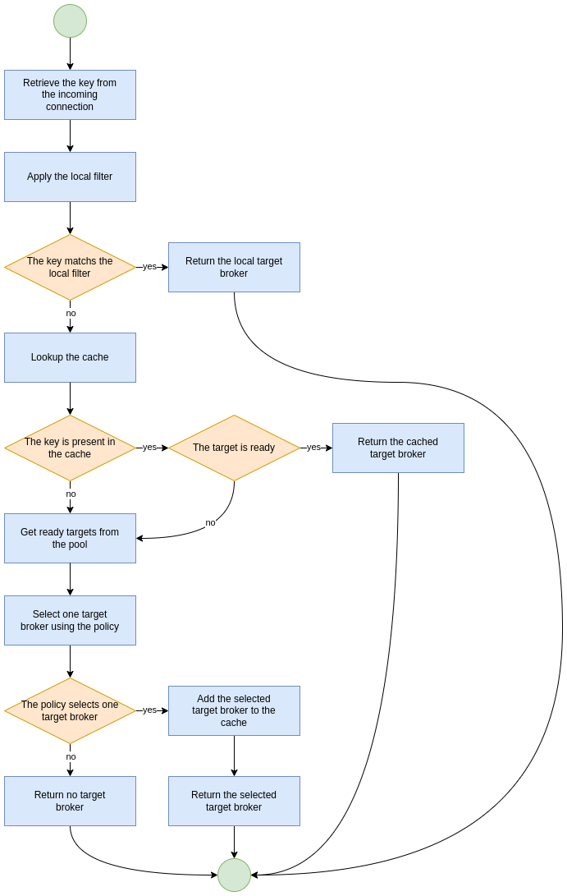
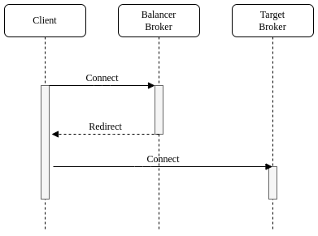

= Connection Routers
:idprefix:
:idseparator: -
:docinfo: shared

Connection routers allow incoming client connections to be distributed across multiple <<target-broker,target brokers>>.
The target brokers are grouped in <<pools,pools>>, and the connection routers use a <<keys,key>> to select a target broker from a pool of brokers according to a <<policies,policy>>.

== Target Broker

Target broker is a broker that can accept incoming client connections and is local or remote.
The local target is a special target that represents the same broker hosting the connection router.
The remote target is another reachable broker.

== Keys

The connection router uses a key to select a target broker.
It is a string retrieved from an incoming client connection, the supported key types are:

CLIENT_ID::
 is the JMS client ID.
SNI_HOST::
 is the hostname indicated by the client in the SNI extension of the TLS protocol.
SOURCE_IP::
 is the source IP address of the client.
USER_NAME::
 is the username indicated by the client.
ROLE_NAME::
 is a role associated with the authenticated user of the connection.

== Pools

The pool is a group of target brokers with periodic checks on their state.
It provides a list of ready target brokers to distribute incoming client connections only when it is active.
A pool becomes active when the minimum number of target brokers, as defined by the `quorum-size` parameter, become ready.
When it is not active, it doesn't provide any target avoiding weird distribution at startup or after a restart.
Including the local broker in the target pool allows broker hosting the router to accept incoming client connections as well.
By default, a pool doesn't include the local broker, to include it as a target the `local-target-enabled` parameter must be `true`.
There are three pool types: <<cluster-pool,cluster pool>>, <<discovery-pool,discovery pool>> and <<static-pool,static pool>>.

=== Cluster Pool

The cluster pool uses a xref:clusters.adoc#configuring-cluster-connections[cluster connection] to get the target brokers to add.
Let's take a look at a cluster pool example from broker.xml that uses a cluster connection:

[,xml]
----
<pool>
  <cluster-connection>cluster1</cluster-connection>
</pool>
----

=== Discovery Pool

The discovery pool uses a xref:clusters.adoc#discovery-groups[discovery group] to discover the target brokers to add.
Let's take a look at a discovery pool example from broker.xml that uses a discovery group:

[,xml]
----
<pool>
    <discovery-group-ref discovery-group-name="dg1"/>
</pool>
----

=== Static Pool

The static pool uses a list of static connectors to define the target brokers to add.
Let's take a look at a static pool example from broker.xml that uses a list of static connectors:

[,xml]
----
<pool>
    <static-connectors>
        <connector-ref>connector1</connector-ref>
        <connector-ref>connector2</connector-ref>
        <connector-ref>connector3</connector-ref>
    </static-connectors>
</pool>
----

=== Defining pools

A pool is defined by the `pool` element that includes the following items:

* the `username` element defines the username to connect to the target broker;
* the `password` element defines the password to connect to the target broker;
* the `check-period` element defines how often to check the target broker, measured in milliseconds, default is `5000`;
* the `quorum-size` element defines the minimum number of ready targets to activate the pool, default is `1`;
* the `quorum-timeout` element defines the timeout to get the minimum number of ready targets, measured in milliseconds, default is `3000`;
* the `local-target-enabled` element defines whether the pool has to include a local target, default is `false`;
* the `cluster-connection` element defines the xref:clusters.adoc#configuring-cluster-connections[cluster connection] used by the <<cluster-pool,cluster pool>>.
* the `static-connectors` element defines a list of static connectors used by the <<static-pool,static pool>>;
* the `discovery-group` element defines the xref:clusters.adoc#discovery-groups[discovery group] used by the <<discovery-pool,discovery pool>>.

Let's take a look at a pool example from broker.xml:

[,xml]
----
<pool>
    <quorum-size>2</quorum-size>
    <check-period>1000</check-period>
    <local-target-enabled>true</local-target-enabled>
    <static-connectors>
        <connector-ref>connector1</connector-ref>
        <connector-ref>connector2</connector-ref>
        <connector-ref>connector3</connector-ref>
    </static-connectors>
</pool>
----

== Policies

The policy defines how to select a broker from a pool and allows <<key-values,key values>> transformation.
The included policies are:

FIRST_ELEMENT::
 to select the first target broker from the pool which is ready.
It is useful to select the ready target brokers according to the priority defined with their sequence order, ie supposing there are 2 target brokers this policy selects the second target broker only when the first target broker isn't ready.
ROUND_ROBIN::
 to select a target sequentially from a pool, this policy is useful to evenly distribute;
CONSISTENT_HASH::
 to select a target by a key.
This policy always selects the same target broker for the same key until it is removed from the pool.
LEAST_CONNECTIONS::
 to select the targets with the fewest active connections.
This policy helps you maintain an equal distribution of active connections with the target brokers.
CONSISTENT_HASH_MODULO` to transform a key value to a number from 0 to N-1, it takes a single `modulo::
 property to configure the bound N.
One use case is `CLIENT_ID` sharding across a cluster of N brokers.
With a consistent hash % N transformation, each client id can map exclusively to just one of the brokers.

A policy is defined by the `policy` element.
Let's take a look at a policy example from broker.xml:

[,xml]
----
<policy name="FIRST_ELEMENT"/>
----

== Cache

The connection router provides a cache with a timeout to improve the stickiness of the target broker selected, returning the same target broker for a key value as long as it is present in the cache and is ready.
So a connection router with the cache enabled doesn't strictly follow the configured policy.
By default, the cache is not enabled.

A cache is defined by the `cache` element that includes the following items:

* the `persisted` element defines whether the cache has to persist entries, default is `false`;
* the `timeout` element defines the timeout before removing entries, measured in milliseconds, setting 0 will disable the timeout, default is `0`.

Let's take a look at a cache example from broker.xml:

[,xml]
----
<cache>
  <persisted>true</persisted>
  <timeout>60000</timeout>
</cache>
----

== Defining connection routers

A connection router is defined by the `connection-router` element, it includes the following items:

* the `name` attribute defines the name of the connection router and is used to reference the router from an acceptor;
* the `key-type` element defines what type of key to select a target broker, the supported values are: `CLIENT_ID`, `SNI_HOST`, `SOURCE_IP`, `USER_NAME`, `ROLE_NAME`, default is `SOURCE_IP`, see <<keys,Keys>> for further details;
* the `key-filter` element defines a regular expression to filter the resolved <<key-values,key values>>;
* the `local-target-filter` element defines a regular expression to match the <<key-values,key values>> that have to return a local target, the <<key-values,key value>> could be equal to the special string `NULL` if the value of the key is undefined or it doesn't match the `key-filter`;
* the `pool` element defines the pool to group the target brokers, see <<pools,pools>>;
* the `policy` element defines the policy used to select the target brokers from the pool, see <<policies,policies>>.

Let's take a look at some connection router examples from broker.xml:

[,xml]
----
<connection-routers>
    <connection-router name="local-partition">
         <key-type>CLIENT_ID</key-type>
         <key-filter>^.{3}</key-filter>
         <local-target-filter>^FOO.*</local-target-filter>
    </connection-router>
    <connection-router name="simple-router">
        <policy name="FIRST_ELEMENT"/>
        <pool>
            <static-connectors>
                <connector-ref>connector1</connector-ref>
                <connector-ref>connector2</connector-ref>
                <connector-ref>connector3</connector-ref>
            </static-connectors>
        </pool>
    </connection-router>
    <connection-router name="consistent-hash-router">
        <key-type>USER_NAME</key-type>
        <local-target-filter>admin</local-target-filter>
        <policy name="CONSISTENT_HASH"/>
        <pool>
            <local-target-enabled>true</local-target-enabled>
            <discovery-group-ref discovery-group-name="dg1"/>
        </pool>
    <policy name="CONSISTENT_HASH"/>
    </connection-router>
    <connection-router name="evenly-balance">
      <key-type>CLIENT_ID</key-type>
      <key-filter>^.{3}</key-filter>
      <policy name="LEAST_CONNECTIONS"/>
      <pool>
        <username>guest</username>
        <password>guest</password>
        <discovery-group-ref discovery-group-name="dg2"/>
      </pool>
    </connection-router>
</connection-routers>
----

== Key values

The key value is retrieved from the incoming client connection.
If the incoming client connection has no value for the key type used, the key value is set to the special string `NULL`.
If the incoming client connection has a value for the key type used, the key value retrieved can be sequentially manipulated using a `key-filter` and a `policy`.
If a `key-filter` is defined and the filter fails to match, the value is set to the special string `NULL`.
If a `policy` with a key transformation is defined, the key value is set to the transformed value.

== Connection Router Workflow

The connection router workflow include the following steps:

* Retrieve the <<key-values,key value>> from the incoming connection;
* Return the local target broker if the key value matches the local filter;
* Delegate to the <<pools,pool>>:
* Return the cached target broker if it is ready;
* Get ready/active target brokers from the pool;
* Select one target broker using the <<policies,policy>>;
* Add the selected broker in the <<cache,cache>>;
* Return the selected broker.

Let's take a look at flowchart of the connection router workflow: 

== Data gravity

The first router configuration: `local-partition`, demonstrates the simplest use case, that of preserving `data gravity` by confining a subset of application data to a given broker.
Each broker is given a subset of keys that it will exclusively service or reject.
If brokers are behind a round-robin load-balancer or have full knowledge of the broker urls, `their` broker will eventually respond.
The `local-target-filter` regular expression determines the granularity of partition that is best for preserving `data gravity` for your applications.

The challenge is in providing a consistent <<Keys,key>> in all related application connections.

NOTE: the concept of `data gravity` tries to capture the reality that while addresses are shared by multiple applications, it is best to keep related addresses and their data co-located on a single broker.
Typically, applications should `connect` to the data rather than the data moving to whatever broker the application connects too.
This is particularly true when the amount of data (backlog) is large, the cost of movement to follow consumers outweighs the cost of delivery to the application.
With the 'data gravity' mindset, operators are less concerned with numbers of connections and more concerned with applications and the addresses they need to interact with.

== Redirection

A protocol-native redirection is provided as well as a management API for other clients using a messaging protocol which doesn't support redirection.

=== Native Redirection

Native redirection is supported for applications using one of the following protocols:

* AMQP 1.0
* https://docs.oasis-open.org/mqtt/mqtt/v5.0/os/mqtt-v5.0-os.html#_Server_redirection[MQTT 5]
* Core
* OpenWire

Native redirection is configurable on a per-acceptor basis.
The acceptor with the `router` url parameter will redirect the incoming connections.
The `router` url parameter specifies the name of the connection router to use.
For example, the following acceptor will redirect incoming Core client connections using the connection router with the name `simple-router`:

[,xml]
----
<acceptor name="artemis">tcp://0.0.0.0:61616?router=simple-router;protocols=CORE</acceptor>
----

Here's how it works.
Applications using a protocol supporting native redirection connect to the acceptor with the router enabled.
The acceptor redirects the connection to the target broker and closes the connection.
The client then establishes a connection to the target broker.

=== Management API Redirection

Applications using a protocol not supporting native redirection can query the management API of connection router to get the target broker to redirect.
If the API returns a target broker the client connects to it otherwise the client can query the API again.

The relevant `ConnectionRouterControl` MBean is named like:

[,]
----
org.apache.activemq.artemis:broker="<brokerName>",component=connection-routers,name="<routerName>"
----

Therefore, if your broker was named `myBroker` and your `connection-router` was named `myRouter` then the MBean name would be:

[,]
----
org.apache.activemq.artemis:broker="myBroker",component=connection-routers,name="myRouter"
----

The API has two operations both of which take a single input parameter - <<key-values,key>>:

* `getTarget`: returns a `javax.management.openmbean.CompositeData` object
* `getTargetAsJSON`: returns a JSON string

Both return values contain the following data:

* `connector`: where to connect
* `nodeID`: the UUID of the broker
* `local`: whether the target is the local broker hosting the router

This API can be accessed over xref:management.adoc#exposing-jmx-using-jolokia[HTTP via Jolokia].