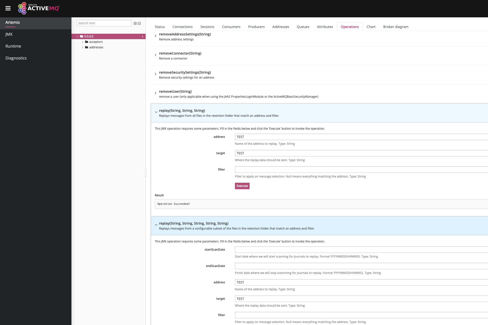

= Data Retention
:idprefix:
:idseparator: -

If you enable `journal-retention-directory` on broker.xml, ActiveMQ Artemis will keep copy of every data that has passed through the broker on this folder.

[,xml]
----
<configuration...>
   <core...>
      ...
      <journal-retention-directory unit="DAYS" period="365" storage-limit="10G">history</journal-retention-directory>
      ...
   </core>
</configuration>
----

ActiveMQ Artemis will keep a copy of each generated journal file, up to the configured retention period, at the unit chose.
On the example above the system would keep all the journal files up to 365 days.

It is also possible to limit the number of files kept on the retention directory.
You can keep a storage-limit, and the system will start removing older files when you have more files than the configured storage limit.

Notice the storage limit is optional however you need to be careful to not run out of disk space at the retention folder or the broker might be shutdown because of a critical IO failure.

You can use the CLI tools to inspect and recover data from the history, by just passing the journal folder being the retention directory.

Example:

[,shell]
----
./artemis data print --journal ../data/history
----

==== Paging and Large Messages
When retention is enabled, paging and large messages are also stored on the retention folder for replaying, so replay will also work for both paged and large messages.

==== Non Persistent Messages
Non persistent messages are never stored anywhere in the broker. If you intend to retain data your producers should be using Durable messages.

== Recovering data from retention

To recover data from the retention folder, you can use the method link:https://activemq.apache.org/components/artemis/documentation/javadocs/javadoc-latest/org/apache/activemq/artemis/api/core/management/ActiveMQServerControl.html#replay(java.lang.String,java.lang.String,java.lang.String,java.lang.String,java.lang.String)[replay] on the management console:

The broker will scan the set of files accordingly to the parameters you passed and it will send these methods to a target queue that you selected.

=== CLI recover operation

The CLI recover operation is intended as a low level operation, where data is read and recovered directly into a set of journal files.
Notice uou should never manipulate journal files that are being used by an active broker as that could risk the integrity of your data files and running broker.

[,shell]
----
./artemis data recovery --journal ../data/history --target ../data/recovered --large-messages ../data/large-messages
----

