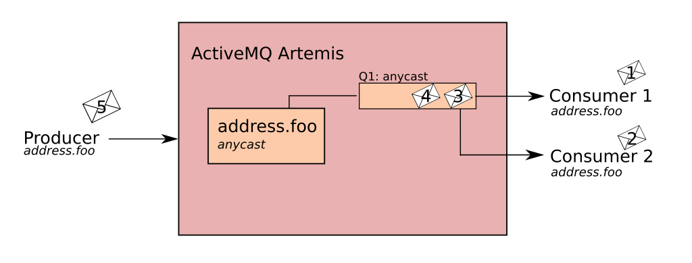
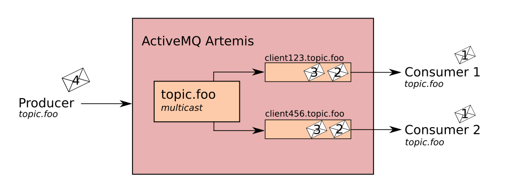
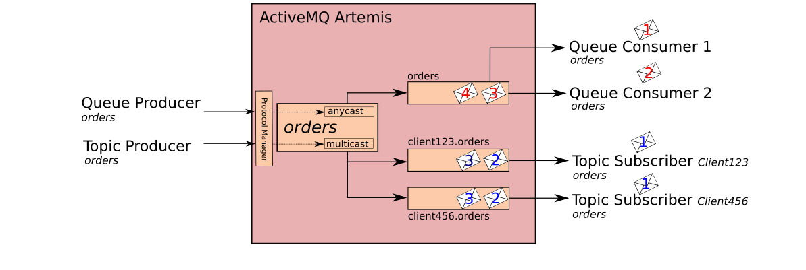

# Addressing Model

Apache ActiveMQ Artemis has a unique addressing model that is both powerful and flexible and that offers great performance. The addressing model comprises three main concepts: addresses, queues and routing types.

An address represents a messaging endpoint. Within the configuration, a typical address is given a unique name, 0 or more queues, and a routing type.

A queue is associated with an address. There can be multiple queues per address. Once an incoming message is matched to an address, the message will be sent on to one or more of its queues, depending on the routing type configured. Queues can be configured to be automatically created and deleted.

A routing type determines how messages are sent to the queues associated with an address. An Apache ActiveMQ Artemis address can be configured with two different routing types.

Table 1. Routing Types

| If you want your messages routed to…​	                                   | Use this routing type …​ |
| :----------------------------------------------------------------------: | :---------------------: |
| A single queue within the matching address, in a point-to-point manner.  | Anycast                 |
| Every queue within the matching address, in a publish-subscribe manner.  | Multicast               |

--------------------------------------------------------------------------------------------
**Note:** It is possible to define more than one routing type per address, but this typically results in an anti-pattern and is therefore not recommended.  If an address does use both routing types, however, and the client does not show a preference for either one, the broker typically defaults to the anycast routing type.
The one exception is when the client uses the MQTT protocol. In that case, the default routing type is multicast. |

## Basic Address Configuration

The following examples show how to configure basic point to point and publish subscribe addresses.

### Point-to-Point Messaging

Point-to-point messaging is a common scenario in which a message sent by a producer has only one consumer. AMQP and JMS message producers and consumers can make use of point-to-point messaging queues, for example. Define an anycast routing type for an address so that its queues receive messages in a point-to-point manner.

When a message is received on an address using anycast, Apache ActiveMQ Artemis locates the queue associated with the address and routes the message to it. When consumers request to consume from the address, the broker locates the relevant queue and associates this queue with the appropriate consumers. If multiple consumers are connected to the same queue, messages are distributed amongst each consumer equally, providing the consumers are equally able to handle them.


Figure 1. Point to Point Messaging

#### Using the Anycast Routing Type

Open the file `<broker-instance>/etc/broker.xml` for editing.

Add an address configuration element and its associated queue if they do not exist already.

**Note** For normal Point to Point semantics, the queue name **MUST** match the address name.

```xml
<configuration ...>
  <core ...>
    ...
    <address name="orders">
      <anycast>
        <queue name="orders"/>
      </anycast>
    </address>
  </core>
</configuration>
```

### Publish-Subscribe Messaging

In a publish-subscribe scenario, messages are sent to every consumer subscribed to an address. JMS topics and MQTT subscriptions are two examples of publish-subscribe messaging.

To configure an address with publish-subscribe semantics, create an address with the multicast routing type.


Figure 2. Publish-Subscribe

#### Using the Multicast Routing Type

Open the file <broker-instance>/etc/broker.xml for editing.

Add an address configuration element with multicast routing type.

```xml
<configuration ...>
  <core ...>
    ...
    <address name="pubsub.foo">
      <multicast/>
    </address>
  </core>
</configuration>
```

When clients connect to an address with the multicast element, a subscription queue for the client will be automatically created for the client. It is also possible to pre-configure subscription queues and connect to them directly using the queue's [Fully Qualified Queue names](#fully-qualified-queue-names).

Optionally add one or more queue elements to the address and wrap the multicast element around them. This step is typically not needed since the broker will automatically create a queue for each subscription requested by a client.

```xml
<configuration ...>
  <core ...>
    ...
    <address name="pubsub.foo">
      <multicast>
        <queue name="client123.pubsub.foo"/>
        <queue name="client456.pubsub.foo"/>
      </multicast>
    </address>
  </core>
</configration>
```

Figure 3. Point-to-Point with Two Queues

### Point-to-Point Address multiple Queues

It is actually possible to define more than one queue on an address with an anycast routing type. When messages are received on such an address, they are firstly distributed evenly across all the defined queues. Using [Fully Qualified Queue names](#fully-qualified-queue-names), clients are able to select the queue that they would like to subscribe to. Should more than one consumer connect direct to a single queue, Apache ActiveMQ Artemis will take care of distributing messages between them, as in the example above.


Figure 3. Point-to-Point with Two Queues

--------------------------------------------------------------------------------------------
**Note:** This is how Apache ActiveMQ Artemis handles load balancing of queues across multiple nodes in a cluster.
Configuring a Point-to-Point Address with two queues, open the file <broker-instance>/etc/broker.xml for editing.

Add an address configuration with Anycast routing type element and its associated queues.

```xml
<configuration ...>
  <core ...>
    ...
    <address name="address.foo">
      <anycast>
        <queue name="q1"/>
        <queue name="q2"/>
      </anycast>
    </address>
  </core>
</configuration>
```

### Point-to-Point and Publish-Subscribe Addresses

It is possible to define an address with both point-to-point and publish-subscribe semantics enabled. While not typically recommend, this can be useful when you want, for example, a JMS Queue say orders and a JMS Topic named orders. The different routing types make the addresses appear to be distinct.

Using an example of JMS Clients, the messages sent by a JMS message producer will be routed using the anycast routing type. Messages sent by a JMS topic producer will use the multicast routing type. In addition when a JMS topic consumer attaches, it will be attached to it’s own subscription queue. JMS queue consumer will be attached to the anycast queue.


Figure 4. [Point-to-Point and Publish-Subscribe

--------------------------------------------------------------------------------------------
**Note:** The behavior in this scenario is dependent on the protocol being used. For JMS there is a clear distinction between topic and queue producers and consumers, which make the logic straight forward. Other protocols like AMQP do not make this distinction. A message being sent via AMQP will be routed by both anycast and multicast and consumers will default to anycast. For more information, please check the behavior of each protocol in the sections on protocols.

The XML snippet below is an example of what the configuration for an address using both anycast and multicast would look like in <broker-instance>/etc/broker.xml. Note that subscription queues are typically created on demand, so there is no need to list specific queue elements inside the multicast routing type.

```xml
<configuration ...>
  <core ...>
    ...
    <address name="foo.orders">
      <anycast>
        <queue name="orders"/>
      </anycast>
      <multicast/>
    </address>
  </core>
</configuration>
```

## How to filter messages

Apache ActiveMQ Artemis supports the ability to filter messages using Apache Artemis [Filter Expressions](filter-expressions.md).

Filters can be applied in two places, on a queue and on a consumer.

### Queue Filter

When a filter is applied to a queue, messages are filter before they sent to the queue.  To add a queue filter use the
filter element when configuring a queue.  Open up the broker.xml and add an address with a queue, using the filter element
to configure a filter on this queue.

```xml
<address name="filter">
   <queue name="filter">
      <filter string="color='red'"/>
    </queue>
</address>
```

The filter defined above ensures that only messages with an attribute "color='red'" is sent to this queue.

### Consumer Filters

Consumer filters are applied after messages have reached a queue and are defined using the appropriate client APIs.  The
follow JMS example shows how to consumer filters work.

1. Define an address with a single queue, with no filter applied.

```xml
<address name="filter">
   <queue name="filter"/>
</address>
```

```java
  ...
  // Send some messages
  for (int i = 0; i < 3; i ++) {
    TextMessage redMessage = senderSession.createTextMessage("Red");
    redMessage.setStringProperty("color", "red");
    producer.send(redMessage)
        
    TextMessage greenMessage = senderSession.createTextMessage("Green");
    greenMessage.setStringProperty("color", "green");
    producer.send(greenMessage)
  }
```

At this point the queue would have 6 messages: red,green,red,green,red,green
         
```java
  MessageConsumer redConsumer = redSession.createConsumer(queue, "color='red'");
```

The redConsumer has a filter that only matches "red" messages.  The redConsumer will receive 3 messages.

```
red, red, red
```

The resulting queue would now be

```
green, green, green
```

## Automatic Address/Queue Management

You can configure Apache ActiveMQ Artemis to automatically create addresses and queues, and then delete them when they are no longer in use. This saves you from having to preconfigure each address and queue before a client can connect to it. Automatic creation and deletion is configured on a per address basis and is controlled by following:

| Parameter | Description |
|-----------|-------------|
| auto-create-addresses | When set to true, the broker will create the address requested by the client if it does not exist already. The default is true.|
| auto-delete-addresses | When set to true, the broker will be delete any **auto-created** adddress once all of it’s queues have been deleted. The default is true |
|default-address-routing-type | The routing type to use if the client does not specify one.   Possible values are MULTICAST and ANYCAST. See earlier in this chapter for more information about routing types. The default value is MULTICAST. |

### Auto Address Creation

- Edit the file `<broker-instance>/etc/broker.xml` and add the `auto-create-addresses` element to the `address-setting` you want the broker to automatically create.

- (Optional) Add the `address-setting` if it does not exits. Use the match parameter and the [wildcard syntax](wildcard-syntax.md) to match more than one specific address.

- Set `auto-create-addresses` to `true`

- (Optional) Assign `MULTICAST` or `ANYCAST` as the default routing type for the address.

The example below configures an `address-setting` to be automatically created by the broker. The default routing type to be used if not specified by the client is MULTICAST. Note that wildcard syntax is used. Any address starting with /news/politics/ will be automatically created by the broker.

```xml
<configuration ...>
  <core ...>
    ...
    <address-settings>
       <address-setting match="/news/politics/#">
          <auto-create-addresses>true</auto-create-addresses>
          <default-address-routing-type>MULTICAST</default-address-routing-type>
       </address-setting>
    </address-settings>
    ...
  </core>
</configuration>
```

### Auto Address Deletion

Edit the file `<broker-instance>/etc/broker.xml` and add the `auto-delete-addresses` element to the `address-setting` you want the broker to automatically create.

(Optional) Add the `address-setting` if it does not exits. Use the match parameter and the [wildcard syntax](wildcard-syntax.md) to match more than one specific address.

Set `auto-delete-addresses` to `true`

The example below configures an `address-setting` to be automatically deleted by the broker. Note that wildcard syntax is used. Any address request by the client that starts with `/news/politics/` is configured to be automatically deleted by the broker.

```xml
<configuration ...>
  <core ...>
    ...
    <address-settings>
       <address-setting match="/news/politics/#">
          <auto-delete-addresses>true</auto-delete-addresses>
          <default-address-routing-type>MULTICAST</default-address-routing-type>
       </address-setting>
    </address-settings>
    ...
  </core>
</configuration>
```

## "Fully Qualified" Queue Names

Internally the broker maps a client’s request for an address to specific queues. The broker decides on behalf of the client which queues to send messages to or from which queue to receive messages. However, more advanced use cases might require that the client specify a queue directly. In these situations the client and use a fully qualified queue name, by specifying both the address name and the queue name, separated by a ::.

Currently Artemis supports fully qualified queue names on Core, AMQP, JMS, OpenWire, MQTT and Stomp protocols for receiving messages only.

### Specifying a Fully Qualified Queue Name
In this example, the address foo is configured with two queues q1, q2 as shown in the configuration below.

```xml
<configuration ...>
  <core ...>
    ...
    <addresses>
       <address name="foo">
          <anycast>
             <queue name="q1" />
             <queue name="q2" />
          </anycast>
       </address>
    </addresses>
  </core>
</configuration>
```

In the client code, use both the address name and the queue name when requesting a connection from the broker. Remember to use two colons, ::, to separate the names, as in the example Java code below.

```java
String FQQN = "foo::q1";
Queue q1 session.createQueue(FQQN);
MessageConsumer consumer = session.createConsumer(q1);
```

## Using Prefixes to Determine Routing Type

Normally, if the broker receives a message sent to a particular address, that has both `ANYCAST` and `MULTICAST` routing types enable, it will route a copy of the message to **one** of the `ANYCAST` queues and to **all** of the `MULTICAST` queues.

However, clients can specify a special prefix when connecting to an address to indicate which kind of routing type to use. The prefixes are custom values that are designated using the anycastPrefix and multicastPrefix parameters within the URL of an acceptor.

### Configuring an Anycast Prefix

In `<broker-instance>/etc/broker.xml`, add the `anycastPrefix` to the URL of the desired acceptor. In the example below, the acceptor is configured to use `anycast://` for the `anycastPrefix`. Client code can specify `anycast://foo/` if the client needs to send a message to only one of the `ANYCAST` queues.

```xml
<configuration ...>
  <core ...>
    ...
      <acceptors>
         <acceptor name="artemis">tcp://0.0.0.0:61616?protocols=AMQP;anycastPrefix=anycast://</acceptor>
      </acceptors>
    ...
  </core>
</configuration>
```

### Configuring a Multicast Prefix

In `<broker-instance>/etc/broker.xml`, add the `multicastPrefix` to the URL of the desired acceptor. In the example below, the acceptor is configured to use `multicast://` for the `multicastPrefix`. Client code can specify `multicast://foo/` if the client needs to send a message to only one of the `MULTICAST` queues.

```xml
<configuration ...>
  <core ...>
    ...
      <acceptors>
         <acceptor name="artemis">tcp://0.0.0.0:61616?protocols=AMQP;multicastPrefix=multicast://</acceptor>
      </acceptors>
    ...
  </core>
</configuration>
```

## Advanced Address Configuration

### Static Subscription Queues

In most cases it’s not necessary to statically configure subscription queues. The relevant protocol managers take care of dynamically creating subscription queues when clients request to subscribe to an address.  The type of subscription queue created depends on what properties the client request.  For example, durable, non-shared, shared etc.  Protocol managers use special queue naming conventions to identify which queues belong to which consumers and users need not worry about the details.

However, there are scenarios where a user may want to use broker side configuration to statically configure a subscription and later connect to that queue directly using a [Fully Qualified Queue name](#fully-qualified-queue-names).  The examples below show how to use broker side configuration to statically configure a queue with publish subscribe behavior for shared, non-shared, durable and non-durable subscription behavior.

#### Shared, Durable Subscription Queue using max-consumers

The default behavior for queues is to not limit the number connected queue consumers.  The **max-consumers** parameter of the queue element can be used to limit the number of connected consumers allowed at any one time.

Open the file `<broker-instance>/etc/broker.xml` for editing.

```xml
<configuration ...>
  <core ...>
    ...
    <address name="durable.foo">
      <multicast>
        <!-- pre-configured shared durable subscription queue -->
        <queue name="q1" max-consumers="10">
          <durable>true</durable>
        </queue>
      </multicast>
    </address>
  </core>
</configuration>
```

#### Non-shared, Durable Subscription Queue

The broker can be configured to prevent more than one consumer from connecting to a queue at any one time. The subscriptions to queues configured this way are therefore "non-shared".  To do this simply set the **max-consumers** parameter to "1"

```xml
<configuration ...>
  <core ...>
    ...
    <address name="durable.foo">
      <multicast>
        <!-- pre-configured non shared durable subscription queue -->
        <queue name="q1" max-consumers="1">
          <durable>true</durable>
        </queue>
      </multicast>
    </address>
  </core>
</configuration>
```

#### Non-durable Subscription Queue

Non-durable subscriptions are again usually managed by the relevant protocol manager, by creating and deleting temporary queues.

If a user requires to pre-create a queue that behaves like a non-durable subscription queue the **purge-on-no-consumers** flag can be enabled on the queue.  When **purge-on-no-consumers** is set to **true**.  The queue will not start receiving messages until a consumer is attached.  When the last consumer is detached from the queue.  The queue is purged (it's messages are removed) and will not receive any more messages until a new consumer is attached.

Open the file `<broker-instance>/etc/broker.xml` for editing.

```xml
<configuration ...>
  <core ...>
    ...
    <address name="non.shared.durable.foo">
      <multicast>
        <queue name="orders1" purge-on-no-consumers="true"/>
      </multicast>
    </address>
  </core>
</configuration>
```

#### Exclusive Consumer Queue

If a user requires to statically configure a queue that routes exclusively to one active consumer the **exclusive** flag can be enabled on the queue.
  
When **exclusive** is set to **true** the queue will route messages to the a single active consumer.  When the active consumer that is being routed to is detached from the queue, if another active consumer exist, one will be chosen and routing will now be exclusive to it.

See [Exclusive Queue](exclusive-queues.md) for further information.

Open the file `<broker-instance>/etc/broker.xml` for editing.

```xml
<configuration ...>
  <core ...>
    ...
    <address name="foo.bar">
      <multicast>
        <queue name="orders1" exclusive="true"/>
      </multicast>
    </address>
  </core>
</configuration>
```

## Protocol Managers

A "protocol manager" maps protocol-specific concepts down to the core addressing model (using addresses, queues and routing types). For example, when a client sends a MQTT subscription packet with the addresses: 

```
/house/room1/lights
/house/room2/lights
```

The MQTT protocol manager understands that the two addresses require `MULTICAST` semantics. The protocol manager will therefore first look to ensure that `MULTICAST` is enabled for both addresses. If not, it will attempt to dynamically create them. If successful, the protocol manager will then create special subscription queues with special names, for each subscription requested by the client.

The special name allows the protocol manager to quickly identify the required client subscription queues should the client disconnect and reconnect at a later date.  If the subscription is temporary the protocol manager will delete the queue once the client disconnects.  

When a client requests to subscribe to a point to point address.  The protocol manager will look up the queue associated with the point to point address.  This queue should have the same name as the addresss.

**Note:** If the queue is auto created, it will be auto deleted once there are no consumers and no messages in it.  For more information on auto create see the next section [Configuring Addresses and Queues via Address Settings](#configuring-addresses-and-queues-via-address-settings)

## Configuring Addresses and Queues via Address Settings

There are some attributes that are defined against an address wildcard
rather than a specific address/queue. Here an example of an `address-setting`
entry that would be found in the `broker.xml` file.

```xml
<address-settings>
   <address-setting match="order.foo">
      <dead-letter-address>DLA</dead-letter-address>
      <max-delivery-attempts>3</max-delivery-attempts>
      <redelivery-delay>5000</redelivery-delay>
      <expiry-address>ExpiryQueue</expiry-address>
      <last-value-queue>true</last-value-queue>
      <max-size-bytes>100000</max-size-bytes>
      <page-size-bytes>20000</page-size-bytes>
      <redistribution-delay>0</redistribution-delay>
      <send-to-dla-on-no-route>true</send-to-dla-on-no-route>
      <address-full-policy>PAGE</address-full-policy>
      <slow-consumer-threshold>-1</slow-consumer-threshold>
      <slow-consumer-policy>NOTIFY</slow-consumer-policy>
      <slow-consumer-check-period>5</slow-consumer-check-period>
   </address-setting>
</address-settings>
```

The idea with address settings, is you can provide a block of settings
which will be applied against any addresses that match the string in the
`match` attribute. In the above example the settings would only be
applied to the address "order.foo" address but you can also use wildcards
to apply settings.  See: [The chapter on the wild card syntax](wildcard-syntax.md).

For example, if you used the `match` string `queue.#` the settings
would be applied to all addresses which start with `queue.`

The meaning of the specific settings are explained fully throughout the
user manual, however here is a brief description with a link to the
appropriate chapter if available.

`max-delivery-attempts` defines how many time a cancelled message can be
redelivered before sending to the `dead-letter-address`. A full
explanation can be found [here](undelivered-messages.md#configuring-dead-letter-addresses).

`redelivery-delay` defines how long to wait before attempting redelivery
of a cancelled message. see [here](undelivered-messages.md#configuring-delayed-redelivery).

`expiry-address` defines where to send a message that has expired. see
[here](message-expiry.md#configuring-expiry-addresses).

`expiry-delay` defines the expiration time that will be used for
messages which are using the default expiration time (i.e. 0). For
example, if `expiry-delay` is set to "10" and a message which is using
the default expiration time (i.e. 0) arrives then its expiration time of
"0" will be changed to "10." However, if a message which is using an
expiration time of "20" arrives then its expiration time will remain
unchanged. Setting `expiry-delay` to "-1" will disable this feature. The
default is "-1".

`last-value-queue` defines whether a queue only uses last values or not.
see [here](last-value-queues.md).

`max-size-bytes` and `page-size-bytes` are used to set paging on an
address. This is explained [here](paging.md#configuration).

`redistribution-delay` defines how long to wait when the last consumer
is closed on a queue before redistributing any messages. see
[here](clusters.md#message-redistribution).

`send-to-dla-on-no-route`. If a message is sent to an address, but the
server does not route it to any queues, for example, there might be no
queues bound to that address, or none of the queues have filters that
match, then normally that message would be discarded. However if this
parameter is set to true for that address, if the message is not routed
to any queues it will instead be sent to the dead letter address (DLA)
for that address, if it exists.

`address-full-policy`. This attribute can have one of the following
values: PAGE, DROP, FAIL or BLOCK and determines what happens when an
address where `max-size-bytes` is specified becomes full. The default
value is PAGE. If the value is PAGE then further messages will be paged
to disk. If the value is DROP then further messages will be silently
dropped. If the value is FAIL then further messages will be dropped and
an exception will be thrown on the client-side. If the value is BLOCK
then client message producers will block when they try and send further
messages. See the following chapters for more info [Flow Control](flow-control.md), [Paging](paging.md).

`slow-consumer-threshold`. The minimum rate of message consumption
allowed before a consumer is considered "slow." Measured in
messages-per-second. Default is -1 (i.e. disabled); any other valid
value must be greater than 0.

`slow-consumer-policy`. What should happen when a slow consumer is
detected. `KILL` will kill the consumer's connection (which will
obviously impact any other client threads using that same connection).
`NOTIFY` will send a CONSUMER\_SLOW management notification which an
application could receive and take action with. See [slow consumers](slow-consumers.md) for more details
on this notification.

`slow-consumer-check-period`. How often to check for slow consumers on a
particular queue. Measured in seconds. Default is 5. See [slow consumers](slow-consumers.md)
for more information about slow consumer detection.

`auto-create-jms-queues`. Whether or not the broker should automatically
create a JMS queue when a JMS message is sent to a queue whose name fits
the address `match` (remember, a JMS queue is just a core queue which has
the same address and queue name) or a JMS consumer tries to connect to a
queue whose name fits the address `match`. Queues which are auto-created
are durable, non-temporary, and non-transient. Default is `true`. This is
_DEPRECATED_.  See `auto-create-queues`.

`auto-delete-jms-queues`. Whether or not the broker should automatically
delete auto-created JMS queues when they have both 0 consumers and 0 messages.
Default is `true`. This is _DEPRECATED_.  See `auto-delete-queues`.

`auto-create-jms-topics`. Whether or not the broker should automatically
create a JMS topic when a JMS message is sent to a topic whose name fits
the address `match` (remember, a JMS topic is just a core address which has 
one or more core queues mapped to it) or a JMS consumer tries to subscribe
to a topic whose name fits the address `match`. Default is `true`. This is
_DEPRECATED_.  See `auto-create-addresses`.

`auto-delete-jms-topics`. Whether or not the broker should automatically
delete auto-created JMS topics once the last subscription on the topic has
been closed. Default is `true`. This is _DEPRECATED_.  See `auto-delete-addresses`.

`auto-create-queues`. Whether or not the broker should automatically
create a queue when a message is sent or a consumer tries to connect to a
queue whose name fits the address `match`. Queues which are auto-created
are durable, non-temporary, and non-transient. Default is `true`.

`auto-delete-queues`. Whether or not the broker should automatically
delete auto-created queues when they have both 0 consumers and 0 messages.
Default is `true`.

`config-delete-queues`. How the broker should handle queues deleted
on config reload, by delete policy: `OFF` or `FORCE`.
See [config-reload](config-reload.md) for more details.
Default is `OFF`.

`auto-create-addresses`. Whether or not the broker should automatically
create an address when a message is sent to or a consumer tries to consume
from a queue which is mapped to an address whose name fits the address `match`.
Default is `true`.

`auto-delete-addresses`. Whether or not the broker should automatically
delete auto-created addresses once the address no longer has any queues.
Default is `true`.

`config-delete-addresses`. How the broker should handle addresses deleted
on config reload, by delete policy: `OFF` or `FORCE`.
See [config-reload](config-reload.md) for more details.
Default is `OFF`.