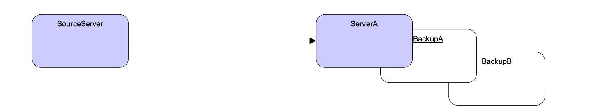

# Broker Connections

Instead of waiting for clients to connect, a broker can initiate a connection to another endpoint on a specific protocol.

Currently, this feature supports only the AMQP protocol. However, in the future, it might be expanded to other protocols.

Broker connections are configured by the `<broker-connections>` XML element in the `broker.xml` configuration file.

```xml
<broker-connections>
  ...
</broker-connections>
```

# AMQP Server Connections

An ActiveMQ Artemis broker can initiate connections using the AMQP protocol. This means that the broker can connect to another AMQP server (not necessarily ActiveMQ Artemis) and create elements on that connection.

To define an AMQP broker connection, add an `<amqp-connection>` element within the `<broker-connections` element in the `broker.xml` configuration file. For example:

```xml
<broker-connections>
  <amqp-connection uri="tcp://HOST:PORT" name="other-server" retry-interval="100" reconnect-attempts="-1" user="john" password="doe">
    ...
  </amqp-connection>
</broker-connections>
```

- `uri`: tcp://host:myport (this is a required argument)
- `name`: Name of the connection used for management purposes
- `user`: User name with which to connect to the endpoint (this is an optional argument)
- `password`: Password with which to connect to the endpoint (this is an optional argument)
- `retry-interval`: Time, in milliseconds to wait before retrying a connection after an error. The default value is `5000`.
- `reconnect-attempts`: default is -1 meaning infinite
- `auto-start` : Should the broker connection start automatically with the broker. Default is `true`. If false it is necessary to call a management operation to start it.

*Notice:* If auto-start is disabled on the broker connection, the start of the broker connection will only happen after the management method `startBrokerConnection(connectionName)` is called on the ServerController.

*Important*: The target endpoint needs permission for all operations that configured. Therefore, If a security manager is being used, ensure to perform the configured operations with a user with sufficient permissions.

<div style="page-break-after: always"></div>

# AMQP Server Connection Operations
The following types of operations are supported on an AMQP server connection:

* Mirrors
  * The broker uses an AMQP connection to another broker and duplicates messages and sends acknowledgements over the wire.
* Senders
  * Messages received on specific queues are transferred to another endpoint.
* Receivers
  * The broker pulls messages from another endpoint.
* Peers
  * The broker creates both senders and receivers on another endpoint that knows how to handle them. This is currently implemented by Apache Qpid Dispatch.

<div style="page-break-after: always"></div>

# Reconnecting and Failover

It is possible to determine how reconnection will happen on a broker connection. 

These are the attributes are available on amqp-connection XML element:
- reconnect-attempts: default as -1 (infinite). How many attempts will be done after a failed connection
- retry-interval: default as 5000, in milliseconds, the wait between each retry in connections. 

It is also possible to specify alternate hosts on a broker connection by appending a comma separated list after a # at the end of the URI.
The broker connection would keep trying on the alternate list until one of the targets is available to connect. Example:

```xml
<broker-connections>
  <amqp-connection uri="tcp://ServerA:5672#BackupA:5672,BackupB:5672" name="ServerA" reconnect-attempts="-1" retry-interval="5000">
    ...
  </amqp-connection>
</broker-connections>
```

Figure 1. Broker Connection - Reconnecting and Failover.


The previous example portrays a case of connection failure towards ServerA. The system would try to connect to serverA, backupA, and backupB until it successfully connects to one of these nodes.

<div style="page-break-after: always"></div>

## Mirroring
The idea of mirroring is to send events that happen on a broker towards another broker, without blocking any operations from producers and consumers, allowing them to keep operating as fast as possible.
It can be used for Disaster Recovery, and depending on the requirements even for failing over the data.

The following events are sent through mirroring:

* Message sending
  * Messages sent to one broker will be "replicated" to the target broker.
* Message acknowledgement
  * Acknowledgements removing messages at one broker will be sent to the target broker.
  * Note that if the message is pending for a consumer on the target mirror, the ack will not succeed and the message might be delivered by both brokers.
* Queue and address creation.
* Queue and address deletion.

### Mirror configuration

Add a `<mirror>` element within the `<amqp-connection>` element to configure mirroring to the target broker.

The following optional arguments can be utilized:

* `queue-removal`: Specifies whether a queue- or address-removal event is sent. The default value is `true`.
* `message-acknowledgements`: Specifies whether message acknowledgements are sent. The default value is `true`.
* `queue-creation`: Specifies whether a queue- or address-creation event is sent. The default value is `true`.

An example of a mirror configuration is shown below:
```xml
<broker-connections>
  <amqp-connection uri="tcp://HOST:PORT" name="mirror">
    <mirror/>
  </amqp-connection>
</broker-connections>
```


### Store and Forward Queue

Mirror events are always stored on a local queue prefixed as "$ACTIVEMQ_ARTEMIS_MIRROR_" and then concatenated with the broker connection's configured name.

So, in the following configuration mirror events will be stored on a queue named "$ACTIVEMQ_ARTEMIS_MIRROR_brokerB".

```xml
<broker-connection>
  <amqp-connection uri="tcp://brokerB:5672" name="brokerB">
    <mirror/>
  </amqp-connection>
</broker-connection>
```

These messages are then transferred to brokerB:5672. A producer to the address $ACTIVEMQ_ARTEMIS_MIRROR_brokerB will be created towards brokerB. If there is a security manager configured, security roles must be provided to the user on the broker connection.

Notice the queue $ACTIVEMQ_ARTEMIS_MIRROR_brokerB will not actually exist on brokerB and so it wont be visible on the administration console. The target broker will treat these messages accordingly as mirror events and perform the appropriate operations at the target broker.

### Pre Existing Messages
The broker will only mirror messages arriving from the point in time the mirror was configured. Previously existing messages will not be forwarded to other brokers.

## Dual Mirror (Disaster Recovery)

ActiveMQ Artemis supports automatic fallback mirroring. Every sent message and every acknowledgement is asynchronously replicated to the mirrored broker.

On the following diagram, there will be two servers called DataCenter1, and DataCenter2. In order to have a dual mirror configuration, it is necessary is to add the mirror broker connection on each broker.xml:


Figure 2. Broker Connection - Disaster Recovery.

on DataCenter1, the following code should be added the broker.xml:

```xml
<broker-connections>
   <amqp-connection uri="tcp://DataCenter2:5672" name="DC2">
      <mirror/>
   </amqp-connection>
</broker-connections>
```

The following xml should be added on DataCenter2's broker.xml:
```xml
<broker-connections>
   <amqp-connection uri="tcp://DataCenter1:5672" name="DC1">
      <mirror/>
   </amqp-connection>
</broker-connections>
```


The broker connections will replicate sends and acknowledgements to the other broker, no matter where they originated. If messages are sent on DC1 (DataCenter1) these will be automatically transferred to DC2 (DataCenter2). Messages acknowledgements received on DC2 will be automatically related back to DC1. 
The only exception to that rule would be if there were already consumers with pending messages on any server, where a mirrored acknowledgement will not prevent the message being consumed by both consumers. It is recommended to not have active consumers on both servers.

## Example
There is an example as part of the distribution showing dual broker configuration (or disaster recovery) under ./examples/features/broker-connection/disaster-recovery.

On the example two brokers are configured to mirror each other and whatever happens in one broker is immediately copied over to the other broker.

<div style="page-break-after: always"></div>

## Senders and Receivers
It is possible to connect an ActiveMQ Artemis broker to another AMQP endpoint simply by creating a sender or receiver broker connection element.

For a `sender`, the broker creates a message consumer on a queue that sends messages to another AMQP endpoint.

For a `receiver`, the broker creates a message producer on an address that receives messages from another AMQP endpoint.

Both elements function as a message bridge. However, there is no additional overhead required to process messages. Senders and receivers behave just like any other consumer or producer in ActiveMQ Artemis.

Specific queues can be configured by senders or receivers. Wildcard expressions can be used to match senders and receivers to specific addresses or _sets_ of addresses. When configuring a sender or receiver, the following properties can be set:

- `address-match`: Match the sender or receiver to a specific address or __set__ of addresses, using a wildcard expression
- `queue-name`: Configure the sender or receiver for a specific queue


Some examples are shown below.

Using address expressions:
```xml
<broker-connections>
  <amqp-connection uri="tcp://HOST:PORT" name="other-server">
    <sender address-match="queues.#"/>
    <!-- notice the local queues for remotequeues.# need to be created on this broker -->
    <receiver address-match="remotequeues.#"/>
  </amqp-connection>
</broker-connections>

<addresses>
  <address name="remotequeues.A">
    <anycast>
      <queue name="remoteQueueA"/>
    </anycast>
  </address>
  <address name="queues.B">
    <anycast>
      <queue name="localQueueB"/>
    </anycast>
  </address>
</addresses>
```
Using queue names:
```xml
<broker-connections>
  <amqp-connection uri="tcp://HOST:PORT" name="other-server">
    <receiver queue-name="remoteQueueA"/>
    <sender queue-name="localQueueB"/>
  </amqp-connection>
</broker-connections>

<addresses>
   <address name="remotequeues.A">
     <anycast>
       <queue name="remoteQueueA"/>
     </anycast>
   </address>
   <address name="queues.B">
     <anycast>
       <queue name="localQueueB"/>
     </anycast>
   </address>
</addresses>
```
*Important:* Receivers can only be matched to a local queue that already exists. Therefore, if receivers are being used, ensure that queues are pre-created locally. Otherwise, the broker cannot match the remote queues and addresses.

*Important:* Do not create a sender and a receiver to the same destination. This creates an infinite loop of sends and receives.

<div style="page-break-after: always"></div>

## Peers
The broker can be configured as a peer which connects to the [Apache Qpid Dispatch Router](https://qpid.apache.org/components/dispatch-router/) and instructs it that the broker will act as a store-and-forward queue for a given AMQP waypoint address configured on the router. In this scenario, clients connect to a router to send and receive messages using a waypointed address, and the router routes these messages to or from the queue on the broker.

The peer configuration causes ActiveMQ Artemis to create a sender and receiver pair for each destination matched in the broker-connection configuration, with these carrying special configuration to let Qpid Dispatch know to collaborate with the broker. This replaces the traditional need of a router-initiated connection and auto-links.

Qpid Dispatch Router offers a lot of advanced networking options that be used together with ActiveMQ Artemis.

With a peer configuration, the same properties are present as when there are senders and receivers. For example, a configuration where queues with names beginning "queue." act as storage for the matching router waypoint address would be:

```xml
<broker-connections>
  <amqp-connection uri="tcp://HOST:PORT" name="router">
    <peer address-match="queues.#"/>
  </amqp-connection>
</broker-connections>

<addresses>
   <address name="queues.A">
     <anycast>
       <queue name="queues.A"/>
     </anycast>
   </address>
   <address name="queues.B">
     <anycast>
       <queue name="queues.B"/>
     </anycast>
   </address>
</addresses>
```

There must be a matching address waypoint configuration on the router instructing it that the particular router addresses the broker attaches to should be treated as waypoints. For example, a similar prefix- based router address configuration would be:

```
address {
    prefix: queue
    waypoint: yes
}
```

For more information refer to the "brokered messaging" documentation for [Apache Qpid Dispatch Router](https://qpid.apache.org/components/dispatch-router/).

*Important:* Do not use this feature to connect to another broker, otherwise any message sent will be immediately ready to consume creating an infinite echo of sends and receives.

*Important:* It is not necessary to configure the router with a connector or auto-links to communicate with the broker. The brokers peer configuration replaces these aspects of the router waypoint usage.

## Address Consideration
It is highly recommended that `address name` and `queue name` are the same. When a queue with its distinct name (as in the following example) is used, senders and receivers will always use the `address name` when creating the remote endpoint.

```xml
<broker-connections>
  <amqp-connection uri="tcp://HOST:PORT" name="other-server">
    <sender address-match="queues.#"/>
  </amqp-connection>
</broker-connections>
<addresses>
  <address name="queues.A">
    <anycast>
      <queue name="distinctNameQueue.A"/>
    </anycast>
  </address>
</addresses>
```

In the above example the `broker connection` would create an AMQP sender towards "queues.A".

*Important:* To avoid confusion it is recommended that `address name` and `queue name` are kept the same.
