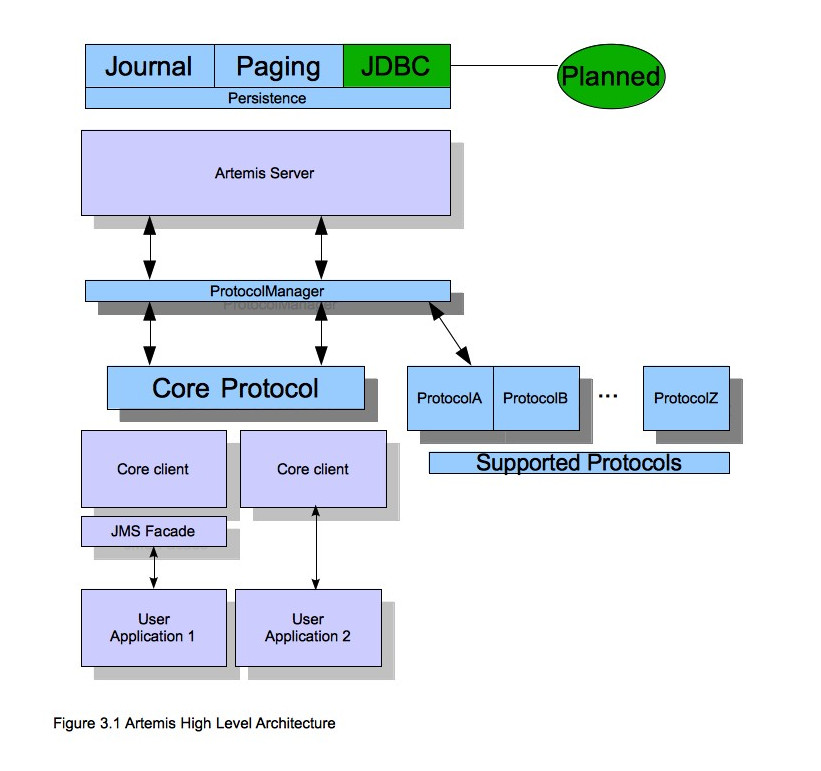
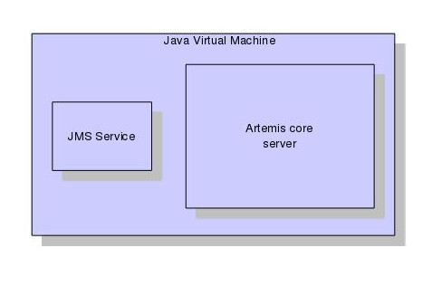

# Architecture

In this section we will give an overview of the ActiveMQ high level
architecture.

## Core Architecture

ActiveMQ core is designed simply as set of Plain Old Java Objects
(POJOs) - we hope you like its clean-cut design.

We've also designed it to have as few dependencies on external jars as
possible. In fact, ActiveMQ core has only one jar dependency, netty.jar,
other than the standard JDK classes! This is because we use some of the
netty buffer classes internally.

This allows ActiveMQ to be easily embedded in your own project, or
instantiated in any dependency injection framework such as Spring or 
Google Guice.

Each ActiveMQ server has its own ultra high performance persistent
journal, which it uses for message and other persistence.

Using a high performance journal allows outrageous persistence message
performance, something not achievable when using a relational database
for persistence.

ActiveMQ clients, potentially on different physical machines interact
with the ActiveMQ server. ActiveMQ currently provides two APIs for
messaging at the client side:

1.  Core client API. This is a simple intuitive Java API that allows the
    full set of messaging functionality without some of the complexities
    of JMS.

2.  JMS client API. The standard JMS API is available at the client
    side.

JMS semantics are implemented by a thin JMS facade layer on the client
side.

The ActiveMQ server does not speak JMS and in fact does not know
anything about JMS, it is a protocol agnostic messaging server designed
to be used with multiple different protocols.

When a user uses the JMS API on the client side, all JMS interactions
are translated into operations on the ActiveMQ core client API before
being transferred over the wire using the ActiveMQ wire format.

The server always just deals with core API interactions.

A schematic illustrating this relationship is shown in figure 3.1 below:

Figure 3.1 shows two user applications interacting with a ActiveMQ
server. User Application 1 is using the JMS API, while User Application
2 is using the core client API directly.

You can see from the diagram that the JMS API is implemented by a thin
facade layer on the client side.

## ActiveMQ embedded in your own application

ActiveMQ core is designed as a set of simple POJOs so if you have an
application that requires messaging functionality internally but you
don't want to expose that as a ActiveMQ server you can directly
instantiate and embed ActiveMQ servers in your own application.

For more information on embedding ActiveMQ, see [Embedding HornetQ](embedding-hornetq.md).

## ActiveMQ integrated with a JEE application server

ActiveMQ provides its own fully functional Java Connector Architecture
(JCA) adaptor which enables it to be integrated easily into any JEE
compliant application server or servlet engine.

JEE application servers provide Message Driven Beans (MDBs), which are a
special type of Enterprise Java Beans (EJBs) that can process messages
from sources such as JMS systems or mail systems.

Probably the most common use of an MDB is to consume messages from a JMS
messaging system.

According to the JEE specification, a JEE application server uses a JCA
adapter to integrate with a JMS messaging system so it can consume
messages for MDBs.

However, the JCA adapter is not only used by the JEE application server
for *consuming* messages via MDBs, it is also used when sending message
to the JMS messaging system e.g. from inside an EJB or servlet.

When integrating with a JMS messaging system from inside a JEE
application server it is always recommended that this is done via a JCA
adaptor. In fact, communicating with a JMS messaging system directly,
without using JCA would be illegal according to the JEE specification.

The application server's JCA service provides extra functionality such
as connection pooling and automatic transaction enlistment, which are
desirable when using messaging, say, from inside an EJB. It is possible
to talk to a JMS messaging system directly from an EJB, MDB or servlet
without going through a JCA adapter, but this is not recommended since
you will not be able to take advantage of the JCA features, such as
caching of JMS sessions, which can result in poor performance.

Figure 3.2 below shows a JEE application server integrating with a
ActiveMQ server via the ActiveMQ JCA adaptor. Note that all
communication between EJB sessions or entity beans and Message Driven
beans go through the adaptor and not directly to ActiveMQ.

The large arrow with the prohibited sign shows an EJB session bean
talking directly to the ActiveMQ server. This is not recommended as
you'll most likely end up creating a new connection and session every
time you want to interact from the EJB, which is an anti-pattern.

For more information on using the JCA adaptor, please see [Application Server Integration and Java EE](appserver-integration.md).

## ActiveMQ stand-alone server

ActiveMQ can also be deployed as a stand-alone server. This means a
fully independent messaging server not dependent on a JEE application
server.

The standard stand-alone messaging server configuration comprises a core
messaging server and a JMS service.

The role of the JMS Service is to deploy any JMS Queue, Topic and
ConnectionFactory instances from any server side `activemq-jms.xml`
configuration files. It also provides a simple management API for
creating and destroying Queues and Topics
which can be accessed via JMX or the connection. It is a separate
service to the ActiveMQ core server, since the core server is JMS
agnostic. If you don't want to deploy any JMS Queue or Topic via 
server side XML configuration and don't require a JMS management 
API on the server side then you can disable this service.

The stand-alone server configuration uses JBoss Microcontainer to
instantiate and enforce dependencies between the components. JBoss
Microcontainer is a very lightweight POJO bootstrapper.

The stand-alone server architecture is shown in figure 3.3 below:

For more information on server configuration files see [Server Configuration](server-configuration.md)
