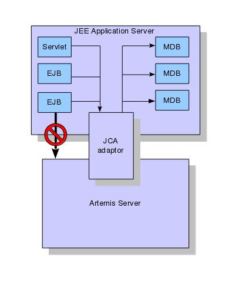

# Core Architecture

Apache ActiveMQ Artemis core is designed simply as set of Plain Old Java Objects
(POJOs) - we hope you like its clean-cut design.

Each Apache ActiveMQ Artemis server has its own ultra high performance persistent
journal, which it uses for message and other persistence.

Using a high performance journal allows outrageous persistence message
performance, something not achievable when using a relational database
for persistence.

Apache ActiveMQ Artemis clients, potentially on different physical machines interact
with the Apache ActiveMQ Artemis server. Apache ActiveMQ Artemis currently provides two APIs for
messaging at the client side:

1. Core client API. This is a simple intuitive Java API that is aligned with the Artemis internal Core.  Allowing more
    control of broker objects, like for example, direct creation of addresses and queues.  The Core API also offers a
    full set of messaging functionality without some of the complexities of JMS.

2. JMS client API. The standard JMS API is available at the client side.

Apache ActiveMQ Artemis also provides different protocol implementations on the server so you can use respective clients for these protocols:

1. AMQP
2. OpenWire
3. MQTT
4. STOMP
5. HornetQ (for use with HornetQ clients).
6. CORE (Artemis CORE protocol)

JMS semantics are implemented by a JMS facade layer on the client side.

The Apache ActiveMQ Artemis server does not speak JMS and in fact does not know
anything about JMS, it is a protocol agnostic messaging server designed
to be used with multiple different protocols.

When a user uses the JMS API on the client side, all JMS interactions
are translated into operations on the Apache ActiveMQ Artemis core client API before
being transferred over the wire using the Apache ActiveMQ Artemis wire format.

The server always just deals with core API interactions.

A schematic illustrating this relationship is shown in figure 3.1 below:

Figure 3.1 shows two user applications interacting with an Apache ActiveMQ Artemis
server. User Application 1 is using the JMS API, while User Application
2 is using the core client API directly.

You can see from the diagram that the JMS API is implemented by a thin
facade layer on the client side.

## Stand-alone Broker

The normal stand-alone messaging broker configuration comprises a core
messaging broker and a number of protocol managers that provide support for
the various protocol mentioned earlier.  Protocol managers are pluggable
if you 

The stand-alone broker configuration uses [Airline](https://github.com/airlift/airline)
for bootstrapping the Broker.

The stand-alone broker architecture is shown in figure 3.3 below:

For more information on server configuration files see [Server Configuration](configuration-index.md)

## Embedded Broker

Apache ActiveMQ Artemis core is designed as a set of simple POJOs so if you have an
application that requires messaging functionality internally but you
don't want to expose that as an Apache ActiveMQ Artemis broker you can directly
instantiate and embed Apache ActiveMQ Artemis brokers in your own application.

For more information on embedding Apache ActiveMQ Artemis, see [Embedding Apache ActiveMQ Artemis](embedding-activemq.md).

## Integrated with a Java EE application server

Apache ActiveMQ Artemis provides its own fully functional Java Connector Architecture
(JCA) adaptor which enables it to be integrated easily into any Java EE
compliant application server or servlet engine.

Java EE application servers provide Message Driven Beans (MDBs), which are a
special type of Enterprise Java Beans (EJBs) that can process messages
from sources such as JMS systems or mail systems.

Probably the most common use of an MDB is to consume messages from a JMS
messaging system.

According to the Java EE specification, a Java EE application server uses a JCA
adapter to integrate with a JMS messaging system so it can consume
messages for MDBs.

However, the JCA adapter is not only used by the Java EE application server
for *consuming* messages via MDBs, it is also used when sending message
to the JMS messaging system e.g. from inside an EJB or servlet.

When integrating with a JMS messaging system from inside a Java EE
application server it is always recommended that this is done via a JCA
adaptor. In fact, communicating with a JMS messaging system directly,
without using JCA would be illegal according to the Java EE specification.

The application server's JCA service provides extra functionality such
as connection pooling and automatic transaction enlistment, which are
desirable when using messaging, say, from inside an EJB. It is possible
to talk to a JMS messaging system directly from an EJB, MDB or servlet
without going through a JCA adapter, but this is not recommended since
you will not be able to take advantage of the JCA features, such as
caching of JMS sessions, which can result in poor performance.

Figure 3.2 below shows a Java EE application server integrating with a
Apache ActiveMQ Artemis server via the Apache ActiveMQ Artemis JCA adaptor. Note that all
communication between EJB sessions or entity beans and Message Driven
beans go through the adaptor and not directly to Apache ActiveMQ Artemis.

The large arrow with the prohibited sign shows an EJB session bean
talking directly to the Apache ActiveMQ Artemis server. This is not recommended as
you'll most likely end up creating a new connection and session every
time you want to interact from the EJB, which is an anti-pattern.

