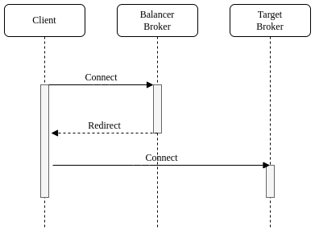

# Broker Balancers
Apache ActiveMQ Artemis broker balancers allow incoming client connections to be distributed across multiple [target brokers](target-brokers).
The target brokers are grouped in [pools](#pools) and the broker balancers use a [target key](#target-key)
to select a target broker from a pool of brokers according to a [policy](#policies).

### This feature is still **EXPERIMENTAL** and not meant to be run in production yet. Furthermore, its configuration can change until declared as **officially stable**.

## Target Broker
Target broker is a broker that can accept incoming client connections and is local or remote.
The local target is a special target that represents the same broker hosting the broker balancer.
The remote target is another reachable broker.

## Target Key
The broker balancer uses a target key to select a target broker.
It is a string retrieved from an incoming client connection, the supported values are:
* `CLIENT_ID` is the JMS client ID;
* `SNI_HOST` is the hostname indicated by the client in the SNI extension of the TLS protocol;
* `SOURCE_IP` is the source IP address of the client;
* `USER_NAME` is the username indicated by the client.

## Pools
The pool is a group of target brokers and checks periodically their state.
It provides a list of ready target brokers to distribute incoming client connections only when it is active.
A pool becomes active when the minimum number of ready target brokers defined by the `quorum-size` parameter is reached.
When it is not active, it doesn't provide any target avoiding weird distribution at startup or after a restart.
Including the local broker in the target pool allows broker hosting the balancer to accept incoming client connections as well.
By default, a pool doesn't include the local broker, to include it as a target the `local-target-enabled` parameter must be `true`.
There are three pool types: [cluster pool](#cluster-pool), [discovery pool](#discovery-pool) and [static pool](#static-pool).

### Cluster Pool
The cluster pool uses a [cluster connection](clusters.md#configuring-cluster-connections) to get the target brokers to add.
Let's take a look at a cluster pool example from broker.xml that uses a cluster connection:
```xml
<pool>
  <cluster-connection>cluster1</cluster-connection>
</pool>
```

### Discovery Pool
The discovery pool uses a [discovery group](clusters.md#discovery-groups) to discover the target brokers to add.
Let's take a look at a discovery pool example from broker.xml that uses a discovery group:
```xml
<pool>
    <discovery-group-ref discovery-group-name="dg1"/>
</pool>
```

### Static Pool
The static pool uses a list of static connectors to define the target brokers to add.
Let's take a look at a static pool example from broker.xml that uses a list of static connectors:
```xml
<pool>
    <static-connectors>
        <connector-ref>connector1</connector-ref>
        <connector-ref>connector2</connector-ref>
        <connector-ref>connector3</connector-ref>
    </static-connectors>
</pool>
```

### Defining pools
A pool is defined by the `pool` element that includes the following items:
* the `username` element defines the username to connect to the target broker;
* the `password` element defines the password to connect to the target broker;
* the `check-period` element defines how often to check the target broker, measured in milliseconds, default is `5000`;
* the `quorum-size` element defines the minimum number of ready targets to activate the pool, default is `1`;
* the `quorum-timeout` element defines the timeout to get the minimum number of ready targets, measured in milliseconds, default is `3000`;
* the `local-target-enabled` element defines whether the pool has to include a local target, default is `false`;
* the `cluster-connection` element defines the [cluster connection](clusters.md#configuring-cluster-connections) used by the [cluster pool](#cluster-pool).
* the `static-connectors` element defines a list of static connectors used by the [static pool](#static-pool);
* the `discovery-group` element defines the [discovery group](clusters.md#discovery-groups) used by the [discovery pool](#discovery-pool).

Let's take a look at a pool example from broker.xml:
```xml
<pool>
    <quorum-size>2</quorum-size>
    <check-period>1000</check-period>
    <local-target-enabled>true</local-target-enabled>
    <static-connectors>
        <connector-ref>connector1</connector-ref>
        <connector-ref>connector2</connector-ref>
        <connector-ref>connector3</connector-ref>
    </static-connectors>
</pool>
```

## Policies
The policy define how to select a broker from a pool. The included policies are:
* `FIRST_ELEMENT` to select the first target broker from the pool which is ready. It is useful to select the ready target brokers
  according to the priority defined with their sequence order, ie supposing there are 2 target brokers
  this policy selects the second target broker only when the first target broker isn't ready.
* `ROUND_ROBIN` to select a target sequentially from a pool, this policy is useful to evenly distribute;
* `CONSISTENT_HASH` to select a target by a key. This policy always selects the same target broker for the same key until it is removed from the pool.
* `LEAST_CONNECTIONS` to select the targets with the fewest active connections. This policy helps you maintain an equal distribution of active connections with the target brokers.

A policy is defined by the `policy` element. Let's take a look at a policy example from broker.xml:
```xml
<policy name="FIRST_ELEMENT"/>
```

## Cache
The broker balancer provides a cache with a timeout to improve the stickiness of the target broker selected,
returning the same target broker for a target key as long as it is present in the cache and is ready.
So a broker balancer with the cache enabled doesn't strictly follow the configured policy.
By default, the cache is enabled, to disable the cache the `cache-timeout` parameter must be `0`.

## Defining broker balancers
A broker balancer is defined by `broker-balancer` element, it includes the following items:
* the `name` attribute defines the name of the broker balancer;
* the `target-key` element defines what key to select a target broker, the supported values are: `CLIENT_ID`, `SNI_HOST`, `SOURCE_IP`, `USER_NAME`, default is `SOURCE_IP`, see [target key](#target-key) for further details;
* the `target-key-filter` element defines a regular expression to filter the resolved keys;
* the `local-target-filter` element defines a regular expression to match the keys that have to return a local target;
* the `cache-timeout` element is the time period for a target broker to remain in the cache, measured in milliseconds, setting `0` will disable the cache, default is `-1`, meaning no expiration;
* the `pool` element defines the pool to group the target brokers, see [pools](#pools).
* the `policy` element defines the policy used to select the target brokers, see [policies](#policies);

Let's take a look at some broker balancer examples from broker.xml:
```xml
<broker-balancers>
    <broker-balancer name="simple-balancer">
        <policy name="FIRST_ELEMENT"/>
        <pool>
            <static-connectors>
                <connector-ref>connector1</connector-ref>
                <connector-ref>connector2</connector-ref>
                <connector-ref>connector3</connector-ref>
            </static-connectors>
        </pool>
    </broker-balancer>
    <broker-balancer name="consistent-hash-balancer">
        <target-key>USER_NAME</target-key>
        <local-target-filter>admin</local-target-filter>
        <policy name="CONSISTENT_HASH"/>
        <pool>
            <local-target-enabled>true</local-target-enabled>
            <discovery-group-ref discovery-group-name="dg1"/>
        </pool>
    <policy name="CONSISTENT_HASH"/>
    </broker-balancer>
    <broker-balancer name="evenly-balancer">
      <target-key>CLIENT_ID</target-key>
      <target-key-filter>^.{3}</target-key-filter>
      <policy name="LEAST_CONNECTIONS"/>
      <pool>
        <username>guest</username>
        <password>guest</password>
        <discovery-group-ref discovery-group-name="dg2"/>
      </pool>
    </broker-balancer>
</broker-balancers>
```

## Broker Balancer Workflow
The broker balancer workflow include the following steps:
* Retrieve the target key from the incoming connection;
* Return the local target broker if the target key matches the local filter;
* Return the cached target broker if it is ready;
* Get ready target brokers from the pool;
* Select one target broker using the policy;
* Add the selected broker in the cache;
* Return the selected broker.

Let's take a look at flowchart of the broker balancer workflow:


## Redirection
Apache ActiveMQ Artemis provides a native redirection for supported clients and a new management API for other clients.
The native redirection can be enabled per acceptor and is supported only for AMQP, CORE and OPENWIRE clients.
The acceptor with the `redirect-to` url parameter will redirect the incoming connections.
The `redirect-to` url parameter specifies the name of the broker balancer to use,
ie the following acceptor will redirect the incoming CORE client connections using the broker balancer with the name `simple-balancer`:

```xml
<acceptor name="artemis">tcp://0.0.0.0:61616?redirect-to=simple-balancer;protocols=CORE</acceptor>
```
### Native Redirect Sequence

The clients supporting the native redirection connect to the acceptor with the redirection enabled.
The acceptor sends to the client the target broker to redirect if it is ready and closes the connection.
The client connects to the target broker if it has received one before getting disconnected
otherwise it connected again to the acceptor with the redirection enabled.



### Management API Redirect Sequence
The clients not supporting the native redirection queries the management API of broker balancer
to get the target broker to redirect. If the API returns a target broker the client connects to it
otherwise the client queries again the API.


