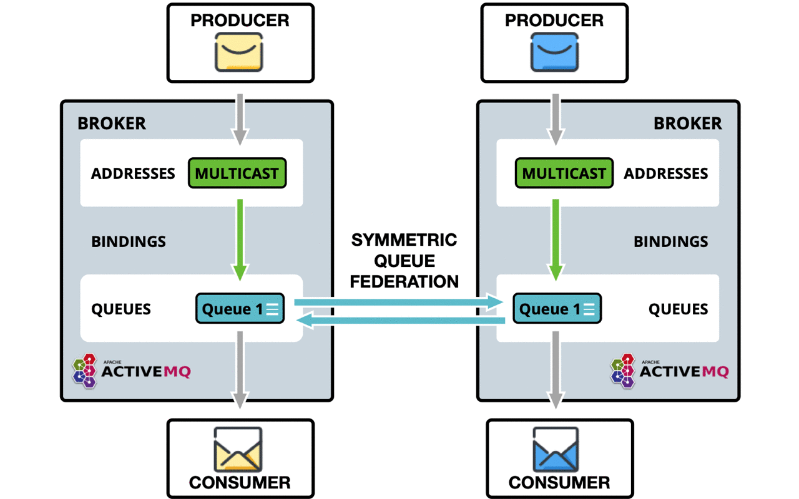
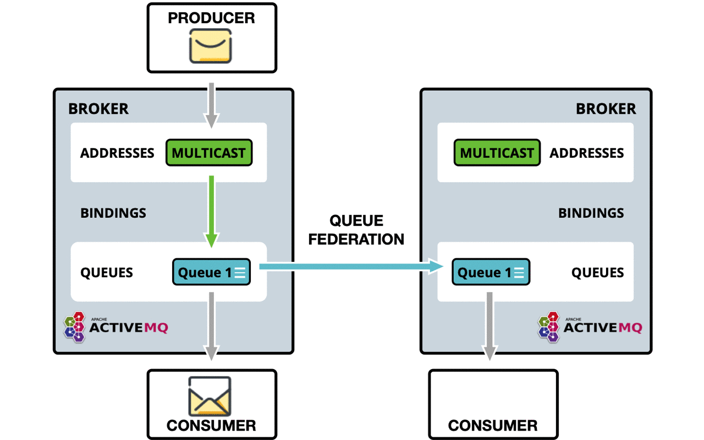

# Queue Federation

## Introduction 

This feature provides a way of balancing the load of a single queue across remote brokers.
 
A federated queue links to other queues (called upstream queues). It will retrieve messages from upstream queues in order to satisfy demand for messages from local consumers. 
The upstream queues do not need to be reconfigured and they do not have to be on the same broker or in the same cluster.

All of the configuration needed to establish the upstream links and the federated queue is in the downstream broker.


### Use Cases

This is not an exhaustive list of what you can do with and the benefits of federated queues, but simply some ideas.

* Higher capacity 

  By having a "logical" queue distributed over many brokers. Each broker would declare a federated queue with all the other federated queues upstream. (The links would form a complete bi-directional graph on n queues.)

By having this a logical distributed queue is capable of having a much higher capacity than a single queue on a single broker. 
When will perform best when there is some degree of locality.
  
e.g. as many messages as possible are consumed from the same broker as they were published to, where federation only needs to move messages around in order to perform load balancing.




* Supporting multi region or venue

  In a multi region setup you may have producers in one region or venue and the consumer in another. 
  typically you want producers and consumer to keep their connections local to the region, in such as case you can deploy brokers in each region where producers and consumer are, and use federation to move messages over the WAN between regions.
  



* Communication between the secure enterprise lan and the DMZ.
 
   Where a number of producer apps maybe in the DMZ and a number of consumer apps in the secure enterprise lan, it may not suitable to allow the producers to connect through to the broker in the secure enterprise lan. 
   
   In this scenario you could deploy a broker in the DMZ where the producers publish to, and then have the broker in the enterprise lan connect out to the DMZ broker and federate the queues so that messages can traverse. 
   
   This is similar to supporting multi region or venue.


* Migrating between two clusters. 
    Consumers and publishers can be moved in any order and the messages won't be duplicated (which is the case if you do exchange federation). Instead, messages are transferred to the new cluster when your consumers are there. 
    Here for such a migration with blue/green or canary moving a number of consumers on the same queue, you may want to set the `priority-adjustment` to 0, or even a positive value, so message would actively flow to the federated queue.


## Configuring Queue Federation

Federation is configured in `broker.xml`.

Sample Queue Federation setup:


```
<federations>
    <federation name="eu-north-1" user="federation_username" password="32a10275cf4ab4e9">
        <upstream name="eu-east-1">
           <static-connectors>
              <connector-ref>eu-east-connector1</connector-ref>
              <connector-ref>eu-east-connector1</connector-ref>
           </static-connectors>
           <policy ref="news-queue-federation"/>
        </upstream>
        <upstream name="eu-west-1" >
           <static-connectors>
              <connector-ref>eu-west-connector1</connector-ref>
              <connector-ref>eu-west-connector1</connector-ref>
           </static-connectors>
           <policy ref="news-queue-federation"/>
        </upstream>
        
        <queue-policy name="news-queue-federation" priority-adjustment="-5" include-federated="true" transformer-ref="federation-transformer-3">
           <include queue-match="#" address-match="queue.bbc.new" />
           <include queue-match="#" address-match="queue.usatoday" />
           <include queue-match="#" address-match="queue.news.#" />
        
           <exclude queue-match="#.local" address-match="#" />
        </queue-policy>
        
        <transformer name="news-transformer">
           <class-name>org.foo.NewsTransformer</class-name>
           <property key="key1" value="value1"/>
           <property key="key2" value="value2"/>
        </transformer>
    </federation>
</federations>

```

In the above setup downstream broker `eu-north-1` is configured to connect to two upstream brokers `eu-east-1` and `eu-east-2`, the credentials used for both connections to both brokers in this sample are shared, you can set user and password at the upstream level should they be different per upstream.

Both upstreams are configured with the same queue-policy `news-queue-federation`, that is selecting addresses which match any of the include criteria, but will exclude any queues that end with `.local`, keeping these as local queues only.

**It is important that federation name is globally unique.**


Let's take a look at all the `queue-policy` parameters in turn, in order of priority.

- `name` attribute. All address-policies must have a unique name in the server.

- `include` the address-match pattern to whitelist addresses, multiple of these can be set. If none are set all addresses are matched.

- `exclude` the address-match pattern to blacklist addresses, multiple of these can be set.

- `priority-adjustment` when a consumer attaches its priority is used to make the upstream consumer, 
but with an adjustment by default -1, so that local consumers get load balanced first over remote, this enables this to be configurable should it be wanted/needed. 

- `include-federated` by default this is false, we dont federate a federated consumer, this is to avoid issue, where in symmetric or any closed loop setup you could end up when no "real" consumers attached with messages flowing round and round endlessly. 

    There is though a valid case that if you dont have a close loop setup e.g. three brokers in a chain (A->B->C) with producer at broker A and consumer at C, you would want broker B to re-federate the consumer onto A.

- `transformer-ref`. The ref name for a transformer (see transformer config) that you may wish to configure to transform the message on federation transfer.

**note** `address-policy`'s and `queue-policy`'s are able to be defined in the same federation, and be linked to the same upstream.


Now look at all the `transformer` parameters in turn, in order of priority:

- `name` attribute. This must be a unique name in the server, and is used to ref the transformer in `address-policy` and `queue-policy`

- `transformer-class-name`. An optional transformer-class-name can be
  specified. This is the name of a user-defined class which implements the
  `org.apache.activemq.artemis.core.server.transformer.Transformer` interface.

  If this is specified then the transformer's `transform()` method will be
  invoked with the message before it is transferred. This gives you the opportunity
  to transform the message's header or body before it is federated.
  
- `property` holds key, value pairs that can be used to configure the transformer.


Finally look at `upstream`, this is what defines the upstream broker connection and the policies to use against it.

- `name` attribute. This must be a unique name in the server, and is used to ref the transformer in `address-policy` and `queue-policy`

- `user`. This optional attribute determines the user name to use when creating
  the upstream connection to the remote server. If it is not specified the shared
  federation user and password will be used if set.

- `password`. This optional attribute determines the password to use when
  creating the upstream connection to the remote server. If it is not specified the shared
  federation user and password will be used if set.

- `static-connectors` or `discovery-group-ref`. Pick either of these options to
  connect the bridge to the target server.

  The `static-connectors` is a list of `connector-ref` elements pointing to
  `connector` elements defined elsewhere. A *connector* encapsulates knowledge of
  what transport to use (TCP, SSL, HTTP etc) as well as the server connection
  parameters (host, port etc). For more information about what connectors are and
  how to configure them, please see [Configuring the
  Transport](configuring-transports.md).

  The `discovery-group-ref` element has one attribute - `discovery-group-name`.
  This attribute points to a `discovery-group` defined elsewhere. For more
  information about what discovery-groups are and how to configure them, please
  see [Discovery Groups](clusters.md).


- `ha`. This optional parameter determines whether or not this bridge should
  support high availability. True means it will connect to any available server
  in a cluster and support failover. The default value is `false`.
  
- `circuit-breaker-timeout` in milliseconds, When a connection issue occurs, 
as the single connection is shared by many federated queue and address consumers, 
to avoid each one trying to reconnect and possibly causing a thrundering heard issue, 
the first one will try, if unsuccessful the circuit breaker will open, 
returning the same exception to all, this is the timeout until the circuit can be closed and connection retried.

