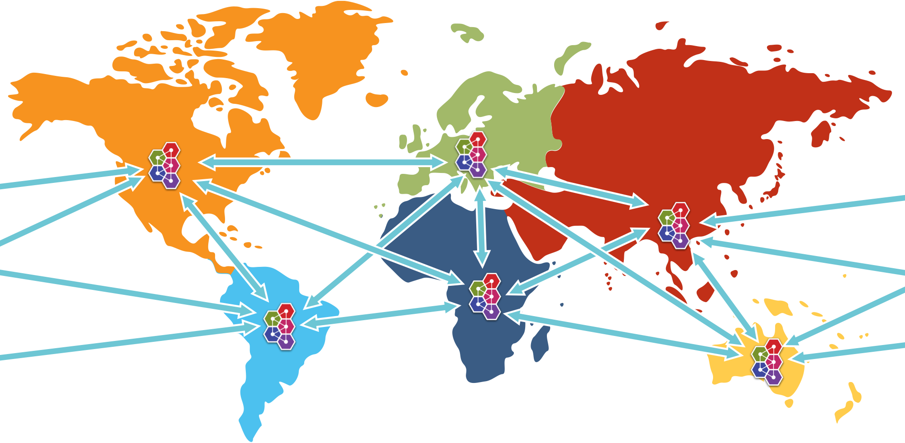

# Federation

## Introduction 

Federation allows transmission of messages between brokers without requiring clustering. 

A federated address can replicate messages published from an upstream address to a local address. 
n.b. This is only supported with multicast addresses.

A federated queue lets a local consumer receive messages from an upstream queue.

A broker can contain federated and local-only components - you don't need to federate everything if you don't want to. 


### Benefits

##### WAN 

The source and target servers do not have to be in the same cluster which makes
federation suitable for reliably sending messages from one cluster to another,
for instance across a WAN, between cloud regions or there internet and where the 
connection may be unreliable.

Federation has built in resilience to failure so if the target server
connection is lost, e.g. due to network failure, federation will retry
connecting to the target until it comes back online. When it comes back online
it will resume operation as normal.

##### Loose Coupling of Brokers

Federation can transmit messages between brokers (or clusters) in different administrative domains:
* they may have different configuration, users and setup;
* they may run on different versions of ActiveMQ Artemis

##### Dynamic and Selective

Federation is applied by policies, that match address and queue names, and then apply. 

This means that federation can dynamically be applied as queues or addresses are added and removed, 
without needing to hard configure each and every one.

Like wise policies are selective, in that they apply with multiple include and exclude matches.

Mutliple policies can applied directly to multiple upstreams, 
as well policies can be grouped into policy sets and then applied to upstreams to make managing easier.


## Address Federation

Address federation is like full multicast over the connected brokers, in that every message sent to address on `Broker-A` will be delivered to every queue on that broker, but like wise will be delivered to `Broker-B` and all attached queues there.


Figure 1. Address Federation

For further details please goto [Address Federation](federation-address.md).


## Queue Federation

Effectively, all federated queues act as a single logical queue, with multiple receivers on multiple machines. 
So federated queues can be used for load balancing. Typically if the brokers are in the same AZ you would look to cluster them, the advantage of queue federation is that it does not require clustering so is suitable for over WAN, cross-region, on-off prem.


Figure 2. Queue Federation

For further details please goto [Queue Federation](federation-queue.md).


## WAN Full Mesh

With federation it is possible to provide a WAN mesh of brokers, replicating with Address Federation or routing and load balancing with Queue Federation. 

Linking producers and consumers distant from each other.


Figure 3. Example possible full federation mesh


## Configuring Federation

Federation is configured in `broker.xml`.

Sample:

```xml
<federations>
    <federation name="eu-north-1-federation">
        <upstream name="eu-west-1" user="westuser" password="32a10275cf4ab4e9">
           <static-connectors>
              <connector-ref>connector1</connector-ref>
           </static-connectors>
           <policy ref="policySetA"/>
        </upstream>
        <upstream name="eu-east-1" user="eastuser" password="32a10275cf4ab4e9">
           <discovery-group-ref discovery-group-name="ue-west-dg"/>
           <policy ref="policySetA"/>
        </upstream>
        
        <policy-set name="policySetA">
           <policy ref="address-federation" />
           <policy ref="queue-federation" />
        </policy-set>
        
        <queue-policy name="queue-federation" >
           <exclude queue-match="federated_queue" address-match="#" />
        </queue-policy>

        <address-policy name="address-federation" >
           <include address-match="federated_address" />
        </address-policy>
    </federation>
</federations>
```

In the above example we have shown the basic key parameters needed to configure
federation for a queue and address to multiple upstream. 

The example shows a broker `eu-north-1` connecting to two upstream brokers `eu-east-1` and `eu-west-1`, 
and applying queue federation to queue `federated_queue` , and also applying address federation to `federated_address`.

**It is important that federation name is globally unique.**

There are many configuration options that you can apply these are detailed in the individual docs for [Address Federation](federation-address.md) and   [Queue Federation](federation-queue.md).