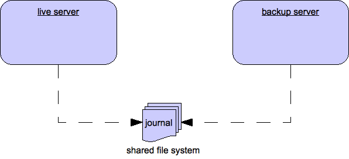
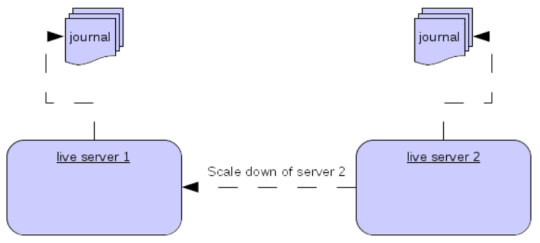

# High Availability and Failover

We define high availability as the *ability for the system to continue
functioning after failure of one or more of the servers*.

A part of high availability is *failover* which we define as the
*ability for client connections to migrate from one server to another in
event of server failure so client applications can continue to operate*.

## Live - Backup Groups

Apache ActiveMQ Artemis allows servers to be linked together as *live - backup* groups
where each live server can have 1 or more backup servers. A backup
server is owned by only one live server. Backup servers are not
operational until failover occurs, however 1 chosen backup, which will
be in passive mode, announces its status and waits to take over the live
servers work

Before failover, only the live server is serving the Apache ActiveMQ Artemis clients
while the backup servers remain passive or awaiting to become a backup
server. When a live server crashes or is brought down in the correct
mode, the backup server currently in passive mode will become live and
another backup server will become passive. If a live server restarts
after a failover then it will have priority and be the next server to
become live when the current live server goes down, if the current live
server is configured to allow automatic failback then it will detect the
live server coming back up and automatically stop.

### HA Policies

Apache ActiveMQ Artemis supports two different strategies for backing up a server
*shared store* and *replication*. Which is configured via the
`ha-policy` configuration element.

```xml
<ha-policy>
   <replication/>
</ha-policy>
```


or

```xml
<ha-policy>
   <shared-store/>
</ha-policy>
```

As well as these 2 strategies there is also a 3rd called `live-only`.
This of course means there will be no Backup Strategy and is the default
if none is provided, however this is used to configure `scale-down`
which we will cover in a later chapter.

> **Note:**
>
> The `ha-policy` configurations replaces any current HA configuration
> in the root of the `broker.xml` configuration. All old
> configuration is now deprecated although best efforts will be made to
> honour it if configured this way.

> **Note:**
>
> Only persistent message data will survive failover. Any non persistent
> message data will not be available after failover.

The `ha-policy` type configures which strategy a cluster should use to
provide the backing up of a servers data. Within this configuration
element is configured how a server should behave within the cluster,
either as a master (live), slave (backup) or colocated (both live and
backup). This would look something like:

```xml
<ha-policy>
   <replication>
      <master/>
   </replication>
</ha-policy>
```

or

```xml
<ha-policy>
   <shared-store>
      <slave/>
   </shared-store>
</ha-policy>
```

or

```xml
<ha-policy>
   <replication>
      <colocated/>
   </replication>
</ha-policy>
```

*Replication* allows too to configure 2 new roles to enable *pluggable quorum* provider configuration, by using:
```xml
<ha-policy>
   <replication>
      <primary/>
   </replication>
</ha-policy>
```
to configure the classic *master* role, and
```xml
<ha-policy>
   <replication>
      <backup/>
   </replication>
</ha-policy>
```
for the classic *slave* one.

If *replication* is configured using such new roles some additional element is required to complete configuration, detailed later.

### IMPORTANT NOTE ON PLUGGABLE QUORUM VOTE FEATURE

This feature is still **EXPERIMENTAL** and not meant to be run in production yet.

It means:
- its configuration can change until declared as **officially stable**
- it has to solve yet an inherent data misalignment issue with replication (it can happen with `classic` replication as well)

More info about this issue are on [ARTEMIS-3340](https://issues.apache.org/jira/browse/ARTEMIS-3340). 

### Data Replication

When using replication, the live and the backup servers do not share the
same data directories, all data synchronization is done over the
network. Therefore all (persistent) data received by the live server
will be duplicated to the backup.


Notice that upon start-up the backup server will first need to
synchronize all existing data from the live server before becoming
capable of replacing the live server should it fail. So unlike when
using shared storage, a replicating backup will not be a fully
operational backup right after start-up, but only after it finishes
synchronizing the data with its live server. The time it will take for
this to happen will depend on the amount of data to be synchronized and
the connection speed.

> **Note:**
>
> In general, synchronization occurs in parallel with current network traffic so
> this won't cause any blocking on current clients. However, there is a critical
> moment at the end of this process where the replicating server must complete
> the synchronization and ensure the replica acknowledges this completion. This
> exchange between the replicating server and replica will block any journal
> related operations. The maximum length of time that this exchange will block
> is controlled by the `initial-replication-sync-timeout` configuration element.

Replication will create a copy of the data at the backup. One issue to
be aware of is: in case of a successful fail-over, the backup's data
will be newer than the one at the live's storage. If you configure your
live server to perform a failback to live server when restarted, it will synchronize its data
with the backup's. If both servers are shutdown, the administrator will
have to determine which one has the latest data.

The replicating live and backup pair must be part of a cluster. The
Cluster Connection also defines how backup servers will find the remote
live servers to pair with. Refer to [Clusters](clusters.md) for details on how this is done,
and how to configure a cluster connection. Notice that:

- Both live and backup servers must be part of the same cluster.
  Notice that even a simple live/backup replicating pair will require
  a cluster configuration.

- Their cluster user and password must match.

Within a cluster, there are two ways that a backup server will locate a
live server to replicate from, these are:

- `specifying a node group`. You can specify a group of live servers
  that a backup server can connect to. This is done by configuring
  `group-name` in either the `master` or the `slave` element of the
  `broker.xml`. A Backup server will only connect to a
  live server that shares the same node group name

- `connecting to any live`. This will be the behaviour if `group-name`
  is not configured allowing a backup server to connect to any live
  server

> **Note:**
>
> A `group-name` example: suppose you have 5 live servers and 6 backup
> servers:
>
> - `live1`, `live2`, `live3`: with `group-name=fish`
>
> - `live4`, `live5`: with `group-name=bird`
>
> - `backup1`, `backup2`, `backup3`, `backup4`: with `group-name=fish`
>
> - `backup5`, `backup6`: with `group-name=bird`
>
> After joining the cluster the backups with `group-name=fish` will
> search for live servers with `group-name=fish` to pair with. Since
> there is one backup too many, the `fish` will remain with one spare
> backup.
>
> The 2 backups with `group-name=bird` (`backup5` and `backup6`) will
> pair with live servers `live4` and `live5`.

The backup will search for any live server that it is configured to
connect to. It then tries to replicate with each live server in turn
until it finds a live server that has no current backup configured. If
no live server is available it will wait until the cluster topology
changes and repeats the process.

> **Note:**
>
> This is an important distinction from a shared-store backup, if a
> backup starts and does not find a live server, the server will just
> activate and start to serve client requests. In the replication case,
> the backup just keeps waiting for a live server to pair with. Note
> that in replication the backup server does not know whether any data
> it might have is up to date, so it really cannot decide to activate
> automatically. To activate a replicating backup server using the data
> it has, the administrator must change its configuration to make it a
> live server by changing `slave` to `master`.

Much like in the shared-store case, when the live server stops or
crashes, its replicating backup will become active and take over its
duties. Specifically, the backup will become active when it loses
connection to its live server. This can be problematic because this can
also happen because of a temporary network problem.

This issue is solved in 2 different ways depending on which replication roles are configured:
- **classic replication** (`master`/`slave` roles): backup will try to determine whether it still can
connect to the other servers in the cluster. If it can connect to more
than half the servers, it will become active, if more than half the
servers also disappeared with the live, the backup will wait and try
reconnecting with the live. This avoids a split brain situation.
- **pluggable quorum vote replication** (`primary`/`backup` roles): backup relies on a pluggable quorum provider 
  (configurable via `manager` xml element) to detect if there's any active live.
  
> ***NOTE***
> 
> A backup in the **pluggable quorum vote replication** still need to carefully configure
> [connection-ttl](connection-ttl.md) in order to promptly issue a request to become live to the quorum service
> before failing-over. 

#### Configuration

To configure a classic replication's live and backup servers to be a replicating pair,
configure the live server in ' `broker.xml` to have:

```xml
<ha-policy>
   <replication>
      <master/>
   </replication>
</ha-policy>
...
<cluster-connections>
   <cluster-connection name="my-cluster">
      ...
   </cluster-connection>
</cluster-connections>
```

The backup server must be similarly configured but as a `slave`

```xml
<ha-policy>
   <replication>
      <slave/>
   </replication>
</ha-policy>
```

To configure a pluggable quorum replication's primary and backup instead:

```xml
<ha-policy>
   <replication>
      <primary/>
   </replication>
</ha-policy>
...
<cluster-connections>
   <cluster-connection name="my-cluster">
      ...
   </cluster-connection>
</cluster-connections>
```
and
```xml
<ha-policy>
   <replication>
      <backup/>
   </replication>
</ha-policy>
```

#### All Replication Configuration

The following table lists all the `ha-policy` configuration elements for
HA strategy Replication for `master`:

- `check-for-live-server`

Whether to check the cluster for a (live) server using our own server
ID when starting up. This is an important option to avoid split-brain
when failover happens and the master is restarted. Default is `false`.

- `cluster-name`

Name of the cluster configuration to use for replication. This setting
is only necessary if you configure multiple cluster connections. If
configured then the connector configuration of the cluster
configuration with this name will be used when connecting to the
cluster to discover if a live server is already running, see
`check-for-live-server`. If unset then the default cluster connections
configuration is used (the first one configured).

- `group-name`

If set, backup servers will only pair with live servers with matching
group-name.

- `initial-replication-sync-timeout`

The amount of time the replicating server will wait at the completion of
the initial replication process for the replica to acknowledge it has
received all the necessary data. The default is 30,000 milliseconds.
**Note:** during this interval any journal related operations will be
blocked.

The following table lists all the `ha-policy` configuration elements for
HA strategy Replication for `slave`:

- `cluster-name`

Name of the cluster configuration to use for replication. This setting
is only necessary if you configure multiple cluster connections. If
configured then the connector configuration of the cluster
configuration with this name will be used when connecting to the
cluster to discover if a live server is already running, see
`check-for-live-server`. If unset then the default cluster connections
configuration is used (the first one configured).

- `group-name`

If set, backup servers will only pair with live servers with matching
group-name

- `max-saved-replicated-journals-size`

This specifies how many times a replicated backup server can restart
after moving its files on start. Once there are this number of backup
journal files the server will stop permanently after if fails back.

- `allow-failback`

Whether a server will automatically stop when another places a request
to take over its place. The use case is when the backup has failed
over.

- `initial-replication-sync-timeout`

After failover and the slave has become live, this is set on the new
live server. It represents the amount of time the replicating server
will wait at the completion of the initial replication process for the
replica to acknowledge it has received all the necessary data. The
default is 30,000 milliseconds. **Note:** during this interval any
journal related operations will be blocked.

#### Pluggable Quorum Vote Replication configurations
Pluggable Quorum Vote replication configuration options are a bit different 
from classic replication, mostly because of its customizable nature.

[Apache curator](https://curator.apache.org/) is used by the default quorum provider.

Below some example configurations to show how it works.

For `primary`:
```xml
      <ha-policy>
         <replication>
            <primary>
               <manager>
                  <class-name>org.apache.activemq.artemis.quorum.zookeeper.CuratorDistributedPrimitiveManager</class-name>
                  <properties>
                     <property key="connect-string" value="127.0.0.1:6666,127.0.0.1:6667,127.0.0.1:6668"/>
                  </properties>
               </manager>
               <check-for-live-server>true</check-for-live-server>
            </primary>
         </replication>
      </ha-policy>
```
And `backup`:
```xml
      <ha-policy>
         <replication>
            <backup>
               <manager>
                  <class-name>org.apache.activemq.artemis.quorum.zookeeper.CuratorDistributedPrimitiveManager</class-name>
                  <properties>
                     <property key="connect-string" value="127.0.0.1:6666,127.0.0.1:6667,127.0.0.1:6668"/>
                  </properties>
               </manager>
               <allow-failback>true</allow-failback>
            </backup>
         </replication>
      </ha-policy>
```
The configuration of `class-name` as follows
```xml
<class-name>org.apache.activemq.artemis.quorum.zookeeper.CuratorDistributedPrimitiveManager</class-name>
```
isn't really needed, because Apache Curator is the default provider, but has been shown for completeness.

The `properties` element, instead
```xml
   <properties>
      <property key="connect-string" value="127.0.0.1:6666,127.0.0.1:6667,127.0.0.1:6668"/>
   </properties>
```
Can specify a list of `property` elements in the form of key-value pairs, depending the ones
accepted by the specified `class-name` provider.

Apache Curator's provider allow to configure these properties:

- [`connect-string`](https://curator.apache.org/apidocs/org/apache/curator/framework/CuratorFrameworkFactory.Builder.html#connectString(java.lang.String)): (no default)
- [`session-ms`](https://curator.apache.org/apidocs/org/apache/curator/framework/CuratorFrameworkFactory.Builder.html#sessionTimeoutMs(int)): (default is 18000 ms)   
- [`session-percent`](https://curator.apache.org/apidocs/org/apache/curator/framework/CuratorFrameworkFactory.Builder.html#simulatedSessionExpirationPercent(int)): (default is 33); should be <= default, 
  see https://cwiki.apache.org/confluence/display/CURATOR/TN14 for more info
- [`connection-ms`](https://curator.apache.org/apidocs/org/apache/curator/framework/CuratorFrameworkFactory.Builder.html#connectionTimeoutMs(int)): (default is 8000 ms)
- [`retries`](https://curator.apache.org/apidocs/org/apache/curator/retry/RetryNTimes.html#%3Cinit%3E(int,int)): (default is 1)
- [`retries-ms`](https://curator.apache.org/apidocs/org/apache/curator/retry/RetryNTimes.html#%3Cinit%3E(int,int)): (default is 1000 ms)
- [`namespace`](https://curator.apache.org/apidocs/org/apache/curator/framework/CuratorFrameworkFactory.Builder.html#namespace(java.lang.String)): (no default)

Configuration of the [Apache Zookeeper](https://zookeeper.apache.org/) nodes is left to the user, but there are few 
**suggestions to improve the reliability of the quorum service**:
- broker `session_ms` must be `>= 2 * server tick time` and `<= 20 * server tick time` as by 
  [Zookeeper 3.6.3 admin guide](https://zookeeper.apache.org/doc/r3.6.3/zookeeperAdmin.html): it directly impacts how fast a backup
  can failover to an isolated/killed/unresponsive live; the higher, the slower.
- GC on broker machine should allow keeping GC pauses within 1/3 of `session_ms` in order to let the Zookeeper heartbeat protocol
to work reliably: if it's not possible, better increase `session_ms` accepting a slower failover
- Zookeeper must have enough resources to keep GC (and OS) pauses much smaller than server tick time: please consider carefully if 
  broker and Zookeeper node should share the same physical machine, depending on the expected load of the broker
- network isolation protection requires configuring >=3 Zookeeper nodes

#### *Important*: Notes on pluggable quorum replication configuration 
 
The first `classic` replication configuration that won't apply to the pluggable quorum replication
is `vote-on-replication-failure` and configure it produces a startup error: pluggable quorum replication
always behave like `vote-on-replication-failure` `true` ie shutting down a live broker (and its JVM) in case of quorum loss.

The second deprecated `classic` replication configuration is `quorum-vote-wait`: given that the pluggable quorum vote replication
requires backup to have an always-on reliable quorum service, there's no need to specify the timeout to reach
the majority of quorum nodes. A backup remains inactive (ie JVM still up, console too, unable to sync with live, to failover etc etc)
until the majority of quorum nodes is reachable again, re-activating if happens.

The only exception is with primary failing-back to an existing live backup using `<allow-failback>true</allow-failback>`: 
if the quorum service isn't immediately available the primary (and its JVM) just stop, allowing fail-fast failing-back.

There are few *semantic differences* of other existing properties:
- `vote-retry-wait`: in `classic` replication means how long to wait between each quorum vote try, while with pluggable quorum replication 
  means how long request to failover for each attempt  
- `vote-retries`: differently from `classic`, the amount of vote attempt is `1 + vote-retries` (with classic is just `vote-retries`). 
  Setting `0` means no retries, leaving backup to still perform an initial attempt.   
  
**Notes on replication configuration with [Apache curator](https://curator.apache.org/) quorum provider**

As said some paragraphs above, `session-ms` affect the failover duration: a backup can 
failover after `session-ms` expires or if the live broker voluntary give up its role 
eg during a fail-back/manual broker stop, it happens immediately.

For the former case (session expiration with live no longer present), the backup broker can detect an unresponsive live by using:
1. cluster connection PINGs (affected by [connection-ttl](connection-ttl.md) tuning)
2. closed TCP connection notification (depends by TCP configuration and networking stack/topology)

These 2 cases have 2 different failover duration depending on different factors:
1. `connection-ttl` affect how much time of the expiring `session-ms` is used to just detect a missing live broker: the higher `connection-tt`, 
   the slower it reacts; backup can attempt to failover for the remaining `session-ms - connection-ttl` 
2. `session-ms` expiration is immediately detected: backup must try to failover for >=`session-ms` to be sure to catch 
   the session expiration and complete failover  
   
The previous comments are meant to suggest to the careful reader that the minimum time to attempt to failover 
cannot be below the full `session-ms` expires.
In short, it means
```
  total failover attempt time > session-ms  
```
with 
```
  total failover attempt time = vote-retry-wait * (vote-retries + 1)
```
and by consequence:
```
  vote-retry-wait * (vote-retries + 1) > session-ms
```
For example with `session-ms = 18000 ms`, safe values for failover timeout are:
```xml
 <vote-retries>11</vote-retries>
 <vote-retry-wait>2000</vote-retry-wait>
```
Because `11 * 2000 = 22000 ms` that's bigger then `18000 ms`.

There's no risk that a backup broker will early stop attempting to failover, losing its chance to become live.

### Shared Store

When using a shared store, both live and backup servers share the *same*
entire data directory using a shared file system. This means the paging
directory, journal directory, large messages and binding journal.

When failover occurs and a backup server takes over, it will load the
persistent storage from the shared file system and clients can connect
to it.

This style of high availability differs from data replication in that it
requires a shared file system which is accessible by both the live and
backup nodes. Typically this will be some kind of high performance
Storage Area Network (SAN). We do not recommend you use Network Attached
Storage (NAS), e.g. NFS mounts to store any shared journal (NFS is
slow).

The advantage of shared-store high availability is that no replication
occurs between the live and backup nodes, this means it does not suffer
any performance penalties due to the overhead of replication during
normal operation.

The disadvantage of shared store replication is that it requires a
shared file system, and when the backup server activates it needs to
load the journal from the shared store which can take some time
depending on the amount of data in the store.

If you require the highest performance during normal operation, have
access to a fast SAN and live with a slightly slower failover (depending
on amount of data).



#### Configuration

To configure the live and backup servers to share their store, configure
id via the `ha-policy` configuration in `broker.xml`:

```xml
<ha-policy>
   <shared-store>
      <master/>
   </shared-store>
</ha-policy>
...
<cluster-connections>
   <cluster-connection name="my-cluster">
      ...
   </cluster-connection>
</cluster-connections>
```

The backup server must also be configured as a backup.

```xml
<ha-policy>
   <shared-store>
      <slave/>
   </shared-store>
</ha-policy>
```

In order for live - backup groups to operate properly with a shared
store, both servers must have configured the location of journal
directory to point to the *same shared location* (as explained in [Configuring the message journal](persistence.md))

> **Note:**
>
> todo write something about GFS

Also each node, live and backups, will need to have a cluster connection
defined even if not part of a cluster. The Cluster Connection info
defines how backup servers announce there presence to its live server or
any other nodes in the cluster. Refer to [Clusters](clusters.md) for details on how this is
done.

### Failing Back to live Server

After a live server has failed and a backup taken has taken over its
duties, you may want to restart the live server and have clients fail
back.

In case of "shared disk", simply restart the original live server and
kill the new live server. You can do this by killing the process itself.
Alternatively you can set `allow-fail-back` to `true` on the slave
config which will force the backup that has become live to automatically
stop. This configuration would look like:

```xml
<ha-policy>
   <shared-store>
      <slave>
         <allow-failback>true</allow-failback>
      </slave>
   </shared-store>
</ha-policy>
```

The same configuration option can be set for both replications, classic:
```xml
<ha-policy>
   <replication>
      <slave>
         <allow-failback>true</allow-failback>
      </slave>
   </replication>
</ha-policy>
```
and with pluggable quorum provider:
```xml
<ha-policy>
   <replication>
      <manager>
         <!-- some meaningful configuration -->
      </manager>
      <backup>
         <allow-failback>true</allow-failback>
      </backup>
   </replication>
</ha-policy>
```

In both replication HA mode you need to set an extra property
`check-for-live-server` to `true` in the `master`/`primary` configuration. If set
to true, during start-up a live server will first search the cluster for
another server using its nodeID. If it finds one, it will contact this
server and try to "fail-back". Since this is a remote replication
scenario, the "starting live" will have to synchronize its data with the
server running with its ID, once they are in sync, it will request the
other server (which it assumes it is a back that has assumed its duties)
to shutdown for it to take over. This is necessary because otherwise the
live server has no means to know whether there was a fail-over or not,
and if there was if the server that took its duties is still running or
not. To configure this option at your `broker.xml`
configuration file as follows, for classic replication:

```xml
<ha-policy>
   <replication>
      <master>
         <check-for-live-server>true</check-for-live-server>
      </master>
   </replication>
</ha-policy>
```

And pluggable quorum replication:

```xml
<ha-policy>
   <replication>
      <manager>
        <!-- some meaningful configuration -->
      </manager>
      <primary>
         <check-for-live-server>true</check-for-live-server>
      </primary>
   </replication>
</ha-policy>
```

The key difference from classic replication is that if `master` cannot reach any 
live server with its same nodeID, it's going straight to become live, while `primary` 
request it to the quorum provider, searching again for any existing live if 
the quorum provider is not available (eg connectivity loss, consensus absence) or 
if there's another live broker with the same nodeID alive, in an endless loop.

In short: a started `primary` cannot become live without consensus.

> **Warning**
>
> Be aware that if you restart a live server while after failover has
> occurred then `check-for-live-server` must be set to `true`. If not the live server
> will restart and server the same messages that the backup has already
> handled causing duplicates.

It is also possible, in the case of shared store, to cause failover to
occur on normal server shutdown, to enable this set the following
property to true in the `ha-policy` configuration on either the `master`
or `slave` like so:

```xml
<ha-policy>
   <shared-store>
      <master>
         <failover-on-shutdown>true</failover-on-shutdown>
      </master>
   </shared-store>
</ha-policy>
```

By default this is set to false, if by some chance you have set this to
false but still want to stop the server normally and cause failover then
you can do this by using the management API as explained at [Management](management.md)

You can also force the running live server to shutdown when the old live
server comes back up allowing the original live server to take over
automatically by setting the following property in the
`broker.xml` configuration file as follows:

```xml
<ha-policy>
   <shared-store>
      <slave>
         <allow-failback>true</allow-failback>
      </slave>
   </shared-store>
</ha-policy>
```

#### All Shared Store Configuration

The following table lists all the `ha-policy` configuration elements for
HA strategy shared store for `master`:

- `failover-on-shutdown`

  If set to true then when this server is stopped normally the backup will become live assuming failover. If false then the backup server will remain passive. Note that if false you want failover to occur the you can use the management API as explained at [Management](management.md).

- `wait-for-activation`

  If set to true then server startup will wait until it is activated. If set to false then server startup will be done in the background. Default is true.

The following table lists all the `ha-policy` configuration elements for
HA strategy Shared Store for `slave`:

- `failover-on-shutdown`

  In the case of a backup that has become live. then when set to true then when this server is stopped normally the backup will become liveassuming failover. If false then the backup server will remain passive. Note that if false you want failover to occur the you can use the management API as explained at [Management](management.md).

- `allow-failback`

  Whether a server will automatically stop when another places a request to take over its place. The use case is when the backup has failed over.

#### Colocated Backup Servers

It is also possible when running standalone to colocate backup servers
in the same JVM as another live server. Live Servers can be configured
to request another live server in the cluster to start a backup server
in the same JVM either using shared store or replication. The new backup
server will inherit its configuration from the live server creating it
apart from its name, which will be set to `colocated_backup_n` where n
is the number of backups the server has created, and any directories and
its Connectors and Acceptors which are discussed later on in this
chapter. A live server can also be configured to allow requests from
backups and also how many backups a live server can start. this way you
can evenly distribute backups around the cluster. This is configured via
the `ha-policy` element in the `broker.xml` file like
so:

```xml
<ha-policy>
   <replication>
      <colocated>
         <request-backup>true</request-backup>
         <max-backups>1</max-backups>
         <backup-request-retries>-1</backup-request-retries>
         <backup-request-retry-interval>5000</backup-request-retry-interval>
         <master/>
         <slave/>
      </colocated>
   </replication>
</ha-policy>
```


the above example is configured to use replication, in this case the
`master` and `slave` configurations must match those for normal
replication as in the previous chapter. `shared-store` is also supported


#### Configuring Connectors and Acceptors

If the HA Policy is colocated then connectors and acceptors will be
inherited from the live server creating it and offset depending on the
setting of `backup-port-offset` configuration element. If this is set to
say 100 (which is the default) and a connector is using port 61616 then
this will be set to 61716 for the first server created, 61816 for the
second, and so on.

> **Note:**
>
> for INVM connectors and Acceptors the id will have
> `colocated_backup_n` appended, where n is the backup server number.

#### Remote Connectors

It may be that some of the Connectors configured are for external
servers and hence should be excluded from the offset. for instance a
connector used by the cluster connection to do quorum voting for a
replicated backup server, these can be omitted from being offset by
adding them to the `ha-policy` configuration like so:

```xml
<ha-policy>
   <replication>
      <colocated>
         <excludes>
            <connector-ref>remote-connector</connector-ref>
         </excludes>
.........
</ha-policy>
```


#### Configuring Directories

Directories for the Journal, Large messages and Paging will be set
according to what the HA strategy is. If shared store the requesting
server will notify the target server of which directories to use. If
replication is configured then directories will be inherited from the
creating server but have the new backups name appended.

The following table lists all the `ha-policy` configuration elements for colocated policy:

- `request-backup`

  If true then the server will request a backup on another node

- `backup-request-retries`

  How many times the live server will try to request a backup, -1 means for ever.

- `backup-request-retry-interval`

  How long to wait for retries between attempts to request a backup server.

- `max-backups`

  How many backups a live server can create

- `backup-port-offset`

  The offset to use for the Connectors and Acceptors when creating a new backup server.

### Scaling Down

An alternative to using Live/Backup groups is to configure scaledown.
when configured for scale down a server can copy all its messages and
transaction state to another live server. The advantage of this is that
you dont need full backups to provide some form of HA, however there are
disadvantages with this approach the first being that it only deals with
a server being stopped and not a server crash. The caveat here is if you
configure a backup to scale down.

Another disadvantage is that it is possible to lose message ordering.
This happens in the following scenario, say you have 2 live servers and
messages are distributed evenly between the servers from a single
producer, if one of the servers scales down then the messages sent back
to the other server will be in the queue after the ones already there,
so server 1 could have messages 1,3,5,7,9 and server 2 would have
2,4,6,8,10, if server 2 scales down the order in server 1 would be
1,3,5,7,9,2,4,6,8,10.



The configuration for a live server to scale down would be something
like:

```xml
<ha-policy>
   <live-only>
      <scale-down>
         <connectors>
            <connector-ref>server1-connector</connector-ref>
         </connectors>
      </scale-down>
   </live-only>
</ha-policy>
```


In this instance the server is configured to use a specific connector to
scale down, if a connector is not specified then the first INVM
connector is chosen, this is to make scale down fromm a backup server
easy to configure. It is also possible to use discovery to scale down,
this would look like:

```xml
<ha-policy>
   <live-only>
      <scale-down>
         <discovery-group-ref discovery-group-name="my-discovery-group"/>
      </scale-down>
   </live-only>
</ha-policy>
```

#### Scale Down with groups

It is also possible to configure servers to only scale down to servers
that belong in the same group. This is done by configuring the group
like so:

```xml
<ha-policy>
   <live-only>
      <scale-down>
         ...
         <group-name>my-group</group-name>
      </scale-down>
   </live-only>
</ha-policy>
```

In this scenario only servers that belong to the group `my-group` will
be scaled down to

#### Scale Down and Backups

It is also possible to mix scale down with HA via backup servers. If a
slave is configured to scale down then after failover has occurred,
instead of starting fully the backup server will immediately scale down
to another live server. The most appropriate configuration for this is
using the `colocated` approach. it means as you bring up live server
they will automatically be backed up by server and as live servers are
shutdown, there messages are made available on another live server. A
typical configuration would look like:

```xml
<ha-policy>
   <replication>
      <colocated>
         <backup-request-retries>44</backup-request-retries>
         <backup-request-retry-interval>33</backup-request-retry-interval>
         <max-backups>3</max-backups>
         <request-backup>false</request-backup>
         <backup-port-offset>33</backup-port-offset>
         <master>
            <group-name>purple</group-name>
            <check-for-live-server>true</check-for-live-server>
            <cluster-name>abcdefg</cluster-name>
         </master>
         <slave>
            <group-name>tiddles</group-name>
            <max-saved-replicated-journals-size>22</max-saved-replicated-journals-size>
            <cluster-name>33rrrrr</cluster-name>
            <restart-backup>false</restart-backup>
            <scale-down>
               <!--a grouping of servers that can be scaled down to-->
               <group-name>boo!</group-name>
               <!--either a discovery group-->
               <discovery-group-ref discovery-group-name="wahey"/>
            </scale-down>
         </slave>
      </colocated>
   </replication>
</ha-policy>
```


#### Scale Down and Clients

When a server is stopping and preparing to scale down it will send a
message to all its clients informing them which server it is scaling
down to before disconnecting them. At this point the client will
reconnect however this will only succeed once the server has completed
scaledown. This is to ensure that any state such as queues or
transactions are there for the client when it reconnects. The normal
reconnect settings apply when the client is reconnecting so these should
be high enough to deal with the time needed to scale down.

## Failover Modes

Apache ActiveMQ Artemis defines two types of client failover:

- Automatic client failover

- Application-level client failover

Apache ActiveMQ Artemis also provides 100% transparent automatic reattachment of
connections to the same server (e.g. in case of transient network
problems). This is similar to failover, except it is reconnecting to the
same server and is discussed in [Client Reconnection and Session Reattachment](client-reconnection.md)

During failover, if the client has consumers on any non persistent or
temporary queues, those queues will be automatically recreated during
failover on the backup node, since the backup node will not have any
knowledge of non persistent queues.

### Automatic Client Failover

Apache ActiveMQ Artemis clients can be configured to receive knowledge of all live and
backup servers, so that in event of connection failure at the client -
live server connection, the client will detect this and reconnect to the
backup server. The backup server will then automatically recreate any
sessions and consumers that existed on each connection before failover,
thus saving the user from having to hand-code manual reconnection logic.

Apache ActiveMQ Artemis clients detect connection failure when it has not received
packets from the server within the time given by
`client-failure-check-period` as explained in section [Detecting Dead Connections](connection-ttl.md). If the client
does not receive data in good time, it will assume the connection has
failed and attempt failover. Also if the socket is closed by the OS,
usually if the server process is killed rather than the machine itself
crashing, then the client will failover straight away.

Apache ActiveMQ Artemis clients can be configured to discover the list of live-backup
server groups in a number of different ways. They can be configured
explicitly or probably the most common way of doing this is to use
*server discovery* for the client to automatically discover the list.
For full details on how to configure server discovery, please see [Clusters](clusters.md).
Alternatively, the clients can explicitly connect to a specific server
and download the current servers and backups see [Clusters](clusters.md).

To enable automatic client failover, the client must be configured to
allow non-zero reconnection attempts (as explained in [Client Reconnection and Session Reattachment](client-reconnection.md)).

By default failover will only occur after at least one connection has
been made to the live server. In other words, by default, failover will
not occur if the client fails to make an initial connection to the live
server - in this case it will simply retry connecting to the live server
according to the reconnect-attempts property and fail after this number
of attempts.

#### Failing over on the Initial Connection

Since the client does not learn about the full topology until after the
first connection is made there is a window where it does not know about
the backup. If a failure happens at this point the client can only try
reconnecting to the original live server. To configure how many attempts
the client will make you can set the URL parameter `initialConnectAttempts`.
The default for this is `0`, that is try only once. Once the number of
attempts has been made an exception will be thrown.

For examples of automatic failover with transacted and non-transacted
JMS sessions, please see [the examples](examples.md) chapter.

#### A Note on Server Replication

Apache ActiveMQ Artemis does not replicate full server state between live and backup
servers. When the new session is automatically recreated on the backup
it won't have any knowledge of messages already sent or acknowledged in
that session. Any in-flight sends or acknowledgements at the time of
failover might also be lost.

By replicating full server state, theoretically we could provide a 100%
transparent seamless failover, which would avoid any lost messages or
acknowledgements, however this comes at a great cost: replicating the
full server state (including the queues, session, etc.). This would
require replication of the entire server state machine; every operation
on the live server would have to replicated on the replica server(s) in
the exact same global order to ensure a consistent replica state. This
is extremely hard to do in a performant and scalable way, especially
when one considers that multiple threads are changing the live server
state concurrently.

It is possible to provide full state machine replication using
techniques such as *virtual synchrony*, but this does not scale well and
effectively serializes all operations to a single thread, dramatically
reducing concurrency.

Other techniques for multi-threaded active replication exist such as
replicating lock states or replicating thread scheduling but this is
very hard to achieve at a Java level.

Consequently it has decided it was not worth massively reducing
performance and concurrency for the sake of 100% transparent failover.
Even without 100% transparent failover, it is simple to guarantee *once
and only once* delivery, even in the case of failure, by using a
combination of duplicate detection and retrying of transactions. However
this is not 100% transparent to the client code.

#### Handling Blocking Calls During Failover

If the client code is in a blocking call to the server, waiting for a
response to continue its execution, when failover occurs, the new
session will not have any knowledge of the call that was in progress.
This call might otherwise hang for ever, waiting for a response that
will never come.

To prevent this, Apache ActiveMQ Artemis will unblock any blocking calls that were in
progress at the time of failover by making them throw a
`javax.jms.JMSException` (if using JMS), or a `ActiveMQException` with
error code `ActiveMQException.UNBLOCKED`. It is up to the client code to
catch this exception and retry any operations if desired.

If the method being unblocked is a call to commit(), or prepare(), then
the transaction will be automatically rolled back and Apache ActiveMQ Artemis will
throw a `javax.jms.TransactionRolledBackException` (if using JMS), or a
`ActiveMQException` with error code
`ActiveMQException.TRANSACTION_ROLLED_BACK` if using the core API.

#### Handling Failover With Transactions

If the session is transactional and messages have already been sent or
acknowledged in the current transaction, then the server cannot be sure
that messages sent or acknowledgements have not been lost during the
failover.

Consequently the transaction will be marked as rollback-only, and any
subsequent attempt to commit it will throw a
`javax.jms.TransactionRolledBackException` (if using JMS), or a
`ActiveMQException` with error code
`ActiveMQException.TRANSACTION_ROLLED_BACK` if using the core API.

> **Warning**
>
> The caveat to this rule is when XA is used either via JMS or through
> the core API. If 2 phase commit is used and prepare has already been
> called then rolling back could cause a `HeuristicMixedException`.
> Because of this the commit will throw a `XAException.XA_RETRY`
> exception. This informs the Transaction Manager that it should retry
> the commit at some later point in time, a side effect of this is that
> any non persistent messages will be lost. To avoid this use persistent
> messages when using XA. With acknowledgements this is not an issue
> since they are flushed to the server before prepare gets called.

It is up to the user to catch the exception, and perform any client side
local rollback code as necessary. There is no need to manually rollback
the session - it is already rolled back. The user can then just retry
the transactional operations again on the same session.

Apache ActiveMQ Artemis ships with a fully functioning example demonstrating how to do
this, please see [the examples](examples.md) chapter.

If failover occurs when a commit call is being executed, the server, as
previously described, will unblock the call to prevent a hang, since no
response will come back. In this case it is not easy for the client to
determine whether the transaction commit was actually processed on the
live server before failure occurred.

> **Note:**
>
> If XA is being used either via JMS or through the core API then an
> `XAException.XA_RETRY` is thrown. This is to inform Transaction
> Managers that a retry should occur at some point. At some later point
> in time the Transaction Manager will retry the commit. If the original
> commit has not occurred then it will still exist and be committed, if
> it does not exist then it is assumed to have been committed although
> the transaction manager may log a warning.

To remedy this, the client can simply enable duplicate detection ([Duplicate Message Detection](duplicate-detection.md)) in
the transaction, and retry the transaction operations again after the
call is unblocked. If the transaction had indeed been committed on the
live server successfully before failover, then when the transaction is
retried, duplicate detection will ensure that any durable messages
resent in the transaction will be ignored on the server to prevent them
getting sent more than once.

> **Note:**
>
> By catching the rollback exceptions and retrying, catching unblocked
> calls and enabling duplicate detection, once and only once delivery
> guarantees for messages can be provided in the case of failure,
> guaranteeing 100% no loss or duplication of messages.

#### Handling Failover With Non Transactional Sessions

If the session is non transactional, messages or acknowledgements can be
lost in the event of failover.

If you wish to provide *once and only once* delivery guarantees for non
transacted sessions too, enabled duplicate detection, and catch unblock
exceptions as described in [Handling Blocking Calls During Failover](ha.md)

### Getting Notified of Connection Failure

JMS provides a standard mechanism for getting notified asynchronously of
connection failure: `java.jms.ExceptionListener`. Please consult the JMS
javadoc or any good JMS tutorial for more information on how to use
this.

The Apache ActiveMQ Artemis core API also provides a similar feature in the form of the
class `org.apache.activemq.artemis.core.client.SessionFailureListener`

Any ExceptionListener or SessionFailureListener instance will always be
called by ActiveMQ Artemis on event of connection failure, **irrespective** of
whether the connection was successfully failed over, reconnected or
reattached, however you can find out if reconnect or reattach has
happened by either the `failedOver` flag passed in on the
`connectionFailed` on `SessionfailureListener` or by inspecting the
error code on the `javax.jms.JMSException` which will be one of the
following:

JMSException error codes

- `FAILOVER`

  Failover has occurred and we have successfully reattached or reconnected.

- `DISCONNECT`

  No failover has occurred and we are disconnected.

### Application-Level Failover

In some cases you may not want automatic client failover, and prefer to
handle any connection failure yourself, and code your own manually
reconnection logic in your own failure handler. We define this as
*application-level* failover, since the failover is handled at the user
application level.

To implement application-level failover, if you're using JMS then you
need to set an `ExceptionListener` class on the JMS connection. The
`ExceptionListener` will be called by Apache ActiveMQ Artemis in the event that
connection failure is detected. In your `ExceptionListener`, you would
close your old JMS connections, potentially look up new connection
factory instances from JNDI and creating new connections.

For a working example of application-level failover, please see [the Application-Layer Failover Example](examples.md#application-layer-failover).

If you are using the core API, then the procedure is very similar: you
would set a `FailureListener` on the core `ClientSession` instances.
