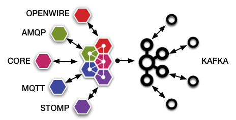

# Apache ActiveMQ Kafka Bridge

The function of a bridge is to consume messages from a source queue in Apache ActiveMQ Artemis, 
and forward them to a target topic, on a remote Apache Kafka server.

By pairing Apache ActiveMQ Artemis and Apache Kafka with the bridge you could have a hybrid broker setup, 
having a data flow with CORE, AMQP, MQTT clients, as well as now Kafka clients also. 
Taking and giving the best features of both broker technologies when and where needed for a flow of data.

The intent is this will be a two way bridge, but currently the flow is a single direction 
from Apache ActiveMQ Artemis to Apache Kafka

The source and target servers are remote making bridging suitable
for reliably sending messages from one Artemis cluster to Kafka, 
for instance across a WAN, to the cloud, or internet and where the connection may be unreliable.

The bridge has built in resilience to failure so if the target server
connection is lost, e.g. due to network failure, the bridge will retry
connecting to the target until it comes back online. When it comes back
online it will resume operation as normal.

In summary, Apache ActiveMQ Kafka Bridge is a way to reliably connect separate 
Apache ActiveMQ Artemis server and Apache Kafka server together.

## Configuring Kakfa Bridges

Bridges are configured in `broker.xml`.  
Let's kick off
with an example (this is actually from the Kafka Bridge test example):

    <connector-services>
         <connector-service name="my-kafka-bridge">
            <factory-class>org.apache.activemq.artemis.integration.kafka.bridge.KafkaProducerBridgeFactory</factory-class>
            <param key="bootstrap.servers" value="kafka-1.domain.local:9092,kafka-2.domain.local:9092,kafka-3.domain.local:9092" />
            <param key="queue-name" value="my.artemis.queue" />
            <param key="kafka-topic" value="my_kafka_topic" />
         </connector-service>
    </connector-services>

In the above example we have shown the required parameters to
configure for a kakfa bridge. See below for a complete list of available configuration options. 

### Serialization
By default the CoreMessageSerializer is used.

#### CoreMessageSerializer
Default but can be explicitly set using
           
    <param key="value.serializer" value="org.apache.activemq.artemis.integration.kafka.protocol.core.CoreMessageSerializer" />

This maps the Message properties to Record headers.
And then maps the payload binary as the Record value, encoding TextMessage

This makes it easy to consume from Kafka using default deserializers
TextMessage using StringDeserializer and
ByteMessage using BytesDeserializer.

Also to note, if you serialized your objects using binary serialization like Apache Avro, Apache Thrift etc. into a byte array for the ByteMessage, 
as that byte array is preserved in the record value part as is, you could deserialize using an equivalent deserializer 
direct to back into Avro Record / Thrift Struct. 

Also supplied are some Apache Kafka deserializers allowing you to consume from Apache Kafka 
and get a more familiar CoreMessage or JMSMessage, that your consumers can use:

`org.apache.activemq.artemis.integration.kafka.protocol.core.jms.CoreJmsMessageDeserializer`
`org.apache.activemq.artemis.integration.kafka.protocol.core.CoreMessageDeserializer`

You can get these Apache Kafka, Serializers/Deserializers via maven using the following GAV coordinates:

    <depedency>
       <groupId>org.apache.activemq</groupId>
       <artifactId>artemis-kafka-core-protocol</artifactId>
       <version>2.X.X</version>
    </depedency>

#### AMQPMessageSerializer
Can be set by using:
    
    <param key="value.serializer" value="org.apache.activemq.artemis.integration.kafka.protocol.amqp.AMQPMessageSerializer" />

This encodes the whole message into AMQP binary protocol into the Record value.

This is useful if you have something like

   https://github.com/EnMasseProject/amqp-kafka-bridge

As it allows messages to pump into Kafka in AMQP binary, to then consumed from Kafka by clients using AMQP binary protocol.

Also provided are Apache Qpid Proton based Apache Kafka deserializers allowing you to consume from 
Apache Kafka and get a Proton Message.

`org.apache.activemq.artemis.integration.kafka.protocol.amqp.proton.ProtonMessageDeserializer`

You can get these Apache Kafka, Serializers/Deserializers via maven using the following GAV coordinates:

    <depedency>
       <groupId>org.apache.activemq</groupId>
       <artifactId>artemis-kafka-amqp-protocol</artifactId>
       <version>2.X.X</version>
    </depedency>

#### Custom Serializer

You can actually provide your own custom serializer if the provided does not fit your needs.

By implement Kafka Serializer that takes a type of `org.apache.activemq.artemis.api.core.Message`

And then simply add your jar to the classpath of Apache ActiveMQ Artemis and set:

    <param key="value.serializer" value="org.foo.bar.MySerializer" />

### Full Configuration

In practice you might use many of the defaults
so it won't be necessary to specify them all but there addtiona.

All Kafka producer configs can be set using the same keys defined here:
https://kafka.apache.org/documentation/#producerconfigs

Now Let's take a look at all Kafka Bridge specific parameters in turn:

-   `name` attribute. All bridges must have a unique name in the server.

-   `queue-name`. This is the unique name of the local queue that the
    bridge consumes from, it's a mandatory parameter.

    The queue must already exist by the time the bridge is instantiated
    at start-up.

-   `kafka-topic`. This is the topic on the target Kafka server that
    the message will be forwarded to.

-   `filter-string`. An optional filter string can be supplied. If
    specified then only messages which match the filter expression
    specified in the filter string will be forwarded. The filter string
    follows the ActiveMQ Artemis filter expression syntax described in [Filter Expressions](filter-expressions.md).

-   `retry-interval`. This optional parameter determines the period in
    milliseconds between subsequent reconnection attempts, if the
    connection to the target server has failed. The default value is
    `2000`milliseconds.
    
-   `retry-max-interval`. This optional parameter determines the maximum 
    period in milliseconds between subsequent reconnection attempts, if the
    connection to the target server has failed. The default value is
    `30000`milliseconds.

-   `retry-interval-multiplier`. This optional parameter determines
    determines a multiplier to apply to the time since the last retry to
    compute the time to the next retry.

    This allows you to implement an *exponential backoff* between retry
    attempts.

    Let's take an example:

    If we set `retry-interval`to `1000` ms and we set
    `retry-interval-multiplier` to `2.0`, then, if the first reconnect
    attempt fails, we will wait `1000` ms then `2000` ms then `4000` ms
    between subsequent reconnection attempts.

    The default value is `1.0` meaning each reconnect attempt is spaced
    at equal intervals.

-   `retry-attempts`. This optional parameter determines the total
    number of retry attempts the Kafka bridge will make before giving up
    and shutting down. A value of `-1` signifies an unlimited number of
    attempts. The default value is `-1`.
