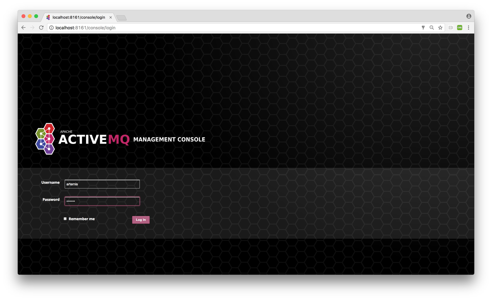
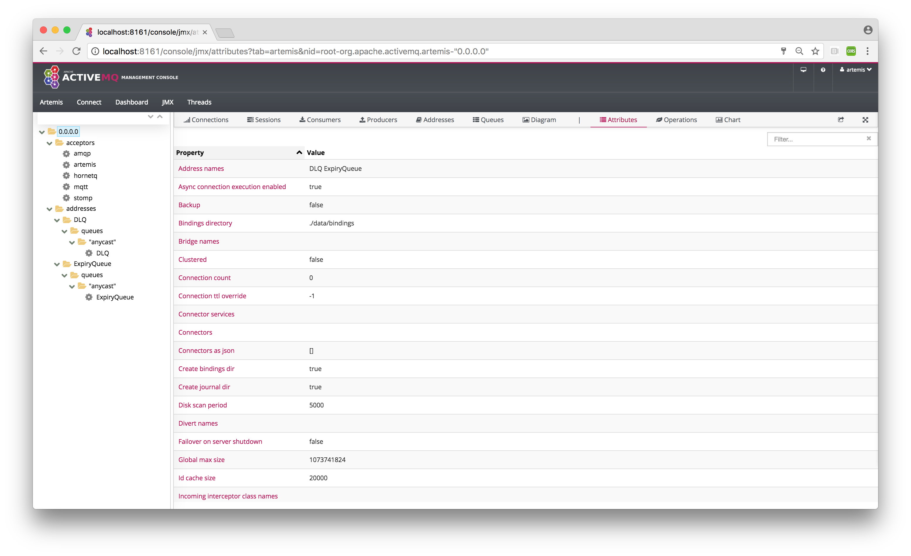

# Management Console

Apache ActiveMQ Artemis ships by default with a management console. It is powered by [Hawt.io](http://hawt.io).

Its purpose is to expose the [Management API](management.md "Management API") via a user friendly web ui. 

## Login

To access the management console use a browser and go to the URL [http://localhost:8161/console]().

A login screen will be presented, if your broker is secure, you will need to use a user with admin role, if it is unsecure simply enter any user/password.

## Security

That Jolokia JMX-HTTP bridge is secured via a policy file in the broker configuration directory: 'etc/jolokia-access.xml'.
The contents of that file should be modified as described in the [Jolokia Security Guide](https://jolokia.org/reference/html/security.html).
By default the console is locked down
to 'localhost', pay particular attention to the 'CORS' restrictions when exposing the console web endpoint over the network.

## Console

Once logged in you should be presented with a screen similar to.

#### Navigation Menu

On the top right is small menu area you will see some icons.

- `question mark` This will load the artemis documentation in the console main window
- `person` will provide a drop down menu with
- `about` this will load an about screen, here you will be able to see and validate versions
- `log out` self descriptive.

#### Navigation Tabs

Running below the Navigation Menu you will see several default feature tabs.
 
- `Artemis` This is the core tab for Apache ActiveMQ Artemis specific functionality. The rest of this document will focus on this.

- `Connect` This allows you to connect to a remote broker from the same console.

- `Dashboard` Here you can create and save graphs and tables of metrics available via JMX, a default jvm health dashboard is provided. 

- `JMX` This exposes the raw Jolokia JMX so you can browse/access all the JMX endpoints exposed by the JVM.

- `Threads` This allows you to monitor the thread usage and their state.

You can install further hawtio plugins if you wish to have further functionality.

## Artemis Tab

Click `Artemis` in the top navigation bar to see the Artemis specific plugin. (The Artemis tab won't appear if there is no broker in this JVM).  The Artemis plugin works very much the same as the JMX plugin however with a focus on interacting with an Artemis broker.

### Tree View

The tree view on the left-hand side shows the top level JMX tree of each broker instance running in the JVM.  Expanding the tree will show the various MBeans registered by Artemis that you can inspect via the **Attributes** tab.

#### Acceptors

This expands to show and expose details of the current configured acceptors.

#### Addresses

This expands to show the current configured available `addresses`.

Under the address you can expand to find the `queues` for the address exposing attributes

### Key Operations

#### Creating a new Address

To create a new address simply click on the broker or the address folder in the jmx tree and click on the create tab.

Once you have created an address you should be able to **Send** to it by clicking on it in the jmx tree and clicking on the send tab.

#### Creating a new Queue

To create a new queue click on the address you want to bind the queue to and click on the create tab.

Once you have created a queue you should be able to **Send** a message to it or **Browse** it or view the  **Attributes** or **Charts**. Simply click on the queue in th ejmx tree and click on the appropriate tab.

You can also see a graphical view of all brokers, addresses, queues and their consumers using the **Diagram** tab. 
