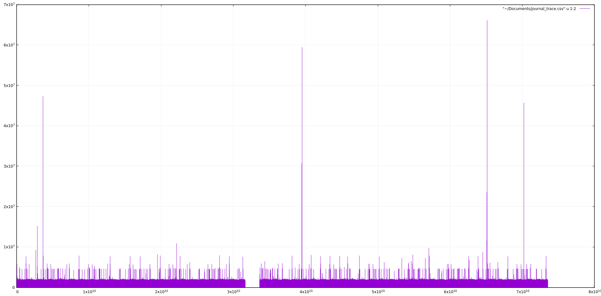

# Tools


You can use the artemis cli interface to execute data maintenance tools:


This is a list of sub-commands available


Name | Description
:--- | :---
exp     | Export the message data using a special and independent XML format
imp  | Imports the journal to a running broker using the output from expt
data     | Prints a report about journal records and summary of existent records, as well a report on paging
encode | shows an internal format of the journal encoded to String
decode | imports the internal journal format from encode


You can use the help at the tool for more information on how to execute each of the tools. For example:

```
$ ./artemis help data print
NAME
        artemis data print - Print data records information (WARNING: don't use
        while a production server is running)

SYNOPSIS
        artemis data print [--bindings <binding>] [--journal <journal>]
                [--paging <paging>]

OPTIONS
        --bindings <binding>
            The folder used for bindings (default ../data/bindings)

        --journal <journal>
            The folder used for messages journal (default ../data/journal)

        --paging <paging>
            The folder used for paging (default ../data/paging)


```


For a full list of data tools commands available use:

```
NAME
        artemis data - data tools group
        (print|imp|exp|encode|decode|compact) (example ./artemis data print)

SYNOPSIS
        artemis data
        artemis data compact [--broker <brokerConfig>] [--verbose]
                [--paging <paging>] [--journal <journal>]
                [--large-messages <largeMessges>] [--bindings <binding>]
        artemis data decode [--broker <brokerConfig>] [--suffix <suffix>]
                [--verbose] [--paging <paging>] [--prefix <prefix>] [--file-size <size>]
                [--directory <directory>] --input <input> [--journal <journal>]
                [--large-messages <largeMessges>] [--bindings <binding>]
        artemis data encode [--directory <directory>] [--broker <brokerConfig>]
                [--suffix <suffix>] [--verbose] [--paging <paging>] [--prefix <prefix>]
                [--file-size <size>] [--journal <journal>]
                [--large-messages <largeMessges>] [--bindings <binding>]
        artemis data exp [--broker <brokerConfig>] [--verbose]
                [--paging <paging>] [--journal <journal>]
                [--large-messages <largeMessges>] [--bindings <binding>]
        artemis data imp [--host <host>] [--verbose] [--port <port>]
                [--password <password>] [--transaction] --input <input> [--user <user>]
        artemis data print [--broker <brokerConfig>] [--verbose]
                [--paging <paging>] [--journal <journal>]
                [--large-messages <largeMessges>] [--bindings <binding>]

COMMANDS
        With no arguments, Display help information

        print
            Print data records information (WARNING: don't use while a
            production server is running)

            With --broker option, This would override the broker configuration
            from the bootstrap

            With --verbose option, Adds more information on the execution

            With --paging option, The folder used for paging (default from
            broker.xml)

            With --journal option, The folder used for messages journal (default
            from broker.xml)

            With --large-messages option, The folder used for large-messages
            (default from broker.xml)

            With --bindings option, The folder used for bindings (default from
            broker.xml)

        exp
            Export all message-data using an XML that could be interpreted by
            any system.

            With --broker option, This would override the broker configuration
            from the bootstrap

            With --verbose option, Adds more information on the execution

            With --paging option, The folder used for paging (default from
            broker.xml)

            With --journal option, The folder used for messages journal (default
            from broker.xml)

            With --large-messages option, The folder used for large-messages
            (default from broker.xml)

            With --bindings option, The folder used for bindings (default from
            broker.xml)

        imp
            Import all message-data using an XML that could be interpreted by
            any system.

            With --host option, The host used to import the data (default
            localhost)

            With --verbose option, Adds more information on the execution

            With --port option, The port used to import the data (default 61616)

            With --password option, User name used to import the data. (default
            null)

            With --transaction option, If this is set to true you will need a
            whole transaction to commit at the end. (default false)

            With --input option, The input file name (default=exp.dmp)

            With --user option, User name used to import the data. (default
            null)

        decode
            Decode a journal's internal format into a new journal set of files

            With --broker option, This would override the broker configuration
            from the bootstrap

            With --suffix option, The journal suffix (default amq)

            With --verbose option, Adds more information on the execution

            With --paging option, The folder used for paging (default from
            broker.xml)

            With --prefix option, The journal prefix (default activemq-data)

            With --file-size option, The journal size (default 10485760)

            With --directory option, The journal folder (default journal folder
            from broker.xml)

            With --input option, The input file name (default=exp.dmp)

            With --journal option, The folder used for messages journal (default
            from broker.xml)

            With --large-messages option, The folder used for large-messages
            (default from broker.xml)

            With --bindings option, The folder used for bindings (default from
            broker.xml)

        encode
            Encode a set of journal files into an internal encoded data format

            With --directory option, The journal folder (default the journal
            folder from broker.xml)

            With --broker option, This would override the broker configuration
            from the bootstrap

            With --suffix option, The journal suffix (default amq)

            With --verbose option, Adds more information on the execution

            With --paging option, The folder used for paging (default from
            broker.xml)

            With --prefix option, The journal prefix (default activemq-data)

            With --file-size option, The journal size (default 10485760)

            With --journal option, The folder used for messages journal (default
            from broker.xml)

            With --large-messages option, The folder used for large-messages
            (default from broker.xml)

            With --bindings option, The folder used for bindings (default from
            broker.xml)

        compact
            Compacts the journal of a non running server

            With --broker option, This would override the broker configuration
            from the bootstrap

            With --verbose option, Adds more information on the execution

            With --paging option, The folder used for paging (default from
            broker.xml)

            With --journal option, The folder used for messages journal (default
            from broker.xml)

            With --large-messages option, The folder used for large-messages
            (default from broker.xml)

            With --bindings option, The folder used for bindings (default from
            broker.xml)


```

## The `profile-journal` tool

Running `./artemis help profile-journal` will print:
```
        NAME
                artemis profile-journal - Provide sampling of performance counters of a
                profiled journal
        
        SYNOPSIS
                artemis profile-journal [--broker <brokerConfig>] [--bytes]
                        [--freq <freq>] [--in <fileIn>] [--no-refresh] [--out <fileOut>]
                        [--raw-time] [--separator <separator>] [--verbose] [--]
                        [<configuration>]
        
        OPTIONS
                --broker <brokerConfig>
                    This would override the broker configuration from the bootstrap
        
                --bytes
                    Add bytes flushed column in the CSV output, false if not defined
        
                --freq <freq>
                    Profile at this frequency (Hz) or will use 1/100 of the configured
                    Journal timeout
        
                --in <fileIn>
                    The input counter file to be used to sample profiled data
        
                --no-refresh
                    Disable console refresh while printing profiler statistics on
                    STDERR, false if not defined
        
                --out <fileOut>
                    Print the CSV output in a text file or stdout if not defined
        
                --raw-time
                    Uses absolute nanoseconds timestamps, false if not defined
        
                --separator <separator>
                    The column separator, whitespace if not specified
        
                --verbose
                    Adds more information on the execution
        
                --
                    This option can be used to separate command-line options from the
                    list of argument, (useful when arguments might be mistaken for
                    command-line options
        
                <configuration>
                    Broker Configuration URI, default
                    'xml:${ARTEMIS_INSTANCE}/etc/bootstrap.xml'
```

This CLI command allows to sample the journal performance counters events of a broker [configured](configuration-index.md) to emit them.

This sampling profiling tool shares most features of Linux's [`perf-tools`](https://perf.wiki.kernel.org/index.php/Main_Page):

- (costantly) lightweight while profiling
- (negligible) no performance hit while not profiling
- constant and very low memory footprint (i.e. just one [OS Page](https://en.wikipedia.org/wiki/Page_(computer_memory)) size in total)
- no Network stack involved (i.e. only Inter-Process Communication)
- no external dependencies

The next simple example will illustrate how to use it, but it could be easily integrated with Nagios or any custom toolchain.


### Gnuplot integration

Run while a proper [configured](configuration-index.md) broker is running:
```
$ ./artemis profile-journal --verbose --out ~/Documents/journal_trace.csv
```

It will print on ``stderr``:
```
Duration 1000ms - 506 samples - 0 missed - 229 kB - 506 sync
```
The line above shows the profiler statistics during an interval of 1 second:
- 506 valid samples collected (on ``--out``)
- no missed samples (i.e. profile data emitted by the journal but not captured by the sampler)
- written 229 kB
- 506 fsyncs/msyncs operations 

The statistics will be refreshed until `CTRL + C` is pressed, that will cause the command to exit.
On exit is printed a summary of the profile session:
```
Total Duration 145330ms - 35,524 total samples - 0 total missed
```

Giving the very low number of missed samples (i.e. 0 on 35,524 total), the default frequency (i.e 1/100 of `journal-buffer-timeout`) 
seems enough to have a precise view of the journal behaviour during the profiling.
Otherwise it will be possible to tune it using the `--freq` option of the command.

The trace collected into `~/Documents/journal_trace.csv` can be easily inspected by any tool able to manage CSV files.

For this example, `gnuplot` will be used:
```
$ gnuplot
gnuplot> plot "~/Documents/journal_trace.csv" u 1:2 with impulses
```
This will show a graph like this (if any journal activity was present):



The graph presents the journal write latencies (in nanoseconds) during the sampling time (in nanoseconds too).

The format of the trace can be managed by many tools and the sampling process is highly customizable in order to build easily 
effective monitoring toolchain to match different needs.


 


 


