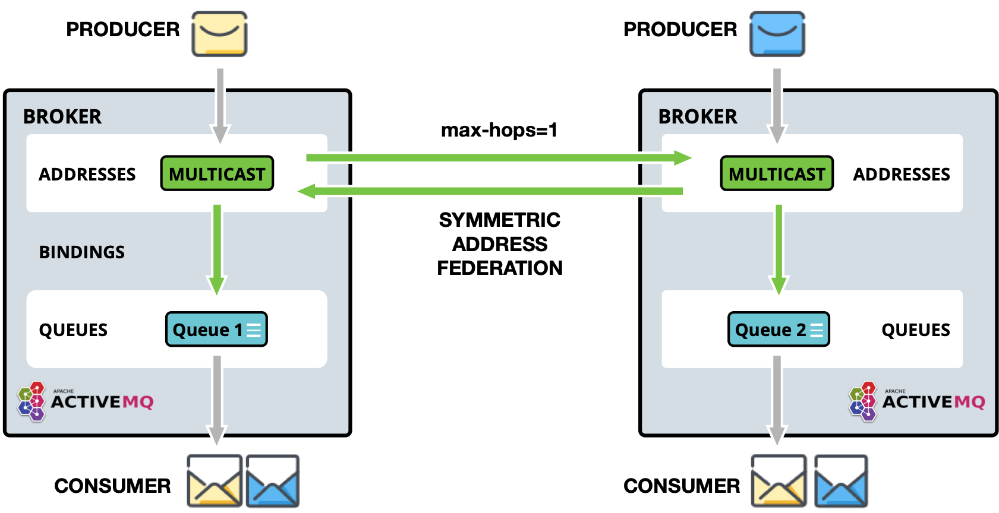
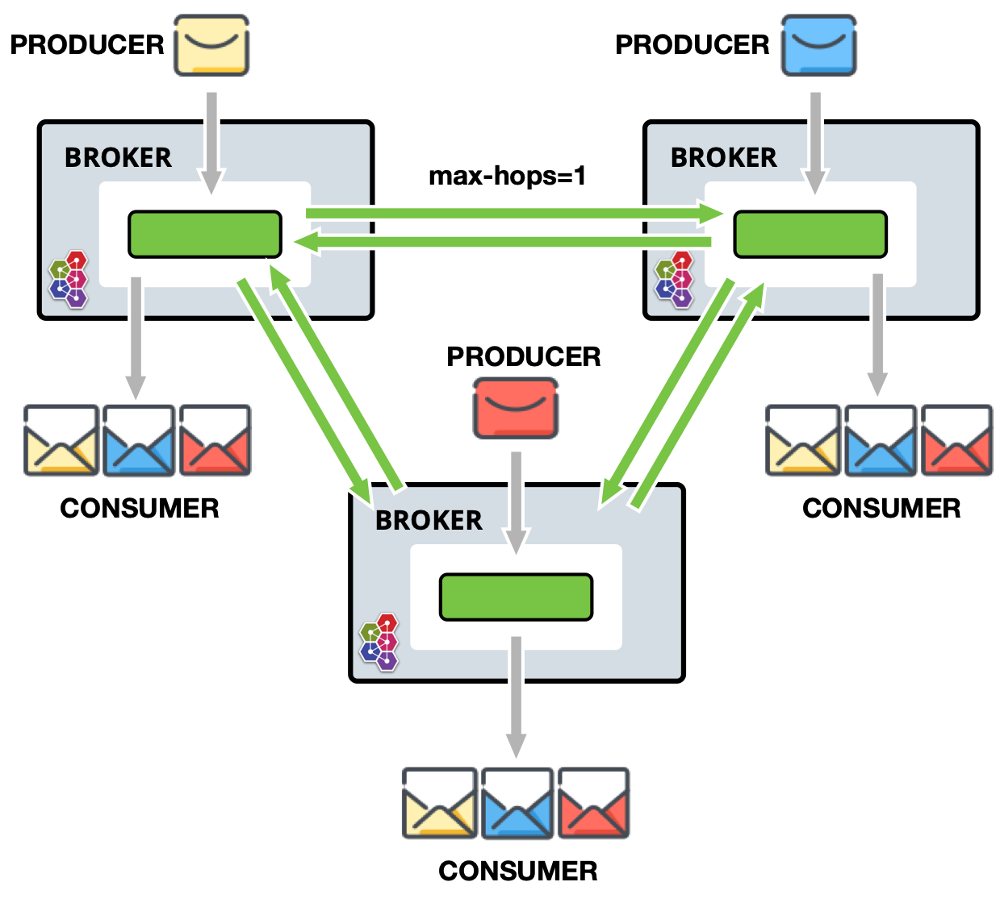
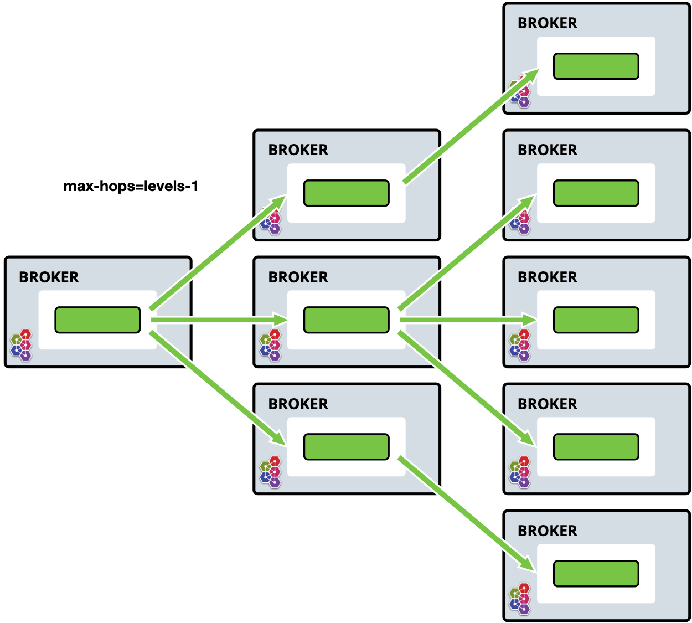

= Address Federation
:idprefix:
:idseparator: -

Address federation is similar to full multicast over the connected brokers.
Every message sent to address on `Broker-A` will be delivered to every queue on that broker, but also will be delivered to `Broker-B` and all their attached queues.

Address federation dynamically links to other addresses in upstream or downstream brokers.
It automatically creates a queue on the remote address for itself, which it then consumes and copies to the local address, as if they were published directly to it.

Upstream brokers or addresses do not need to be reconfigured.
Just add the needed permissions to the address for the downstream broker.
The same applies for downstream configurations.

.Address Federation
image::images/federation-address.png[]

== Topology Patterns

=== Symmetric

.Address Federation - Symmetric

As seen above, a publisher and consumer are connected to each broker.
Queues _(consumers of those queues)_ can receive messages published by either publisher.

In this setup, it is important to set `max-hops=1`, so messages are copied only once and cyclic replication is avoided.
If `max-hops` is not configured correctly, consumers will get multiple copies of the same message.

=== Full Mesh

.Address Federation - Full Mesh

This setup is identical to symmetric above.
All brokers are symmetrically federating each other, creating a full mesh.

As illustrated, a publisher and consumer are connected to each broker.
Queues and thus consumers on those queues, can receive messages published by either publisher.

Again, it is important to set `max-hops=1`, so messages are copied only once and cyclic replication is avoided.
If `max-hops` is not configured correctly, consumers will get multiple copies of the same message.

=== Ring

.Address Federation - Ring
image::images/federation-address-ring.png[]

In a ring of brokers each federated address is `upstream` to just one other in the ring.
To avoid the cyclic issue, it is important to set `max-hops` to `n - 1` where `n` is the number of nodes in the ring.
In the example above, property is set to 5, so that every address in the ring receives the message exactly once.

Whilst this setup is cheap in regard to connections it is brittle.
If a single broker fails then the ring fails.

=== Fan out

.Address Federation - Fan Out

One main address (requires no configuration) is linked to a tree of downstream federated addresses.
The tree can extend to any depth and can be extended further without needing to re-configure existing brokers.

In this case, messages published to the main address can be received by any consumer connected to any broker in the tree.

=== Divert Binding Support

Divert binding support can be added as part of the address policy configuration.
This will allow the federation to respond to divert bindings to create demand.
For example, let's say there is one address called `test.federation.source` that is included as a match for the federated address and another address called `test.federation.target` that is not included.
Normally, when a queue is created on `test.federation.target`, this would not cause a federated consumer to be created because the address is not part of the included matches.
However, if we create a divert binding such that `test.federation.source` is the source address and `test.federation.target` is the forwarded address then demand will now be created.
The source address still must be _multicast_ but the target address can be _multicast_ or _anycast_.

An example use case for this might be a divert, that redirects JMS topics (multicast addresses) to a JMS queue (anycast addresses).
This allows message load balancing on a topic for legacy consumers not supporting JMS 2.0 and shared subscriptions.

== Configuring Address Federation

Federation is configured in `broker.xml` file.

Sample Address Federation setup:

[,xml]
----
<federations>
    <federation name="eu-north-1" user="federation_username" password="32a10275cf4ab4e9">
        <upstream name="eu-east-1">
           <static-connectors>
              <connector-ref>eu-east-connector1</connector-ref>
              <connector-ref>eu-east-connector2</connector-ref>
           </static-connectors>
           <policy ref="news-address-federation"/>
        </upstream>
        <upstream name="eu-west-1" >
           <static-connectors>
              <connector-ref>eu-west-connector1</connector-ref>
              <connector-ref>eu-west-connector2</connector-ref>
           </static-connectors>
           <policy ref="news-address-federation"/>
        </upstream>

        <address-policy name="news-address-federation" max-hops="1" auto-delete="true" auto-delete-delay="300000" auto-delete-message-count="-1" transformer-ref="news-transformer">
           <include address-match="queue.bbc.new" />
           <include address-match="queue.usatoday" />
           <include address-match="queue.news.#" />

           <exclude address-match="queue.news.sport.#" />
        </address-policy>

        <transformer name="news-transformer">
           <class-name>org.foo.NewsTransformer</class-name>
           <property key="key1" value="value1"/>
           <property key="key2" value="value2"/>
        </transformer>
    </federation>
</federations>
----

In the above setup, downstream broker `eu-north-1` is configured to connect to two upstream brokers `eu-east-1` and `eu-west-1`.
Credentials used for both connections to brokers in this sample are shared.
Should they be different per upstream, you can alter credentials at the upstream level.

Both upstreams are configured with the same address-policy `news-address-federation`, that is selecting addresses which match any of the include criteria and exclude anything that starts `queue.news.sport`.

*It is important that federation name is globally unique.*

==== address-policy parameters

name::
All address-policies must have a unique name in the server.

include::
The address-match pattern to include addresses.
Multiple of these can be set.
If none are set all addresses are matched.

exclude::
The address-match pattern to exclude addresses. Multiple of these can be set.

max-hops::
The maximum number of hops that message can perform across federated addresses. See <<topology-patterns,Topology Patterns>> above for details.

auto-delete::
For address federation, the downstream dynamically creates a durable queue on the upstream address.
This is used to mark if the upstream queue should be deleted once downstream disconnects and the delay and message count parameters have been met.
It is useful in automating cleanup.
You may wish to disable this, if you want messages to be queued for the downstream when disconnect no matter what.

auto-delete-delay::
The amount of time in milliseconds after the downstream broker has disconnected, before the upstream queue can be eligible for `auto-delete`.

auto-delete-message-count::
Maximum number of messages allowed in the upstream queue to be eligible for `auto-delete`, after the downstream broker has disconnected.

transformer-ref::
Reference name of a transformer (see transformer config) that you may wish to configure to transform the message on federation transfer.

enable-divert-bindings::
Setting to `true` will enable divert bindings to be listened for demand.
If there is a divert binding with an address that matches the included addresses for the stream, any queue bindings that match the forward address of the divert will create demand.
Default is `false`.

NOTE: `address-policy` and `queue-policy` elements can be defined in the same federation and be linked to the same upstream.

==== transformer parameters

name::
Unique name in the server used to reference the transformer in `address-policy` and `queue-policy`.

transformer-class-name::
This is the name of a user-defined class which implements the `org.apache.activemq.artemis.core.server.transformer.Transformer` interface.
+
If specified, then the transformer's `transform()` method will be invoked with the message before it is transferred.
This gives you the opportunity to transform the message's header or body before it is federated.

property:: holds key-value pairs that can be used to configure the transformer.

==== Upstream parameters
Tag `upstream` defines the upstream broker connection and the policies to use.

name::
Unique name for upstream federated server.

user::
This optional attribute determines the username to use when creating the upstream connection to the remote server.
If not specified, the shared federation user and password will be used if they were set.

password::
This optional attribute determines the password to use when creating the upstream connection to the remote server.
If not specified, the shared federation user and password will be used if they were set.

static-connectors::
Either this or `discovery-group-ref` is used to connect the bridge to the target server.
+
The `static-connectors` is a list of `connector-ref` elements pointing to `connector` elements defined elsewhere.
A _connector_ encapsulates knowledge of what transport to use (TCP, SSL, HTTP etc.) as well as the server connection parameters (host, port etc).
+
For more information about what connectors are and how to configure them, see xref:configuring-transports.adoc#configuring-the-transport[Configuring the Transport].

discovery-group-ref::
Either this or `static-connectors` is used to connect the bridge to the target server.
+
The `discovery-group-ref` element has one attribute - `discovery-group-name`.
This attribute points to a `discovery-group` defined elsewhere.
For more information about what _discovery-groups_ are and how to configure them, see xref:clusters.adoc#clusters[Discovery Groups].

ha::
Optional parameter determines whether this bridge should support high availability.
Using `true` will connect to any available server in a cluster and support failover.
The default value is `false`.

circuit-breaker-timeout::
When a connection issue occurs, as the single connection is shared by many federated queue and address consumers, to avoid each one trying to reconnect and possibly causing a thundering herd issue, the first one will be tried.
If unsuccessful the circuit breaker will open, returning the same exception to all connections.
This is the timeout until the circuit can be closed and connection retried.
Measured in milliseconds.

share-connection::
If there is a downstream and upstream connection configured for the same broker then the same connection will be shared as long as both stream configs set this flag to true.
Default is `false`.

check-period::
The period (in milliseconds) used to check if the federation connection has failed to receive pings from another server.
Default is `30000`.

connection-ttl::
This is how long a federation connection should stay alive if it stops receiving messages from the remote broker.
Default is `60000`.

call-timeout::
When a packet is sent via a federation connection and is a blocking call, i.e. for acknowledgements, this is how long it will wait (in milliseconds) for the reply before throwing an exception.
Default is `30000`.

call-failover-timeout::
Similar to `call-timeout` but used when a call is made during a failover attempt.
Default is `-1` (no timeout).

retry-interval::
This optional parameter determines the period in milliseconds between subsequent reconnection attempts, if the connection to the target server has failed.
The default value is `500` milliseconds.

retry-interval-multiplier::
Used to increase the `retry-interval` after each reconnect attempt, default is 1.

max-retry-interval::
The maximum delay (in milliseconds) for retries.
Default is `2000`.

initial-connect-attempts::
The number of times the system will try to connect to the remote broker in the federation.
If the max is reached this broker will be considered permanently down and the system will not route messages to this broker.
Default is `-1` (infinite retries).

reconnect-attempts::
The number of times the system will try to reconnect to the remote broker in the federation.
If the max is reached this broker will be considered permanently down and the system will stop routing messages to this broker.
Default is `-1` (infinite retries).

== Configuring Downstream Federation

Similarly to `upstream` configuration, a downstream configuration can be configured.
This works by sending a command to the `downstream` broker to have it create an `upstream` connection back to the downstream broker.
The benefit of this is being able to configure everything for federation on one broker in some cases to make it easier, such as a hub and spoke topology

All the same configuration options apply to `downstream` as does `upstream` with the exception of one extra configuration flag that needs to be set:

upstream-connector-ref::
Is an element pointing to a `connector` elements defined elsewhere.
This reference is used to tell the downstream broker what connector to use to create a new upstream connection back to the downstream broker.
+
A _connector_ encapsulates knowledge of what transport to use (TCP, SSL, HTTP etc.) as well as the server connection parameters (host, port etc).
For more information about what connectors are and how to configure them, see xref:configuring-transports.adoc#configuring-the-transport[Configuring the Transport].

Sample Downstream Address Federation setup:

[,xml]
----
   <!--Other config Here -->

<connectors>
   <connector name="netty-connector">tcp://localhost:61616</connector>
   <connector name="eu-west-1-connector">tcp://localhost:61616</connector>
   <connector name="eu-east-1-connector">tcp://localhost:61617</connector>
</connectors>

<acceptors>
   <acceptor name="netty-acceptor">tcp://localhost:61616</acceptor>
</acceptors>

   <!--Other config Here -->

<federations>
   <federation name="eu-north-1" user="federation_username" password="32a10275cf4ab4e9">
      <downstream name="eu-east-1">
          <static-connectors>
             <connector-ref>eu-east-1-connector</connector-ref>
          </static-connectors>
          <policy ref="news-address-federation"/>
          <upstream-connector-ref>netty-connector</upstream-connector-ref>
      </downstream>
      <downstream name="eu-west-1" >
         <static-connectors>
            <connector-ref>eu-west-1-connector</connector-ref>
         </static-connectors>
         <policy ref="news-address-federation"/>
         <upstream-connector-ref>netty-connector</upstream-connector-ref>
      </downstream>

      <address-policy name="news-address-federation" max-hops="1" auto-delete="true" auto-delete-delay="300000" auto-delete-message-count="-1" transformer-ref="news-transformer">
         <include address-match="queue.bbc.new" />
         <include address-match="queue.usatoday" />
         <include address-match="queue.news.#" />

         <exclude address-match="queue.news.sport.#" />
      </address-policy>

      <transformer name="news-transformer">
         <class-name>org.foo.NewsTransformer</class-name>
         <property key="key1" value="value1"/>
         <property key="key2" value="value2"/>
      </transformer>
   </federation>
</federations>
----
