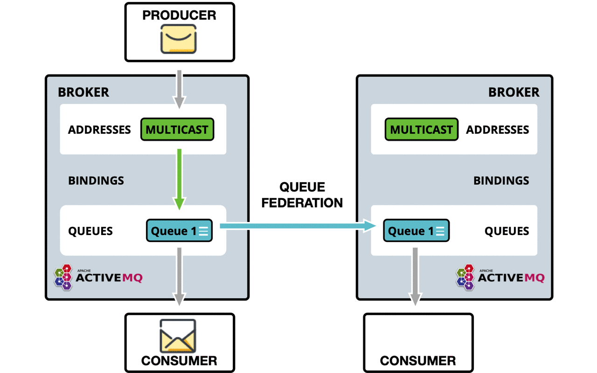

= Queue Federation
:idprefix:
:idseparator: -

This feature provides a way of balancing the load of a single queue across remote brokers.

A federated queue links to other queues (called upstream queues).
It will retrieve messages from upstream queues in order to satisfy demand for messages from local consumers.
The upstream queues do not need to be reconfigured and they do not have to be on the same broker or in the same cluster.

All of the configuration needed to establish the upstream links and the federated queue is in the downstream broker.

== Use Cases

This is not an exhaustive list of what you can do with and the benefits of federated queues, but simply some ideas.

* Higher capacity
+
By having a "logical" queue distributed over many brokers.
Each broker would declare a federated queue with all the other federated queues upstream.
(The links would form a complete bi-directional graph on n queues.)

By having this a logical distributed queue is capable of having a much higher capacity than a single queue on a single broker.
When will perform best when there is some degree of locality.

e.g. as many messages as possible are consumed from the same broker as they were published to, where federation only needs to move messages around in order to perform load balancing.

.Federated Queue Symmetric

* Supporting multi region or venue
+
In a multi region setup you may have producers in one region or venue and the consumer in another.
typically you want producers and consumer to keep their connections local to the region, in such as case you can deploy brokers in each region where producers and consumer are, and use federation to move messages over the WAN between regions.

.Federated Queue

* Communication between the secure enterprise lan and the DMZ.
+
Where a number of producer apps maybe in the DMZ and a number of consumer apps in the secure enterprise lan, it may not suitable to allow the producers to connect through to the broker in the secure enterprise lan.
+
In this scenario you could deploy a broker in the DMZ where the producers publish to, and then have the broker in the enterprise lan connect out to the DMZ broker and federate the queues so that messages can traverse.
+
This is similar to supporting multi region or venue.

* Migrating between two clusters.
Consumers and publishers can be moved in any order and the messages won't be duplicated (which is the case if you do exchange federation).
Instead, messages are transferred to the new cluster when your consumers are there.
Here for such a migration with blue/green or canary moving a number of consumers on the same queue, you may want to set the `priority-adjustment` to 0, or even a positive value, so message would actively flow to the federated queue.
* Dual Federation - potential for messages to flip-flop between clusters.
If the backlog on your queues exceeds the available local credit across consumers, any lower priority federation consumer becomes a candidate for dispatch and messages will be federated.
Eventually all messages may migrate and the scenario can repeat on the other cluster.
Applying a rate limit to the connector url can help mitigate but this could have an adverse effect on migration when there are no local consumers.
To better support this use case, it is possible to configure the consumerWindowSize to zero on the referenced connector URI: `tcp://<host>:<port>?consumerWindowSize=0`.
This will cause the federation consumer to pull messages in batches only when the local queue has excess capacity.
This means that federation won't ever drain more messages than it can handle, such that messages would flip-flop.
The batch size is derived from the relevant address settings defaultConsumerWindowSize.

== Configuring Queue Federation

Federation is configured in `broker.xml` file.

Sample Queue Federation setup:
[,xml]
----
<federations>
    <federation name="eu-north-1" user="federation_username" password="32a10275cf4ab4e9">
        <upstream name="eu-east-1">
           <static-connectors>
              <connector-ref>eu-east-connector1</connector-ref>
              <connector-ref>eu-east-connector2</connector-ref>
           </static-connectors>
           <policy ref="news-queue-federation"/>
        </upstream>
        <upstream name="eu-west-1" >
           <static-connectors>
              <connector-ref>eu-west-connector1</connector-ref>
              <connector-ref>eu-west-connector2</connector-ref>
           </static-connectors>
           <policy ref="news-queue-federation"/>
        </upstream>

        <queue-policy name="news-queue-federation" priority-adjustment="-5" include-federated="true" transformer-ref="news-transformer">
           <include queue-match="#" address-match="queue.bbc.new" />
           <include queue-match="#" address-match="queue.usatoday" />
           <include queue-match="#" address-match="queue.news.#" />

           <exclude queue-match="#.local" address-match="#" />
        </queue-policy>

        <transformer name="news-transformer">
           <class-name>org.foo.NewsTransformer</class-name>
           <property key="key1" value="value1"/>
           <property key="key2" value="value2"/>
        </transformer>
    </federation>
</federations>
----

In the above setup downstream broker `eu-north-1` is configured to connect to two upstream brokers `eu-east-1` and `eu-west-1`, the credentials used for both connections to both brokers in this sample are shared, you can set user and password at the upstream level should they be different per upstream.

Both upstreams are configured with the same queue-policy `news-queue-federation`, that is selecting addresses which match any of the include criteria, but will exclude any queues that end with `.local`, keeping these as local queues only.

*It is important that federation name is globally unique.*

==== Priority ordered queue-policy parameters

name::
All address-policies must have a unique name in the server.

include::
The address-match pattern to include addresses. Multiple of these can be set. If none are set all addresses are matched.

exclude::
The address-match pattern to exclude addresses. Multiple of these can be set.

priority-adjustment::
 when a consumer attaches its priority is used to make the upstream consumer,  but with an adjustment by default -1, so that local consumers get load balanced first over remote, this enables this to be configurable should it be wanted/needed.

include-federated::
 by default this is `false`, we do not federate a federated consumer, this is to avoid issue, where in symmetric or any closed loop setup you could end up when no "real" consumers attached with messages flowing round and round endlessly.
+
There is though a valid case that if you do not have a close loop setup e.g. three brokers in a chain (A\->B\->C) with producer at broker A and consumer at C, you would want broker B to re-federate the consumer onto A.

transformer-ref::
The ref name for a transformer (see transformer config) that you may wish to configure to transform the message on federation transfer.

NOTE: `address-policy` and `queue-policy` elements are able to be defined in the same federation, and they can be linked to the same upstream.

==== Priority ordered transformer parameters

name::
Unique name in the server used to reference the transformer in `address-policy` and `queue-policy`

transformer-class-name::
An optional `transformer-class-name` can be specified.
This is the name of a user-defined class which implements the `org.apache.activemq.artemis.core.server.transformer.Transformer` interface.
+
If specified, then the transformer's `transform()` method will be invoked with the message before it is transferred.
This gives you the opportunity to transform the message's header or body before it is federated.

property:: holds key-value pairs that can be used to configure the transformer.

==== Upstream parameters
Tag `upstream` defines the upstream broker connection and the policies to use.

name::
Unique name for upstream federated server.

user::
This optional attribute determines the username to use when creating the upstream connection to the remote server.
If not specified, the shared federation user and password will be used if they were set.

password::
This optional attribute determines the password to use when creating the upstream connection to the remote server.
If not specified, the shared federation user and password will be used if they were set.

static-connectors::
Either this or `discovery-group-ref` is used to connect the bridge to the target server.
+
The `static-connectors` is a list of `connector-ref` elements pointing to `connector` elements defined elsewhere.
A _connector_ encapsulates knowledge of what transport to use (TCP, SSL, HTTP etc.) as well as the server connection parameters (host, port etc).
+
For more information about what connectors are and how to configure them, see xref:configuring-transports.adoc#configuring-the-transport[Configuring the Transport].

discovery-group-ref::
Either this or `static-connectors` is used to connect the bridge to the target server.
+
The `discovery-group-ref` element has one attribute - `discovery-group-name`.
This attribute points to a `discovery-group` defined elsewhere.
For more information about what discovery-groups are and how to configure them, see xref:clusters.adoc#clusters[Discovery Groups].

ha::
This optional parameter determines whether this bridge should support high availability.
`True` means it will connect to any available server in a cluster and support failover.
Default is `false`.

circuit-breaker-timeout::
When a connection issue occurs, as the single connection is shared by many federated queue and address consumers, to avoid each one trying to reconnect and possibly causing a thundering herd issue, the first one will be tried.
If unsuccessful the circuit breaker will open, returning the same exception to all connections.
This is the timeout until the circuit can be closed and connection retried.
Measured in milliseconds.

share-connection::
If there is a downstream and upstream connection configured for the same broker then the same connection will be shared as long as both stream configs set this flag to true.
Default is `false`.

check-period::
The period (in milliseconds) used to check if the federation connection has failed to receive pings from another server.
Default is 30000.

connection-ttl::
This is how long a federation connection should stay alive if it stops receiving messages from the remote broker.
Default is 60000.

call-timeout::
When a packet is sent via a federation connection and is a blocking call, i.e. for acknowledgements, this is how long it will wait (in milliseconds) for the reply before throwing an exception.
Default is 30000.

call-failover-timeout::
Similar to `call-timeout` but used when a call is made during a failover attempt.
Default is -1 (no timeout).

retry-interval::
This optional parameter determines the period in milliseconds between subsequent reconnection attempts, if the connection to the target server has failed.
The default value is `500` milliseconds.

retry-interval-multiplier::
Used to increase the `retry-interval` after each reconnect attempt, default is 1.

max-retry-interval::
The maximum delay (in milliseconds) for retries.
Default is 2000.

initial-connect-attempts::
The number of times the system will try to connect to the remote broker in the federation.
If the _max-retry_ is achieved this broker will be considered permanently down and the system will not route messages to this broker.
Default is -1 (infinite retries).

reconnect-attempts::
The number of times the system will try to reconnect to the remote broker in the federation.
If the _max-retry_ is achieved this broker will be considered permanently down and the system will stop routing messages to this broker.
Default is -1 (infinite retries).

== Configuring Downstream Federation

Similarly to `upstream` configuration, a downstream configuration can be configured.
This works by sending a command to the `downstream` broker to have it create an `upstream` connection back to the downstream broker.
The benefit of this is being able to configure everything for federation on one broker in some cases to make it easier, such as a hub and spoke topology.

All the same configuration options apply to `downstream` as does `upstream` with the exception of one extra configuration flag that needs to be set:

upstream-connector-ref::
Is an element pointing to a `connector` elements defined elsewhere.
This reference is used to tell the downstream broker what connector to use to create a new upstream connection back to the downstream broker.
+
A _connector_ encapsulates knowledge of what transport to use (TCP, SSL, HTTP etc.) as well as the server connection parameters (host, port etc).
For more information about what connectors are and how to configure them, see xref:configuring-transports.adoc#configuring-the-transport[Configuring the Transport].

Sample Downstream Address Federation setup:

[,xml]
----

  <!--Other config Here -->

<connectors>
   <connector name="netty-connector">tcp://localhost:61616</connector>
   <connector name="eu-west-1-connector">tcp://localhost:61616</connector>
   <connector name="eu-east-1-connector">tcp://localhost:61617</connector>
</connectors>

<acceptors>
   <acceptor name="netty-acceptor">tcp://localhost:61616</acceptor>
</acceptors>

   <!--Other config Here -->

<federations>
   <federation name="eu-north-1" user="federation_username" password="32a10275cf4ab4e9">
      <downstream name="eu-east-1">
          <static-connectors>
             <connector-ref>eu-east-1-connector</connector-ref>
          </static-connectors>
          <policy ref="news-address-federation"/>
          <upstream-connector-ref>netty-connector</upstream-connector-ref>
      </downstream>
      <downstream name="eu-west-1" >
         <static-connectors>
            <connector-ref>eu-west-1-connector</connector-ref>
         </static-connectors>
         <policy ref="news-address-federation"/>
         <upstream-connector-ref>netty-connector</upstream-connector-ref>
      </downstream>

      <queue-policy name="news-queue-federation" priority-adjustment="-5" include-federated="true" transformer-ref="news-transformer">
         <include queue-match="#" address-match="queue.bbc.new" />
         <include queue-match="#" address-match="queue.usatoday" />
         <include queue-match="#" address-match="queue.news.#" />

         <exclude queue-match="#.local" address-match="#" />
      </queue-policy>

      <transformer name="news-transformer">
         <class-name>org.foo.NewsTransformer</class-name>
         <property key="key1" value="value1"/>
         <property key="key2" value="value2"/>
      </transformer>
   </federation>
</federations>
----
