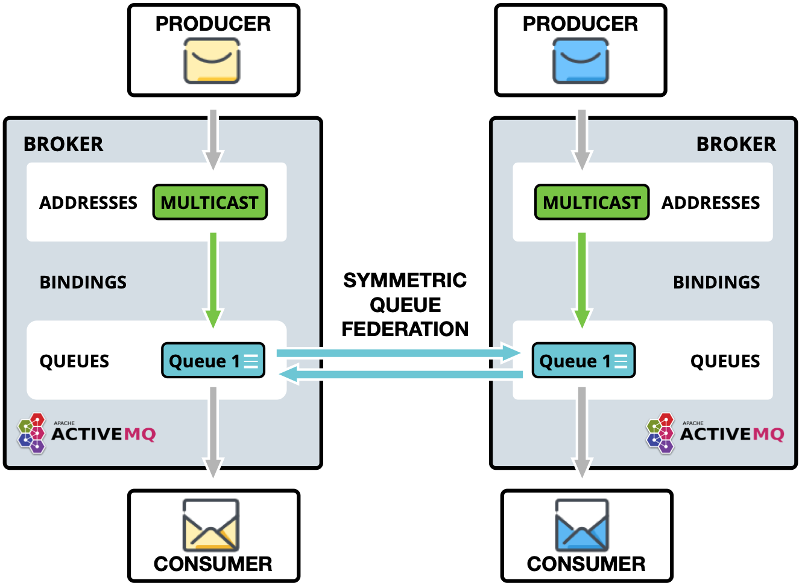
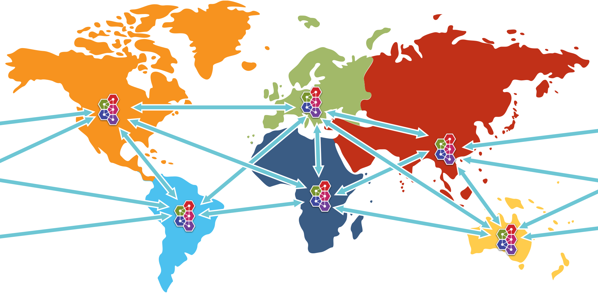

= Federation
:idprefix:
:idseparator: -

Federation allows transmission of messages between brokers without requiring clustering.

A federated address can replicate messages published from an upstream address to a local address.
n.b.
This is only supported with multicast addresses.

A federated queue lets a local consumer receive messages from an upstream queue.

A broker can contain federated and local-only components - you don't need to federate everything if you don't want to.

== Benefits

=== WAN

The source and target servers do not have to be in the same cluster which makes federation suitable for reliably sending messages from one cluster to another, for instance across a WAN, between cloud regions or where connection may be unreliable.

Federation has built-in resilience to failure so if the target server connection is lost, e.g. due to network failure, federation will retry connecting to the target until it comes back online.
When it comes back online it will resume operation as normal.

=== Loose Coupling of Brokers

Federation can transmit messages between brokers (or clusters) in different administrative domains:

* they may have different configuration, users and setup;
* they may run on different versions of ActiveMQ Artemis

=== Dynamic and Selective

Federation is applied by policies, that match address and queue names, and then apply.

This means that federation can dynamically be applied as queues or addresses are added and removed, without need to individually configure them.

Likewise, policies are selective. They apply with multiple include and exclude matches.

Multiple policies can be applied directly to multiple upstreams. Policies can be grouped into policy sets and then applied to upstreams to make managing easier.

== Address Federation

Address federation is similar to full multicast over the connected brokers. Every message sent to address on `Broker-A` will be delivered to every queue on that broker, but also will be delivered to `Broker-B` and all their attached queues.

.Address Federation
image:images/federation-address.png[Address Federation]

For further details please see xref:federation-address.adoc#address-federation[Address Federation].

== Queue Federation

Federated queues act as a single logical queue with multiple receivers on multiple machines.
They can be used for load balancing.
If brokers are in the same Availability Zone you would look to cluster them. The advantage of queue federation is that it does not require clustering, so it is suitable for over WAN, cross-region or on/off-premises usage.

.Queue Federation

For further details please see xref:federation-queue.adoc#queue-federation[Queue Federation].

== WAN Full Mesh

It is also possible to provide a WAN mesh of brokers, which can

 * replicate by Address Federation
 * route and load balance using Queue Federation
 * link distant producers and consumers

.Example of possible full federation mesh

== Configuring Federation

Example configuration in `broker.xml`:

[,xml]
----
<federations>
    <federation name="eu-north-1-federation">
        <upstream name="eu-west-1" user="westuser" password="32a10275cf4ab4e9">
           <static-connectors>
              <connector-ref>connector1</connector-ref>
           </static-connectors>
           <policy ref="policySetA"/>
        </upstream>
        <upstream name="eu-east-1" user="eastuser" password="32a10275cf4ab4e9">
           <discovery-group-ref discovery-group-name="ue-west-dg"/>
           <policy ref="policySetA"/>
        </upstream>

        <policy-set name="policySetA">
           <policy ref="address-federation" />
           <policy ref="queue-federation" />
        </policy-set>

        <queue-policy name="queue-federation" >
           <exclude queue-match="federated_queue" address-match="#" />
        </queue-policy>

        <address-policy name="address-federation" >
           <include address-match="federated_address" />
        </address-policy>
    </federation>
</federations>
----

In the above example we have shown the basic key parameters needed to configure federation for a queue and address to multiple upstream.

The example shows a broker `eu-north-1` connecting to two upstream brokers `eu-east-1` and `eu-west-1`.
Applying queue federation to queue `federated_queue` and address federation to address `federated_address`.

*It is important that federation name is globally unique.*

There are many configuration options that you can apply. These are detailed in the individual docs:

* xref:federation-address.adoc#address-federation[Address Federation]
* xref:federation-queue.adoc#queue-federation[Queue Federation]

[NOTE]
====
Extra parameters from the URI of a connector-ref can be used to override or provide additional configuration to the ServiceLocator.
====

=== Large Messages

If federation has to process large messages, the default `ackBatchSize` and `consumerWindowSize` for the consumer will need to be changed to limit the number of in-flight messages and to enable large message flow.
These options can be supplied as parameters on the referenced connector URI, for example:
[,url]
----
tcp://<host>:<port>?ackBatchSize=100&consumerWindowSize=-1
----
