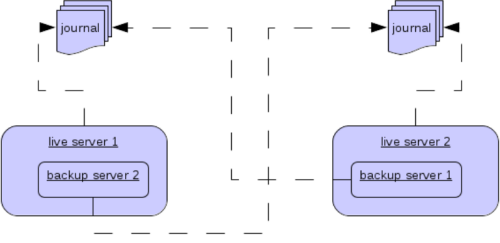
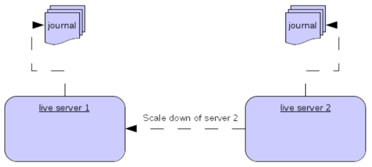

= High Availability and Failover
:idprefix:
:idseparator: -
:experimental:

We define high availability (HA) as the _ability for the system to continue functioning after failure of one or more of the servers_.

A part of high availability is _failover_ which we define as the _ability for client connections to migrate from one server to another in event of server failure so client applications can continue to operate_.

== Terminology

In order to discuss both configuration and runtime behavior consistently we need to define a couple nouns and adjectives.
These terms will be used throughout the documentation, configuration, source code, and runtime logs.

=== Configuration

These nouns identify how the broker is _configured_, e.g. in `broker.xml`. The configuration allows brokers to be paired together as _primary/backup_ (i.e. an _HA pair_ of brokers).

primary::
This identifies the main broker in the high availability configuration.
Oftentimes the hardware on this broker will be higher performance than the hardware on the backup broker.
Typically, this broker is started before the backup and is active most of the time.
+
Each primary server can be paired with one backup server.
Other backups can be configured, but the primary will only pair with one.
When the primary fails the backup will take over.
At this point if there are other backups configured then the backup that took over will pair with one of those.

backup::
This identifies the broker that should take over when the primary broker fails in a high availability configuration.
Oftentimes the hardware on this broker will be lower performance than the hardware on the primary broker.
Typically, this broker is started after the primary and is passive most of the time.

=== Runtime

These adjectives describe the _behavior_ of the broker at runtime. For example, you could have a _passive_ primary or an _active_ backup.

active::
This identifies a broker in a high-availability configuration which is accepting remote connections.
For example, consider the scenario where the primary broker has failed and its backup has taken over.
The backup would be described as _active_ at that point since it is accepting remote connections.

passive::
This identifies a broker in a high-availability configuration which is **not** accepting remote connections.
For example, consider the scenario where the primary broker was started and then the backup broker was started.
The backup broker would be _passive_ since it is not accepting remote connections.
It is waiting for the primary to fail before it activates and begins accepting remote connections.

== HA Policies

Apache ActiveMQ Artemis supports two main policies for backing up a server:

* *shared store*
* *replication*

These are configured via the `ha-policy` configuration element.

[NOTE]
.What is Backed Up?
====
Only message data *written to storage* will survive failover.
Any message data not written to storage will not be available after failover.
====

[NOTE]
.Clustering is Required
====
A proper xref:clusters.adoc#clusters[cluster] configuration is required as a pre-requisite for an HA configuration.
The cluster configuration allows the server to announce its presence to its primary/backup (or any other nodes in the cluster).
====

There is technically a third policy called `primary-only` which omits the backup entirely.
This is used to configure xref:#scaling-down[`scale-down`].
This is the default policy if none is provided.

=== Shared Store

When using a shared store both primary and backup servers share the _same_ entire data directory using a shared file system.
This includes the paging directory, journal directory, large messages, and bindings journal.

When the primary server fails it will release its lock on the shared journal and allow the backup server to activate.
The backup will then load the data from the shared file system and accept remote connections from clients.

Typically, this will be some kind of high performance Storage Area Network (SAN).
Network Attached Storage (NAS), like an <<NFS Mount Recommendations,NFS mount>>, is viable but won't provide optimal performance.

One main advantage of a shared store configuration is that no replication occurs between the primary and backup nodes which means it does not suffer any performance penalties due to the overhead of replication during normal operation.

One potentially significant disadvantage of shared store versus replication is that it requires a shared file system, and when the backup server activates it needs to load the journal from the shared store which can take some time depending on the amount of data in the store and the speed of the store.

If you require the highest performance during normal operation then acquire access to a fast SAN and deal with a slightly slower failover (depending on amount of data).

[TIP]
.What About Split Brain?
====
Shared store configurations are naturally immune to xref:network-isolation.adoc#network-isolation-split-brain[split-brain].
====

==== Shared Store Configuration

Both primary & backup servers must configure the location of journal directories to the _same shared location_ (as explained in xref:persistence.adoc#persistence[persistence documentation]).

===== Primary

The primary broker needs this basic configuration in `broker.xml`:

[,xml]
----
<ha-policy>
   <shared-store>
      <primary/>
   </shared-store>
</ha-policy>
----

====== Additional parameters

failover-on-shutdown::
include::_failover-on-shutdown.adoc[]

wait-for-activation::
This setting is only for *embedded* use cases where the primary broker has failed, the backup has activated, and the primary has been restarted.
By default, when `org.apache.activemq.artemis.core.server.ActiveMQServer.start()` is invoked the broker will block until the primary broker actually takes over from the backup (i.e. either via failback or by the backup actually stopping).
Setting `wait-for-activation` to `false` prevents `start()` from blocking so that control is returned to the caller.
The caller can use `waitForActivation()` to wait until broker activates or just check the current status using `getState()`.
Default is `true`.

===== Backup

The backup needs this basic configuration in `broker.xml`:

[,xml]
----
<ha-policy>
   <shared-store>
      <backup/>
   </shared-store>
</ha-policy>
----

====== Additional parameters

allow-failback::
Whether this backup will automatically stop when its primary is restarted and requests to take over its place.
The use case is when a primary server stops and its backup takes over its duties, later the primary server restarts and requests the now-active backup to stop so the primary can take over again.
Default is `true`.

failover-on-shutdown::
include::_failover-on-shutdown.adoc[]
+
NOTE: This only applies when this backup has activated due to its primary failing.

scale-down::
If provided then this backup will scale down rather than becoming active after fail over.
This really only applies to colocated configurations where the backup will scale-down its messages to the primary broker in the same JVM.

restart-backup::
Will this backup restart after being stopped due to failback or scaling down.
Default is `false`.

===== NFS Mount Recommendations

If you choose to implement your shared store configuration with NFS here are some recommended configuration options.
These settings are designed for reliability and to help the broker detect problems with NFS quickly and shut itself down so that clients can failover to a working broker.

sync::
Specifies that all changes are immediately flushed to disk.
intr::
Allows NFS requests to be interrupted if the server is shut down or cannot be reached.
noac::
Disables attribute caching. This behavior is needed to achieve attribute cache coherence among multiple clients.
soft::
Specifies that if the NFS server is unavailable the error should be reported rather than waiting for the server to come back online.
lookupcache=none::
Disables lookup caching.
timeo=n::
The time, in deciseconds (i.e. tenths of a second), that the NFS client (i.e. the broker) waits for a response from the NFS server before it retries a request. For NFS over TCP the default `timeo` value is `600` (60 seconds). For NFS over UDP the client uses an adaptive algorithm to estimate an appropriate timeout value for frequently used request types, such as read and write requests.
retrans=n::
The number of times that the NFS client retries a request before it attempts further recovery action.

[TIP]
====
Use reasonable values when you configure `timeo` and `retrans`. A default `timeo` wait time of 600 deciseconds (60 seconds) combined with a `retrans` value of 5 retries can result in a five-minute wait for the broker to detect an NFS disconnection. You likely don't want all store-related operations on the broker to be blocked for that long while clients wait for responses. Tune these values to balance latency and reliability in your environment.
====

=== Replication

When using replication, the primary and the backup servers do not share the same data directories.
All data synchronization is done over the network.
Therefore, all (durable) data received by the primary server will be duplicated to the backup.

Note that upon start-up the backup server will first need to synchronize all existing data from the primary server before becoming capable of replacing the primary server should it fail.
Therefore, unlike when using shared storage, a backup will not be _fully operational_ until after it finishes synchronizing the data with its primary server.
The time it takes for this to happen depends on the amount of data to be synchronized and the connection speed.

[NOTE]
====
In general, synchronization occurs in parallel with current network traffic so this won't cause any blocking for current clients.
However, there is a critical moment at the end of this process where the replicating server must complete the synchronization and ensure the backup acknowledges this completion.
This exchange between the replicating server and backup will block any journal related operations.
The maximum length of time that this exchange will block is controlled by the `initial-replication-sync-timeout` configuration element.
====

Since replication will create a copy of the data at the backup then in case of a successful fail-over, the backup's data will be newer than the primary's data.
If you configure your backup to allow failback to the primary then when the primary is restarted it will be passive and the active backup will synchronize its data with the passive primary before stopping to allow the passive primary to become active again.
If both servers are shutdown then the administrator will have to determine which one has the latest data.

[NOTE]
.An Important Difference From Shared Store
====
If a shared-store backup *does not* find a primary then it will just activate and service client requests like it is a primary.

However, in the replication case, the backup just keeps waiting for a primary to pair with because the backup does not know whether its data is up-to-date.
It cannot unilaterally decide to activate.
To activate a replicating backup using its current data the administrator must change its configuration to make it a primary server by changing `backup` to `primary`.
====

==== Split Brain

"Split Brain" is a potential issue that is important to understand.
xref:network-isolation.adoc[A whole chapter] has been devoted to explaining what it is and how it can be mitigated at a high level.
Once you read it you will understand the main differences between **quorum voting** and **pluggable lock manager** configurations which will be referenced in later sections.

==== Replication Configuration

In a shared-store configuration brokers pair with each other based on their shared storage device.
However, since replication configurations have no such shared storage device they must find each other another way.
Servers can be grouped together explicitly using the same `group-name` in both the `primary` or the `backup` elements.
A backup will only connect to a primary that shares the same node group name.

[NOTE]
.A `group-name` Example
====
Suppose you have 5 primary servers and 6 backup servers:

* `primary1`, `primary2`, `primary3`: with `group-name=fish`
* `primary4`, `primary5`: with `group-name=bird`
* `backup1`, `backup2`, `backup3`, `backup4`: with `group-name=fish`
* `backup5`, `backup6`: with `group-name=bird`

After joining the cluster the backups with `group-name=fish` will search for primary servers with `group-name=fish` to pair with.
Since there is one backup too many, the `fish` will remain with one spare backup.

The 2 backups with `group-name=bird` (`backup5` and `backup6`) will pair with primary servers `primary4` and `primary5`.
====

If `group-name` is not configured then the backup will search for any primary that it can find the cluster.
It tries to replicate with each primary until it finds a primary that has no current backup configured.
If no primary server is available it will wait until the cluster topology changes and repeat the process.

===== Primary

The primary broker needs this basic configuration in `broker.xml`:

[,xml]
----
<ha-policy>
   <replication>
      <primary/>
   </replication>
</ha-policy>
----

====== Additional parameters

group-name::
If set, backup servers will only pair with primary servers with matching group-name.
See <<replication-configuration,above>> for more details.
Valid for both quorum voting and pluggable lock manager.

cluster-name::
Name of the `cluster-connection` to use for replication.
This setting is only necessary if you configure multiple cluster connections.
If configured then the connector configuration of the cluster configuration with this name will be used when connecting to the cluster to discover if an active server is already running, see `check-for-active-server`.
If unset then the default cluster connections configuration is used (i.e. the first one configured).
Valid for both quorum voting and pluggable lock manager.

max-saved-replicated-journals-size::
This option specifies how many replication backup directories will be kept when server starts as a passive backup.
Every time when server starts as such all former data moves to `oldreplica.\{id}` directory, where `{id}` is a growing backup index.
This parameter sets the maximum number of such directories kept on disk.
Valid for both quorum voting and pluggable lock manager.

check-for-active-server::
Whether to check the cluster for an active server using our own server ID when starting up.
This is an important option to avoid split-brain when failover happens and the primary is restarted.
Default is `false`.
Only valid for quorum voting.

initial-replication-sync-timeout::
The amount of time the replicating server will wait at the completion of the initial replication process for the backup to acknowledge it has received all the necessary data.
The default is `30000`; measured in milliseconds.
Valid for both quorum voting and pluggable lock manager.
+
NOTE: During this interval any journal related operations will be blocked.

vote-on-replication-failure::
Whether this primary broker should vote to remain active if replication is lost.
Default is `false`.
Only valid for quorum voting.

quorum-size::
The quorum size used for voting after replication loss, -1 means use the current cluster size
Default is `-1`.
Only valid for quorum voting.

vote-retries::
If we start as a backup and lose connection to the primary, how many times should we attempt to vote for quorum before restarting
Default is `12`.
Only valid for quorum voting.

vote-retry-wait::
How long to wait (in milliseconds) between each vote attempt.
Default is `5000`.
Only valid for quorum voting.

quorum-vote-wait::
How long to wait (in seconds) for vote results.
Default is `30`.
Only valid for quorum voting.

retry-replication-wait::
If we start as a backup how long to wait (in milliseconds) before trying to replicate again after failing to find a primary.
Default is `2000`.
Valid for both quorum voting and pluggable lock manager.

manager::
This element controls and is required for pluggable lock manager configuration.
It has two sub-elements:
* `class-name` - the name of the class implementing `org.apache.activemq.artemis.lockmanager.DistributedLockManager`.
Default is `org.apache.activemq.artemis.lockmanager.zookeeper.CuratorDistributedLockManager` which <<apache-zookeeper-integration,integrates with ZooKeeper>>.
* `properties` - a list of `property` elements each with `key` and `value` attributes for configuring the plugin.
+
Here's a simple example:
+
[,xml]
----
<ha-policy>
   <replication>
      <primary>
         <manager>
            <class-name>org.foo.MyQuorumVotingPlugin</class-name>
            <properties>
               <property key="property1" value="value1"/>
               <property key="property2" value="value2"/>
            </properties>
         </manager>
      </primary>
   </replication>
</ha-policy>
----

coordination-id::
This is for <<competing-primary-brokers,Competing Primary Brokers>>.
Only valid when using pluggable lock manager.

===== Backup

The backup needs this basic configuration in `broker.xml`:

[,xml]
----
<ha-policy>
   <replication>
      <backup/>
   </replication>
</ha-policy>
----

====== Additional parameters

group-name::
If set, backup servers will only pair with primary servers with matching group-name.
See <<replication-configuration,above>> for more details.
Valid for both quorum voting and pluggable lock manager.

cluster-name::
Name of the `cluster-connection` to use for replication.
This setting is only necessary if you configure multiple cluster connections.
If configured then the connector configuration of the cluster configuration with this name will be used when connecting to the cluster to discover if an active server is already running, see `check-for-active-server`.
If unset then the default cluster connections configuration is used (i.e. the first one configured).
Valid for both quorum voting and pluggable lock manager.

max-saved-replicated-journals-size::
This option specifies how many replication backup directories will be kept when server starts as a passive backup.
Every time when server starts as such all former data moves to `oldreplica.\{id}` directory, where `{id}` is a growing backup index.
This parameter sets the maximum number of such directories kept on disk.
Valid for both quorum voting and pluggable lock manager.

scale-down::
If provided then this backup will scale down rather than becoming active after fail over.
This really only applies to colocated configurations where the backup will scale-down its messages to the primary broker in the same JVM.

restart-backup::
Will this server, if a backup, restart once it has been stopped because of failback or scaling down.
Default is `false`.

allow-failback::
Whether this backup will automatically stop when its primary is restarted and requests to take over its place.
The use case is when a primary server stops and its backup takes over its duties, later the primary server restarts and requests the now-active backup to stop so the primary can take over again.
Default is `true`.
Valid for both quorum voting and pluggable lock manager.

initial-replication-sync-timeout::
After failover when the backup has activated this is enforced when the primary is restarted and connects as a backup (e.g. for failback).
The amount of time the replicating server will wait at the completion of the initial replication process for the backup to acknowledge it has received all the necessary data.
The default is `30000`; measured in milliseconds.
Valid for both quorum voting and pluggable lock manager.
+
NOTE: during this interval any journal related operations will be blocked.

vote-on-replication-failure::
Whether this primary broker should vote to remain active if replication is lost.
Default is `false`.
Only valid for quorum voting.

quorum-size::
The quorum size used for voting after replication loss, -1 means use the current cluster size
Default is `-1`.
Only valid for quorum voting.

vote-retries::
If we start as a backup and lose connection to the primary, how many times should we attempt to vote for quorum before restarting.
Default is `12`.
Only valid for quorum voting.

vote-retry-wait::
How long to wait (in milliseconds) between each vote attempt.
Default is `5000`.
Only valid for quorum voting.

quorum-vote-wait::
How long to wait (in seconds) for vote results.
Default is `30`.
Only valid for quorum voting.

retry-replication-wait::
If we start as a backup how long to wait (in milliseconds) before trying to replicate again after failing to find a primary.
Default is `2000`.
Valid for both quorum voting and pluggable lock manager.

manager::
This element controls and is required for pluggable lock manager configuration.
It has two sub-elements:
* `class-name` - the name of the class implementing `org.apache.activemq.artemis.lockmanager.DistributedLockManager`.
Default is `org.apache.activemq.artemis.lockmanager.zookeeper.CuratorDistributedLockManager` which <<apache-zookeeper-integration,integrates with ZooKeeper>>.
* `properties` - a list of `property` elements each with `key` and `value` attributes for configuring the plugin.
+
Here's a simple example:
+
[,xml]
----
<ha-policy>
   <replication>
      <backup>
         <manager>
            <class-name>org.foo.MyQuorumVotingPlugin</class-name>
            <properties>
               <property key="property1" value="value1"/>
               <property key="property2" value="value2"/>
            </properties>
         </manager>
         <allow-failback>true</allow-failback>
      </backup>
   </replication>
</ha-policy>
----

==== Apache ZooKeeper Integration

The default pluggable lock manager implementation uses https://curator.apache.org/[Apache Curator] to integrate with https://zookeeper.apache.org/[Apache ZooKeeper].

===== ZooKeeper Plugin Configuration

Here's a basic configuration example:

[,xml]
----
<ha-policy>
   <replication>
      <primary>
         <manager>
            <class-name>org.apache.activemq.artemis.lockmanager.zookeeper.CuratorDistributedLockManager</class-name>
            <properties>
               <property key="connect-string" value="127.0.0.1:6666,127.0.0.1:6667,127.0.0.1:6668"/>
            </properties>
         </manager>
      </primary>
   </replication>
</ha-policy>
----
+
NOTE: The `class-name` isn't technically required here since the default value is being used, but it is included for clarity.

====== Available Properties

https://curator.apache.org/apidocs/org/apache/curator/framework/CuratorFrameworkFactory.Builder.html#connectString(java.lang.String)[`connect-string`]::
(no default)

https://curator.apache.org/apidocs/org/apache/curator/framework/CuratorFrameworkFactory.Builder.html#sessionTimeoutMs(int)[`session-ms`]::
(default is 18000 ms)

https://curator.apache.org/apidocs/org/apache/curator/framework/CuratorFrameworkFactory.Builder.html#simulatedSessionExpirationPercent(int)[`session-percent`]::
(default is 33); should be &le; default (see https://cwiki.apache.org/confluence/display/CURATOR/TN14[TN14] for more info)

https://curator.apache.org/apidocs/org/apache/curator/framework/CuratorFrameworkFactory.Builder.html#connectionTimeoutMs(int)[`connection-ms`]::
(default is 8000 ms)

https://curator.apache.org/apidocs/org/apache/curator/retry/RetryNTimes.html#%3Cinit%3E(int,int)[`retries`]::
(default is 1)

https://curator.apache.org/apidocs/org/apache/curator/retry/RetryNTimes.html#%3Cinit%3E(int,int)[`retries-ms`]::
(default is 1000 ms)

https://curator.apache.org/apidocs/org/apache/curator/framework/CuratorFrameworkFactory.Builder.html#namespace(java.lang.String)[`namespace`]::
(no default)

===== Improving Reliability

Configuration of the ZooKeeper ensemble is the responsibility of the user, but here are few  *suggestions to improve the reliability of the quorum service*:

* Broker `session_ms` must be `&ge; 2 * server tick time` and `&le; 20 * server tick time` as by  https://zookeeper.apache.org/doc/r3.6.3/zookeeperAdmin.html[ZooKeeper 3.6.3 admin guide].
This directly impacts how fast a backup can failover to an isolated/killed/unresponsive primary.
The higher, the slower.
* GC on broker machine should allow keeping GC pauses within 1/3 of `session_ms` in order to let the ZooKeeper heartbeat protocol work reliably.
If that is not possible, it is better to increase `session_ms`, accepting a slower failover.
* ZooKeeper must have enough resources to keep GC (and OS) pauses much smaller than server tick time.
Please consider carefully if  a broker and ZooKeeper node should share the same physical machine depending on the expected load of the broker.
* Network isolation protection requires configuring &ge;3 ZooKeeper nodes

As noted previously, `session-ms` affects the failover duration.
The passive broker can activate after `session-ms` expires or if the active broker voluntary gives up its role (e.g. during a failback/manual broker stop, it happens immediately).

For the former case (session expiration with active broker no longer present), the passive broker can detect an unresponsive active broker by using:

. cluster connection PINGs (affected by xref:connection-ttl.adoc#detecting-dead-connections[connection-ttl] tuning)
. closed TCP connection notification (depends on TCP configuration and networking stack/topology)

The suggestion is to tune `connection-ttl` low enough to attempt failover as soon as possible, while taking in consideration that the whole fail-over duration cannot last less than the configured `session-ms`.

[NOTE]
====
A backup still needs to carefully configure xref:connection-ttl.adoc#detecting-dead-connections[connection-ttl] in order to promptly send a request to the quorum manager to become active before failing-over.
====

==== Competing Primary Brokers

When delegating quorum to pluggable implementation roles of primary & backup are less important.
It is possible to have two brokers _compete_ for activation with the winner activating as primary and the loser taking the backup role.
On restart, any peer server with the most up-to-date journal can activate.
The key is that the brokers need to know in advance what identity they will coordinate on.
In the replication `primary` `ha-policy` we can explicitly set the `coordination-id` to a common value for all peers in a cluster.

[,xml]
----
<ha-policy>
   <replication>
      <primary>
         <manager>
            <class-name>org.apache.activemq.artemis.lockmanager.zookeeper.CuratorDistributedLockManager</class-name>
            <properties>
               <property key="connect-string" value="127.0.0.1:6666,127.0.0.1:6667,127.0.0.1:6668"/>
            </properties>
         </manager>
         <coordination-id>peer-journal-001</coordination-id>
      </primary>
   </replication>
</ha-policy>
----

NOTE: The string value provided as the `coordination-id` will be converted internally into a 16-byte UUID so it may not be immediately recognisable or human-readable. However, it will ensure that all "peers" coordinate.

== Failing Back to Primary Server

After a primary server has failed and a backup taken has taken over its duties, you may want to restart the primary server and have clients fail back.

=== Failback with Shared Store

In case of shared storage you have a couple of options:

. Simply restart the primary and kill the backup.
You can do this by killing the process itself.
. Alternatively you can set `allow-failback` to `true` on the backup which will force the backup that has become active to automatically stop.
This configuration would look like:
+
[,xml]
----
<ha-policy>
   <shared-store>
      <backup>
         <allow-failback>true</allow-failback>
      </backup>
   </shared-store>
</ha-policy>
----

It is also possible, in the case of shared store, to cause failover to occur on normal server shutdown, to enable this set the following property to true in the `ha-policy` configuration on either the `primary` or `backup` like so:

[,xml]
----
<ha-policy>
   <shared-store>
      <primary>
         <failover-on-shutdown>true</failover-on-shutdown>
      </primary>
   </shared-store>
</ha-policy>
----

By default this is set to false, if by some chance you have set this to false but still want to stop the server normally and cause failover then you can do this by using the management API as explained at xref:management.adoc#management[Management]

You can also force the active backup to shutdown when the primary comes back up allowing the primary to take over automatically by setting the following property in the `broker.xml` configuration file as follows:

[,xml]
----
<ha-policy>
   <shared-store>
      <backup>
         <allow-failback>true</allow-failback>
      </backup>
   </shared-store>
</ha-policy>
----

=== Failback with Replication

As with shared storage the `allow-failback` option can be set for both quorum voting and pluggable lock manager replication configurations.

==== Quorum Voting

[,xml]
----
<ha-policy>
   <replication>
      <backup>
         <allow-failback>true</allow-failback>
      </backup>
   </replication>
</ha-policy>
----

With quorum voting replication you need to set an extra property `check-for-active-server` to `true` in the `primary` configuration.
If set to `true` then during start-up the primary server will first search the cluster for another active server using its nodeID.
If it finds one it will contact this server and try to "failback".
Since this is a remote replication scenario the primary will have to synchronize its data with the backup server running with its ID. Once they are in sync it will request the other server (which it assumes it is a backup that has assumed its duties) to shutdown in order for it to take over.
This is necessary because otherwise the primary server has no means to know whether there was a fail-over or not, and if there was, if the server that took its duties is still running or not.
To configure this option at your `broker.xml` configuration file as follows:

[,xml]
----
<ha-policy>
   <replication>
      <primary>
         <check-for-active-server>true</check-for-active-server>
      </primary>
   </replication>
</ha-policy>
----

[WARNING]
====
Be aware that if you restart a primary server after failover has occurred then `check-for-active-server` *must* be `true`.
If not then the primary server will restart and serve the same messages that the backup has already handled causing duplicates.
====

==== Pluggable Lock Manager

One key difference between replication with quorum voting and replication with a lock manager is that with quorum voting if the primary cannot reach any active server with its nodeID then it activates unilaterally.
With a pluggable lock manager the responsibilities of coordination are delegated to 3rd party. There are no unilateral decisions.
The primary will only activate when it knows that it has the most up-to-date version of the journal identified by its nodeID.

In short: *a primary cannot activate without permission when using a pluggable lock manager*.

Here's an example configuration:

[,xml]
----
<ha-policy>
   <replication>
      <manager>
        <!-- some meaningful configuration -->
      </manager>
      <primary>
         <!-- no need to check-for-active-server anymore -->
      </primary>
   </replication>
</ha-policy>
----

=== All Shared Store Configuration

==== Primary

The following lists all the `ha-policy` configuration elements for HA strategy shared store for `primary`:

failover-on-shutdown::
include::_failover-on-shutdown.adoc[]

wait-for-activation::
If set to true then server startup will wait until it is activated.
If set to false then server startup will be done in the background.
Default is `true`.

==== Backup

The following lists all the `ha-policy` configuration elements for HA strategy Shared Store for `backup`:

failover-on-shutdown::
include::_failover-on-shutdown.adoc[]

allow-failback::
Whether a server will automatically stop when another places a request to take over its place.
The use case is when the backup has failed over.

==== Colocated Backup Servers

It is also possible when running standalone to colocate backup servers in the same JVM as another primary server.
Primary Servers can be configured to request another primary server in the cluster to start a backup server in the same JVM either using shared store or replication.
The new backup server will inherit its configuration from the primary server creating it apart from its name, which will be set to `colocated_backup_n` where n is the number of backups the server has created, and any directories and its Connectors and Acceptors which are discussed later on in this chapter.
A primary server can also be configured to allow requests from backups and also how many backups a primary server can start.
This way you can evenly distribute backups around the cluster.
This is configured via the `ha-policy` element in the `broker.xml` file like so:

[,xml]
----
<ha-policy>
   <replication>
      <colocated>
         <request-backup>true</request-backup>
         <max-backups>1</max-backups>
         <backup-request-retries>-1</backup-request-retries>
         <backup-request-retry-interval>5000</backup-request-retry-interval>
         <primary/>
         <backup/>
      </colocated>
   </replication>
</ha-policy>
----

the above example is configured to use replication, in this case the `primary` and `backup` configurations must match those for normal replication as in the previous chapter.
`shared-store` is also supported

=== Configuring Connectors and Acceptors

If the HA Policy is `colocated` then `connectors` and `acceptors` will be inherited from the primary server creating it and offset depending on the setting of `backup-port-offset` configuration element.
If this is set to say 100 (which is the default) and a connector is using port 61616 then this will be set to 61716 for the first server created, 61816 for the second, and so on.

[NOTE]
====
for INVM connectors and Acceptors the id will have `colocated_backup_n` appended, where n is the backup server number.
====

=== Remote Connectors

It may be that some of the Connectors configured are for external servers and hence should be excluded from the offset.
for instance a connector used by the cluster connection to do quorum voting for a replicated backup server, these can be omitted from being offset by adding them to the `ha-policy` configuration like so:

[,xml]
----
<ha-policy>
   <replication>
      <colocated>
         ...
         <excludes>
            <connector-ref>remote-connector</connector-ref>
         </excludes>
         ...
      </colocated>
   </replication
</ha-policy>
----

=== Configuring Directories

Directories for the Journal, Large messages and Paging will be set according to what the HA strategy is.
If shared store the requesting server will notify the target server of which directories to use.
If replication is configured then directories will be inherited from the creating server but have the new backups name appended.

The following table lists all the `ha-policy` configuration elements for colocated policy:

request-backup::
If true then the server will request a backup on another node

backup-request-retries::
How many times the primary server will try to request a backup, `-1` means for ever.

backup-request-retry-interval::
How long to wait for retries between attempts to request a backup server.

max-backups::
How many backups a primary server can create

backup-port-offset::
The offset to use for the Connectors and Acceptors when creating a new backup server.

== Scaling Down

An alternative to using primary/backup groups is to configure _scaledown_.
When configured for scale down a server can copy all its messages and transaction state to another active server.
The advantage of this is that you don't need full backups to provide some form of HA, however there are disadvantages with this approach the first being that it only deals with a server being stopped and not a server crash.
The caveat here is if you configure a backup to scale down.

Another disadvantage is that it is possible to lose message ordering.
This happens in the following scenario, say you have 2 active servers and messages are distributed evenly between the servers from a single producer, if one of the servers scales down then the messages sent back to the other server will be in the queue after the ones already there, so server 1 could have messages 1,3,5,7,9 and server 2 would have 2,4,6,8,10, if server 2 scales down the order in server 1 would be 1,3,5,7,9,2,4,6,8,10.

The configuration for an active server to scale down would be something like:

[,xml]
----
<ha-policy>
   <primary-only>
      <scale-down>
         <connectors>
            <connector-ref>server1-connector</connector-ref>
         </connectors>
      </scale-down>
   </primary-only>
</ha-policy>
----

In this instance the server is configured to use a specific connector to scale down, if a connector is not specified then the first INVM connector is chosen, this is to make scale down from a backup server easy to configure.
It is also possible to use discovery to scale down, this would look like:

[,xml]
----
<ha-policy>
   <primary-only>
      <scale-down>
         <discovery-group-ref discovery-group-name="my-discovery-group"/>
      </scale-down>
   </primary-only>
</ha-policy>
----

=== Scale Down with groups

It is also possible to configure servers to only scale down to servers that belong in the same group.
This is done by configuring the group like so:

[,xml]
----
<ha-policy>
   <primary-only>
      <scale-down>
         ...
         <group-name>my-group</group-name>
      </scale-down>
   </primary-only>
</ha-policy>
----

In this scenario only servers that belong to the group `my-group` will be scaled down to

=== Scale Down and Backups

It is also possible to mix scale down with HA via backup servers.
If a backup is configured to scale down then after failover has occurred, instead of starting fully the backup server will immediately scale down to another active server.
The most appropriate configuration for this is using the `colocated` approach.
It means that as you bring up primary servers they will automatically be backed up, and as they are shutdown their messages are made available on another active server.
A typical configuration would look like:

[,xml]
----
<ha-policy>
   <replication>
      <colocated>
         <backup-request-retries>44</backup-request-retries>
         <backup-request-retry-interval>33</backup-request-retry-interval>
         <max-backups>3</max-backups>
         <request-backup>false</request-backup>
         <backup-port-offset>33</backup-port-offset>
         <primary>
            <group-name>purple</group-name>
            <check-for-active-server>true</check-for-active-server>
            <cluster-name>abcdefg</cluster-name>
         </primary>
         <backup>
            <group-name>tiddles</group-name>
            <max-saved-replicated-journals-size>22</max-saved-replicated-journals-size>
            <cluster-name>33rrrrr</cluster-name>
            <restart-backup>false</restart-backup>
            <scale-down>
               <!--a grouping of servers that can be scaled down to-->
               <group-name>boo!</group-name>
               <!--either a discovery group-->
               <discovery-group-ref discovery-group-name="wahey"/>
            </scale-down>
         </backup>
      </colocated>
   </replication>
</ha-policy>
----

=== Scale Down and Clients

When a server is stopping and preparing to scale down it will send a message to all its clients informing them which server it is scaling down to before disconnecting them.
At this point the client will reconnect however this will only succeed once the server has completed the scaledown process.
This is to ensure that any state such as queues or transactions are there for the client when it reconnects.
The normal reconnect settings apply when the client is reconnecting so these should be high enough to deal with the time needed to scale down.

== Client Failover

Apache ActiveMQ Artemis clients can be configured to receive knowledge of all primary and backup servers, so that in event of connection failure the client will detect this and reconnect to the backup server.
The backup server will then automatically recreate any sessions and consumers that existed on each connection before failover, thus saving the user from having to hand-code manual reconnection logic.
For further details see xref:client-failover.adoc#core-client-failover[Client Failover]

.A Note on Seamless Failover
****
Apache ActiveMQ Artemis does not reproduce _full_ server state between active and passive servers.
When a core client automatically creates a new session on the backup that session won't contain any information about messages already sent or acknowledged in the previous session.
Any in-flight sends or acknowledgements at the time of failover will also be lost if they weren't written to storage.

Theoretically we could provide a 100% transparent, seamless failover which would avoid any lost messages or acknowledgements.
However, this comes at a great cost: reproducing the full server state (including the queues, session, etc.).
This would require every operation on the primary server to be reproduced on the backup server in the exact same global order to ensure a consistent state.
This is extremely hard to do in a performant and scalable way, especially when one considers that multiple threads are changing the active server's state concurrently.

It is possible to provide reproduce the full state machine using techniques such as _virtual synchrony_, but this does not scale well and effectively serializes all operations to a single thread, dramatically reducing concurrency.

Other techniques for multi-threaded use-cases exist such as reproducing lock states or thread scheduling, but this is very hard to achieve at a Java level.

Consequently, it has been decided that it worth not worth massively reducing performance and concurrency for the sake of 100% transparent failover.
Even without 100% transparent failover, it is simple to guarantee _once and only once_ delivery, even in the case of failure, by using a combination of duplicate detection and retrying of transactions.
However, this is not 100% transparent to the client code.
****

=== Handling Blocking Calls During Failover

If the client code is in a blocking call to the server, waiting for a response to continue its execution, when failover occurs, the new session will not have any knowledge of the call that was in progress.
This call might otherwise hang for ever, waiting for a response that will never come.

To prevent this, Apache ActiveMQ Artemis will unblock any blocking calls that were in progress at the time of failover by making them throw a `javax.jms.JMSException` (if using JMS), or a `ActiveMQException` with error code `ActiveMQException.UNBLOCKED`.
It is up to the client code to catch this exception and retry any operations if desired.

If the method being unblocked is a call to commit(), or prepare(), then the transaction will be automatically rolled back and Apache ActiveMQ Artemis will throw a `javax.jms.TransactionRolledBackException` (if using JMS), or a `ActiveMQException` with error code `ActiveMQException.TRANSACTION_ROLLED_BACK` if using the core API.

=== Handling Failover With Transactions

If the session is transactional and messages have already been sent or acknowledged in the current transaction, then the server cannot be sure that messages sent or acknowledgements have not been lost during the failover.

Consequently the transaction will be marked as rollback-only, and any subsequent attempt to commit it will throw a `javax.jms.TransactionRolledBackException` (if using JMS), or a `ActiveMQException` with error code `ActiveMQException.TRANSACTION_ROLLED_BACK` if using the core API.

[WARNING]
====
The caveat to this rule is when XA is used either via JMS or through the core API.
If 2 phase commit is used and prepare has already been called then rolling back could cause a `HeuristicMixedException`.
Because of this the commit will throw a `XAException.XA_RETRY` exception.
This informs the Transaction Manager that it should retry the commit at some later point in time, a side effect of this is that any non persistent messages will be lost.
To avoid this use persistent messages when using XA.
With acknowledgements this is not an issue since they are flushed to the server before prepare gets called.
====

It is up to the user to catch the exception, and perform any client side local rollback code as necessary.
There is no need to manually rollback the session - it is already rolled back.
The user can then just retry the transactional operations again on the same session.

Apache ActiveMQ Artemis ships with a fully functioning example demonstrating how to do this, please see xref:examples.adoc#examples[the examples] chapter.

If failover occurs when a commit call is being executed, the server, as previously described, will unblock the call to prevent a hang, since no response will come back.
In this case it is not easy for the client to determine whether the transaction commit was actually processed before failure occurred.

[NOTE]
====
If XA is being used either via JMS or through the core API then an `XAException.XA_RETRY` is thrown.
This is to inform Transaction Managers that a retry should occur at some point.
At some later point in time the Transaction Manager will retry the commit.
If the original commit has not occurred then it will still exist and be committed, if it does not exist then it is assumed to have been committed although the transaction manager may log a warning.
====

To remedy this, the client can simply enable duplicate detection (xref:duplicate-detection.adoc#duplicate-message-detection[Duplicate Message Detection]) in the transaction, and retry the transaction operations again after the call is unblocked.
If the transaction had indeed been committed successfully before failover, then when the transaction is retried, duplicate detection will ensure that any durable messages resent in the transaction will be ignored on the server to prevent them getting sent more than once.

[NOTE]
====
By catching the rollback exceptions and retrying, catching unblocked calls and enabling duplicate detection, _once and only once_ delivery guarantees can be provided for messages in the case of failure, guaranteeing 100% no loss or duplication of messages.
====

==== Handling Failover With Non Transactional Sessions

If the session is non transactional, messages or acknowledgements can be lost in the event of a failover.

If you wish to provide _once and only once_ delivery guarantees for non transacted sessions too, enable duplicate detection, and catch unblock exceptions as described in <<handling-blocking-calls-during-failover,Handling Blocking Calls During Failover>>

==== Use client connectors to fail over

Apache ActiveMQ Artemis clients retrieve the backup connector from the topology updates that the cluster brokers send.
If the connection options of the clients don't match the options of the cluster brokers the clients can define a client connector that will be used in place of the connector in the topology.
To define a client connector it must have a name that matches the name of the connector defined in the `cluster-connection` of the broker, i.e. supposing to have a primary broker with the cluster connector name `node-0` and a backup broker with the `cluster-connector` name `node-1` the client connection url must define 2 connectors with the names `node-0` and `node-1`:

Primary broker config:

[,xml]
----
<connectors>
   <!-- Connector used to be announced through cluster connections and notifications -->
   <connector name="node-0">tcp://localhost:61616</connector>
</connectors>
...
<cluster-connections>
   <cluster-connection name="my-cluster">
      <connector-ref>node-0</connector-ref>
      ...
   </cluster-connection>
</cluster-connections>
----

Backup broker config

[,xml]
----
<connectors>
    <!-- Connector used to be announced through cluster connections and notifications -->
    <connector name="node-1">tcp://localhost:61617</connector>
</connectors>
<cluster-connections>
   <cluster-connection name="my-cluster">
      <connector-ref>node-1</connector-ref>
      ...
   </cluster-connection>
</cluster-connections>
----

Client connection url

----
(tcp://localhost:61616?name=node-0,tcp://localhost:61617?name=node-1)?ha=true&reconnectAttempts=-1
----

=== Getting Notified of Connection Failure

JMS provides a standard mechanism for getting notified asynchronously of connection failure: `java.jms.ExceptionListener`.
Please consult the JMS javadoc or any good JMS tutorial for more information on how to use this.

The Apache ActiveMQ Artemis core API also provides a similar feature in the form of the class `org.apache.activemq.artemis.core.client.SessionFailureListener`

Any ExceptionListener or SessionFailureListener instance will always be called by ActiveMQ Artemis on event of connection failure, *irrespective* of whether the connection was successfully failed over, reconnected or reattached, however you can find out if reconnect or reattach has happened by either the `failedOver` flag passed in on the `connectionFailed` on `SessionfailureListener` or by inspecting the error code on the `javax.jms.JMSException` which will be one of the following:

JMSException error codes:

FAILOVER::
Failover has occurred and we have successfully reattached or reconnected.

DISCONNECT::
No failover has occurred and we are disconnected.

=== Application-Level Failover

In some cases you may not want automatic client failover, and prefer to handle any connection failure yourself, and code your own manually reconnection logic in your own failure handler.
We define this as _application-level_ failover, since the failover is handled at the user application level.

To implement application-level failover, if you're using JMS then you need to set an `ExceptionListener` class on the JMS connection.
The `ExceptionListener` will be called by Apache ActiveMQ Artemis in the event that connection failure is detected.
In your `ExceptionListener`, you would close your old JMS connections, potentially look up new connection factory instances from JNDI and creating new connections.

For a working example of application-level failover, please see xref:examples.adoc#application-layer-failover[the Application-Layer Failover Example].

If you are using the core API, then the procedure is very similar: you would set a `FailureListener` on the core `ClientSession` instances.
