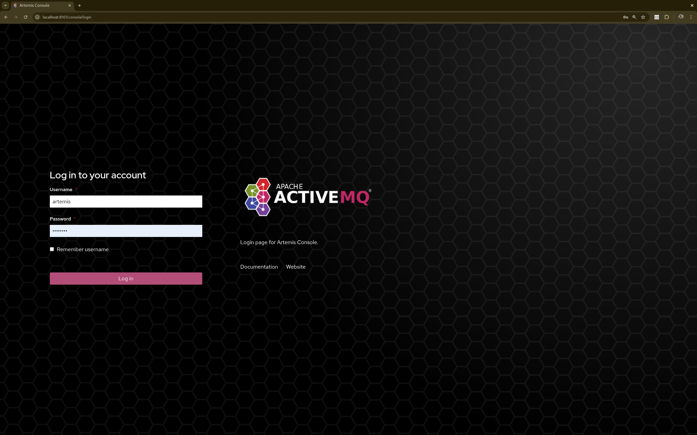
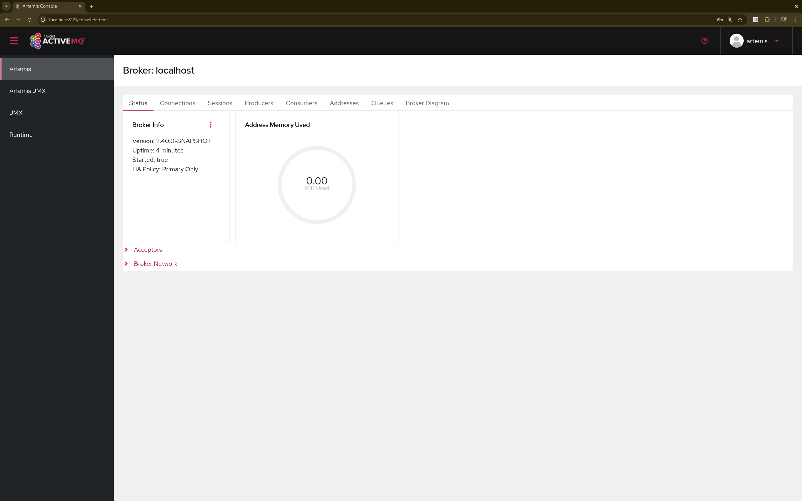

= Management Console
:idprefix:
:idseparator: -
:docinfo: shared

Apache ActiveMQ Artemis ships by default with a management console.
It is powered by http://hawt.io[Hawt.io].

Its purpose is to expose the xref:management.adoc#management[Management API] via a user friendly web ui.

== Login

To access the management console use a browser and go to the URL link:[http://localhost:8161/console].

A login screen will be presented, if your broker is secure, you will need to use a user with admin role, if it is unsecure simply enter any user/password.

== Security

The management console communicates with the broker via HTTP(S).
The broker uses the https://jolokia.org/[Jolokia JMX-HTTP bridge] to convert the contents of these HTTP requests into a JMX operations and then returns the results.

Security for Jolokia is configured via `etc/jolokia-access.xml`.
You can read more about the contents of this file in the https://jolokia.org/reference/html/manual/security.html[Jolokia Security Guide].
By default the console is locked down to `localhost`.
Pay particular attention to the `<cors>` restrictions when exposing the console web endpoint over the network.

[NOTE]
====
Any request with an `Origin` header using the HTTPS scheme which is ultimately received by Jolokia via HTTP is discarded by default since it is deemed insecure.
If you use a TLS proxy that transforms secure requests to insecure requests (e.g. in a Kubernetes environment) then consider changing the proxy to preserve HTTPS and switching the embedded web server to HTTPS.
If that isn’t feasible then you can accept the risk by specifying following element
[,xml]
----
<cors>
    ...
    <ignore-scheme/>
    ...
</cors>
----
====

Problems with Jolokia security are often observed as the ability to login to the console, but the console is blank.

== Console

Once logged in you should be presented with a screen similar to.

=== Navigation Menu

On the top right is small menu area you will see some icons.

* `question mark`
This will open a menu with the following items
** `Help` This will navigate to the console user guide
** `About` this will load an about screen, here you will be able to see and validate versions
* `person`
will provide a drop down menu with
** `Preferences` this will open the preferences page
** `Log out` self descriptive.

=== Navigation Tabs

Running below the Navigation Menu you will see several default feature tabs. The 1st 2 are specific to Artemis. The rest of
this document will feature on these 2 tabs.

* `Artemis` This shows detailed information of Apache ActiveMQ Artemis specific functionality in a tabular format.
* `Artemis JMX` This is a JMX view of Apache ActiveMQ Artemis specific functionality.
* `JMX` This exposes the raw Jolokia JMX so you can browse/access all the JMX endpoints exposed by the JVM.
* `Runtime` This allows you to monitor the thread usage and their state as well as view metrics etc..

In previous versions there was a "Connect" tab which could be used to connect to a remote broker from the same console.
This was disabled by default for security purposes, but it can be enabled again by removing `-Dhawtio.disableProxy=true` from `artemis.profile` (or `artemis.profile.cmd` on Windows).

You can install further hawtio plugins if you wish to have further functionality.

== Artemis Tab

Click `Artemis` in the left navigation bar to see the Artemis specific plugin. The Artemis tab shows view of information
in a tabular format.
(The Artemis tab won't appear if there is no broker in this JVM).

=== Status Tab

The Status tan shows the basic health of the broker.

==== Acceptors

This expands to show and expose details of the current configured acceptors.

==== Broker Network

This expands to show and expose details of the current Cluster of Brokers.

=== Connections Tab

This shows a table of all the brokers connections from clients and other Brokers.

=== Sessions Tab

This shows a table of all sessions that belong ti connected clients.

=== Producers Tab

This shows a table of all client producers including message sent information.

=== Consumers Tab

This shows a table of all client consumers including message delivered information.

=== Addresses Tab

This shows a table of all the Broker's addresses

==== Key Operations

===== Creating a new Address

To create a new address simply click on the 'Create Address' button and filling in the form presented

You can also perform operations on an address by clicking on the 3 dots and choosing the appropriate operation.

=== Queues Tab

This shows a table of all the Broker's queues

== Artemis JMX Tab

Click `Artemis JMX` in the left navigation bar to see the Artemis JMX specific plugin.
(The Artemis JMX tab won't appear if there is no broker in this JVM).
The Artemis JMX plugin works very much the same as the JMX plugin however with a focus on interacting with an Artemis broker.

=== Tree View

The tree view on the left-hand side shows the top level JMX tree of each broker instance running in the JVM.
Expanding the tree will show the various MBeans registered by Artemis that you can inspect via the *Attributes* tab.

=== Key Operations

==== Creating a new Address

To create a new address simply click on the broker or the address folder in the jmx tree and click on the create tab.

Once you have created an address you should be able to *Send* to it by clicking on it in the jmx tree and clicking on the send tab.

==== Creating a new Queue

To create a new queue click on the address you want to bind the queue to and click on the create tab.

Once you have created a queue you should be able to *Send* a message to it or *Browse* it or view the  *Attributes* or *Charts*.
Simply click on the queue in th ejmx tree and click on the appropriate tab.

You can also see a graphical view of all brokers, addresses, queues and their consumers using the *Diagram* tab.

== Status Logging

When the broker starts it will detect the presence of the web console and log status information, e.g.:

----
INFO  [org.apache.activemq.artemis] AMQ241002: Artemis Jolokia REST API available at http://localhost:8161/console/jolokia
INFO  [org.apache.activemq.artemis] AMQ241004: Artemis Console available at http://localhost:8161/console
----

The web console is detected by inspecting the value of the `<display-name>` tag in the war file's `WEB-INF/web.xml` descriptor.
By default it looks for `hawtio`.
However, if this value is changed for any reason the broker can look for this new value by setting the following system property

----
-Dorg.apache.activemq.artemis.webConsoleDisplayName=newValue
----
