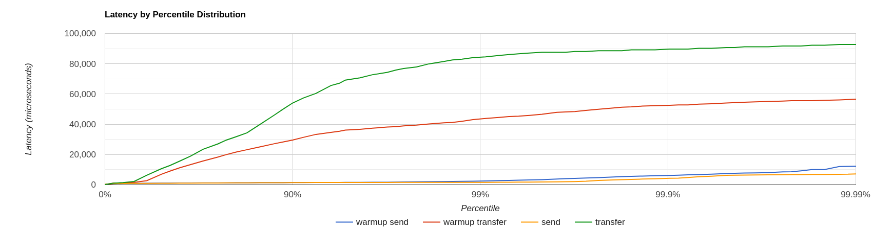
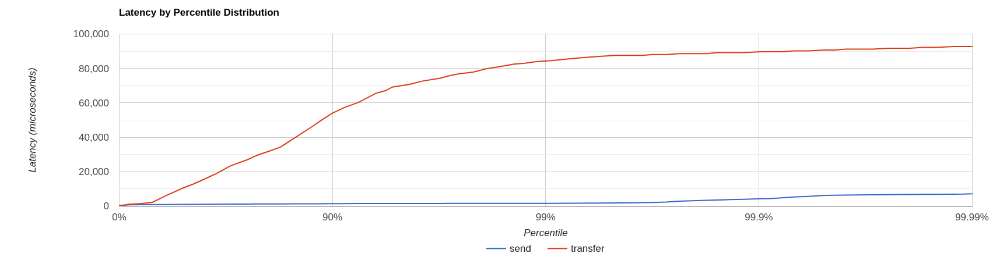
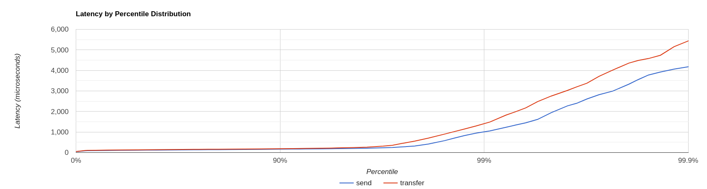

= Performance Tools
:idprefix:
:idseparator: -

Artemis provides some built-in performance test tools based on the https://javaee.github.io/jms-spec/pages/JMS20FinalRelease[JMS 2 API] to help users (and developers) to stress test a configured Artemis broker instance in different scenarios.

These command-line tools won't represent a full-fat benchmark (such as https://openmessaging.cloud/docs/benchmarks/[Open Messaging]), but can be used as building blocks to produce one.
They are also quite useful on their own.

In summary, the provided `perf` tools are:

. `producer` tool: it can generate both all-out throughput or target-rate load, using https://jakarta.ee/specifications/messaging/2.0/apidocs/javax/jms/bytesmessage[BytesMessage] of a configured size
. `consumer` tool: it uses a https://jakarta.ee/specifications/messaging/2.0/apidocs/javax/jms/messagelistener[MessageListener] to consume messages sent by the `producer` command
. `client` tools: it packs both tools as a single command

Most users will just need the `client` tool, but the `producer` and `consumer` tools allow performing tests in additional scenario(s):

* delaying consumer start, in order to cause the broker to page
* running producers and consumers on different machines
* ...

The examples below (running on a `64 bit Linux 5.14 with Intel® Core™ i7-9850H CPU @ 2.60GHz × 12 with Turbo Boost disabled, 32 GB of RAM and SSD`)  show different use cases of increasing complexity.
As they progress, some internal architectural details of the tool and the configuration options supported, are explored.

[NOTE]
====
The tools can run both from within the broker's instance folder or from the home folder.
In both cases, the user should set `JAVA_ARGS` environment variable to override default heap and GC parameters (e.g. `-XX:+UseParallelGC -Xms512M -Xmx1024M`)
====

== Case 1: Single producer Single consumer over a queue

This is the simplest possible case: running a load test with 1 producer and 1 consumer on a non-durable queue `TEST_QUEUE`,  using https://jakarta.ee/specifications/messaging/2.0/apidocs/javax/jms/deliverymode#NON_PERSISTENT[non-persistent]  1024 bytes long (by default) messages, using https://jakarta.ee/specifications/messaging/2.0/apidocs/javax/jms/session#AUTO_ACKNOWLEDGE[auto-acknowledge].

Let's see what happens after typing:

[,bash]
----
$ ./artemis perf client queue://TEST_QUEUE
Connection brokerURL = tcp://localhost:61616
2022-01-18 10:30:54,535 WARN  [org.apache.activemq.artemis.core.client] AMQ212053: CompletionListener/SendAcknowledgementHandler used with confirmationWindowSize=-1. Enable confirmationWindowSize to receive acks from server!
--- warmup false
--- sent:          7316 msg/sec
--- blocked:       6632 msg/sec
--- completed:     7320 msg/sec
--- received:      7317 msg/sec
# ...
----

The test keeps on running, until `SIGTERM` or `SIGINT` signals are sent to the Java process (on Linux Console it translates into pressing *CTRL + C*).
Before looking what the metrics mean, there's an initial `WARN` log that shouldn't be ignored:

[,bash]
----
WARN  [org.apache.activemq.artemis.core.client] AMQ212053: CompletionListener/SendAcknowledgementHandler used with confirmationWindowSize=-1. Enable confirmationWindowSize to receive acks from server!
----

It shows two things:

. the load generator uses https://jakarta.ee/specifications/messaging/2.0/apidocs/javax/jms/messageproducer#send-javax.jms.Destination-javax.jms.Message-javax.jms.CompletionListener-[async message producers]
. `confirmationWindowSize` is an Artemis CORE protocol specific setting;
the `perf` commands uses CORE as the default JMS provider

=== Live Latency Console Reporting

The `perf client` command can report on Console different latency percentiles metrics by adding `--show-latency` to the command arguments, but in order to obtain meaningful metrics, we need to address `WARN` by setting `confirmationWindowSize` on the producer `url`,  setting `--consumer-url` to save applying the same configuration for consumer(s).

In short, the command is using these additional parameters:

[,bash]
----
--show-latency --url tcp://localhost:61616?confirmationWindowSize=20000 --consumer-url tcp://localhost:61616
----

==== Running it

[,bash]
----
$ ./artemis perf client --show-latency --url tcp://localhost:61616?confirmationWindowSize=20000 --consumer-url tcp://localhost:61616 queue://TEST_QUEUE
--- warmup false
--- sent:          8114 msg/sec
--- blocked:       8114 msg/sec
--- completed:     8114 msg/sec
--- received:      8113 msg/sec
--- send ack time:   mean:    113.01 us - 50.00%:    106.00 us - 90.00%:    142.00 us - 99.00%:    204.00 us - 99.90%:    371.00 us - 99.99%:   3455.00 us - max:      3455.00 us
--- transfer time:   mean:    213.71 us - 50.00%:    126.00 us - 90.00%:    177.00 us - 99.00%:   3439.00 us - 99.90%:   7967.00 us - 99.99%:   8895.00 us - max:      8895.00 us
# CTRL + C pressed
--- SUMMARY
--- result:              success
--- total sent:            70194
--- total blocked:         70194
--- total completed:       70194
--- total received:        70194
--- aggregated send time:       mean:    101.53 us - 50.00%:     86.00 us - 90.00%:    140.00 us - 99.00%:    283.00 us - 99.90%:    591.00 us - 99.99%:   2007.00 us - max:     24959.00 us
--- aggregated transfer time:   mean:    127.48 us - 50.00%:     97.00 us - 90.00%:    166.00 us - 99.00%:    449.00 us - 99.90%:   4671.00 us - 99.99%:   8255.00 us - max:     27263.00 us
----

Some notes:

. `WARN` message is now gone
. `send ack time` and `transfer time` statistics are printed at second interval
. `total` and `aggregated` metrics are printed on test completion (more on this later)

The meaning of the live latency statistics are:

send ack time::
percentiles of latency to acknowledge sent messages

transfer time::
percentiles of latency to transfer messages from producer(s) to consumer(s)

The `perf` commands uses https://jakarta.ee/specifications/messaging/2.0/apidocs/javax/jms/messageproducer#send-javax.jms.Destination-javax.jms.Message-javax.jms.CompletionListener-[JMS 2 async message producers] that allow the load generator to accumulate in-flight sent messages and depending on the protocol implementation, may block its producer thread due to producer flow control.
e.g: the Artemis CORE protocol can block producers threads to refill producers credits, while the https://qpid.apache.org/components/jms/index.html[QPID-JMS] won't.

The `perf` tool is implementing its own in-flight sent requests tracking and can be configured to limit the amount of pending sent messages,  while reporting the rate by which producers are "blocked" awaiting completions

[NOTE]
.Producer threads are `blocked`?
====
Although the load back-pressure mechanism is non-blocking, given that the load generator cannot push further load while back-pressured by the protocol client, the load is semantically "blocked".
This detail is relevant to explain the live rate <<running-it,statistics>> on Console:
====

By default, the `perf` tools (i.e: `client` and `producer`) *limits the number of in-flight request to 1*: to change the default setting users should add `--max-pending` parameter configuration.

[WARNING]
====
Setting `--max-pending 0` will disable the load generator in-flight sent messages limiter, allowing the tool to accumulate an unbounded number of in-flight messages, risking `OutOfMemoryError`.

This is *NOT RECOMMENDED!*
====

More detail on the metrics:

warmup::
The generator phase while the statistics sample is collected; warmup duration can be set by setting `--warmup`

sent::
The message sent rate

blocked::
The rate of attempts to send a new message, "blocked" awaiting `--max-pending` refill

completed::
The rate of message send acknowledgements received by producer(s)

received::
The rate of messages received by consumer(s)

=== How to read the live statistics?
+ The huge amount of `blocked` vs `sent` means that the broker wasn't fast enough to refill the single `--max-pending` budget before sending a new message.
+ It can be changed into:

[,bash]
----
--max-pending 100
----

[#our-previous-command]

[,bash]
----
$ ./artemis perf client --warmup 20 --max-pending 100 --show-latency --url tcp://localhost:61616?confirmationWindowSize=20000 --consumer-url tcp://localhost:61616 queue://TEST_QUEUE
Connection brokerURL = tcp://localhost:61616?confirmationWindowSize=20000
# first samples shows very BAD performance because client JVM is still warming up
--- warmup true
--- sent:         27366 msg/sec
--- blocked:        361 msg/sec
--- completed:    27305 msg/sec
--- received:     26195 msg/sec
--- send ack time:   mean:   1743.39 us - 50.00%:   1551.00 us - 90.00%:   3119.00 us - 99.00%:   5215.00 us - 99.90%:   8575.00 us - 99.99%:   8703.00 us - max:     23679.00 us
--- transfer time:   mean:  11860.32 us - 50.00%:  11583.00 us - 90.00%:  18559.00 us - 99.00%:  24319.00 us - 99.90%:  31359.00 us - 99.99%:  31615.00 us - max:     31615.00 us
# ... > 20 seconds later ...
# performance is now way better then during warmup
--- warmup false
--- sent:         86525 msg/sec
--- blocked:       5734 msg/sec
--- completed:    86525 msg/sec
--- received:     86556 msg/sec
--- send ack time:   mean:   1109.13 us - 50.00%:   1103.00 us - 90.00%:   1447.00 us - 99.00%:   1687.00 us - 99.90%:   5791.00 us - 99.99%:   5983.00 us - max:      5983.00 us
--- transfer time:   mean:   4662.94 us - 50.00%:   1679.00 us - 90.00%:  12159.00 us - 99.00%:  14079.00 us - 99.90%:  14527.00 us - 99.99%:  14783.00 us - max:     14783.00 us
# CTRL + C
--- SUMMARY
--- result:              success
--- total sent:          3450389
--- total blocked:        168863
--- total completed:     3450389
--- total received:      3450389
--- aggregated send time:       mean:   1056.09 us - 50.00%:   1003.00 us - 90.00%:   1423.00 us - 99.00%:   1639.00 us - 99.90%:   4287.00 us - 99.99%:   7103.00 us - max:     19583.00 us
--- aggregated transfer time:   mean:  18647.51 us - 50.00%:  10751.00 us - 90.00%:  54271.00 us - 99.00%:  84991.00 us - 99.90%:  90111.00 us - 99.99%:  93183.00 us - max:     94207.00 us
----

Some notes on the results:

* we now have a reasonable `blocked/sent` ratio (< ~10%)
* sent rate has improved *ten-fold* if compared to <<running-it,previous results>>

And on the `SUMMARY` statistics:

* `total` counters include measurements collected with `warmup true`
* `aggregated` latencies *don't* include measurements collected with `warmup true`

=== How to compare latencies across tests?

The Console output format isn't designed for easy latency comparisons, however the `perf` commands expose `--hdr <hdr file name>` parameter to produce a http://hdrhistogram.org/[HDR Histogram] compatible report that can be opened with different visualizers + eg https://hdrhistogram.github.io/HdrHistogramJSDemo/logparser.html[Online HdrHistogram Log Analyzer], https://github.com/ennerf/HdrHistogramVisualizer[HdrHistogramVisualizer] or https://github.com/HdrHistogram/HistogramLogAnalyzer[HistogramLogAnalyzer].

NOTE: Any latency collected trace on this guide is going to use https://hdrhistogram.github.io/HdrHistogramJSDemo/logparser.html[Online HdrHistogram Log Analyzer] as HDR Histogram visualizer tool.

Below is the visualization of the HDR histograms collected while adding to the previous benchmark

[,bash]
----
--hdr /tmp/non_durable_queue.hdr
----

Whole test execution shows tagged latencies, to distinguish `warmup` ones:

Filtering out `warmup` latencies, it looks like

Latency results shows that at higher percentiles `transfer` latency is way higher than the `sent` one (reminder: `sent` it's the time to acknowledge sent messages), probably meaning that some queuing-up is happening on the broker.

In order to test this theory we switch to *target rate tests*.

== Case 2: Target Rate Single producer Single consumer over a queue

`perf client` and `perf producer` tools allow specifying a target rate to schedule producer(s) requests: adding

[,bash]
----
--rate <msg/sec integer value>
----

The previous example <<our-previous-command,last run>> shows that `--max-pending 100` guarantees < 10% blocked/sent messages with  aggregated latencies

[,bash]
----
--- aggregated send time:       mean:   1056.09 us - 50.00%:   1003.00 us - 90.00%:   1423.00 us - 99.00%:   1639.00 us - 99.90%:   4287.00 us - 99.99%:   7103.00 us - max:     19583.00 us
--- aggregated transfer time:   mean:  18647.51 us - 50.00%:  10751.00 us - 90.00%:  54271.00 us - 99.00%:  84991.00 us - 99.90%:  90111.00 us - 99.99%:  93183.00 us - max:     94207.00 us
----

We would like to lower `transfer time` sub-millisecond;
let's try by running a load test with ~30% of the max perceived sent rate, by setting:

[,bash]
----
--rate 30000 --hdr /tmp/30K.hdr
----

The whole command is then:

[,bash]
----
$ ./artemis perf client --rate 30000 --hdr /tmp/30K.hdr --warmup 20 --max-pending 100 --show-latency --url tcp://localhost:61616?confirmationWindowSize=20000 --consumer-url tcp://localhost:61616 queue://TEST_QUEUE
# ... after 20 warmup seconds ...
--- warmup false
--- sent:         30302 msg/sec
--- blocked:          0 msg/sec
--- completed:    30302 msg/sec
--- received:     30303 msg/sec
--- send delay time: mean:     24.20 us - 50.00%:     21.00 us - 90.00%:     54.00 us - 99.00%:     72.00 us - 99.90%:    233.00 us - 99.99%:    659.00 us - max:       731.00 us
--- send ack time:   mean:    150.48 us - 50.00%:    120.00 us - 90.00%:    172.00 us - 99.00%:   1223.00 us - 99.90%:   2543.00 us - 99.99%:   3183.00 us - max:      3247.00 us
--- transfer time:   mean:    171.53 us - 50.00%:    135.00 us - 90.00%:    194.00 us - 99.00%:   1407.00 us - 99.90%:   2607.00 us - 99.99%:   3151.00 us - max:      3183.00 us
# CTRL + C
--- SUMMARY
--- result:              success
--- total sent:          1216053
--- total blocked:           845
--- total completed:     1216053
--- total received:      1216053
--- aggregated delay send time: mean:     35.84 us - 50.00%:     20.00 us - 90.00%:     55.00 us - 99.00%:    116.00 us - 99.90%:   3359.00 us - 99.99%:   5503.00 us - max:      6495.00 us
--- aggregated send time:       mean:    147.38 us - 50.00%:    117.00 us - 90.00%:    165.00 us - 99.00%:    991.00 us - 99.90%:   4191.00 us - 99.99%:   5695.00 us - max:      7103.00 us
--- aggregated transfer time:   mean:    178.48 us - 50.00%:    134.00 us - 90.00%:    188.00 us - 99.00%:   1359.00 us - 99.90%:   5471.00 us - 99.99%:   8831.00 us - max:     12799.00 us
----

We've now achieved sub-millisecond `transfer` latencies until `90.00 pencentile`.
+ Opening `/tmp/30K.hdr` makes easier to see it:

Now `send` and `transfer` time looks quite similar and there's no sign of queueing, but...

=== What `delay send time` means?

This metric is borrowed from the http://highscalability.com/blog/2015/10/5/your-load-generator-is-probably-lying-to-you-take-the-red-pi.html[Coordinated Omission] concept, and it measures the delay of producer(s) while trying to send messages at the requested rate.

The source of such delay could be:

* slow responding broker: the load generator reached `--max-pending` and the expected rate cannot be honored
* client running out of resources (lack of CPU time, GC pauses, etc etc): load generator cannot keep-up with the expected rate because it is just "too fast" for it
* protocol-dependent blocking behaviours: CORE JMS 2 async send can block due to `producerWindowSize` exhaustion

A sane run of a target rate test should keep `delay send time` under control or investigation actions must be taken to understand what's the source of the delay.
+ Let's show it with an example: we've already checked the all-out rate of the broker ie ~90K msg/sec

By running a `--rate 90000` test under the same conditions, latencies will look as

It clearly shows that the load generator is getting delayed and cannot keep-up with the expected rate.

Below is a more complex example involving destinations (auto)generation with "asymmetric" load i.e: the producer number is different from consumer number.

== Case 3: Target Rate load on 10 durable topics, each with 3 producers and 2 unshared consumers

The `perf` tool can auto generate destinations using

[,bash]
----
--num-destinations <number of destinations to generate>
----

and naming them by using the destination name specified as the seed and an ordered sequence suffix.

eg

[,bash]
----
--num-destinations 3 topic://TOPIC
----

would generate 3 topics: `TOPIC0`, `TOPIC1`, `TOPIC2`.

With the default configuration (without specifying `--num-destinations`) it would just create `TOPIC`, without any numerical suffix.

In order to create a load generation on 10 topics, *each* with 3 producers and 2 unshared consumers:

[,bash]
----
--producers 3 --consumers 2 --num-destinations 10 topic://TOPIC
----

The whole `perf client` all-out throughput command would be:

[,bash]
----
# same as in the previous cases
./artemis perf client --warmup 20 --max-pending 100 --s
how-latency --url tcp://localhost:61616?confirmationWindowSize=20000 --consumer-url tcp://localhost:61616 \
--producers 3 --consumers 2 --num-destinations 10 --durable --persistent topic://DURABLE_TOPIC
# this last part above is new
----

and it would print...

[,bash]
----
javax.jms.IllegalStateException: Cannot create durable subscription - client ID has not been set
----

Given that the generator is creating https://jakarta.ee/specifications/messaging/2.0/apidocs/javax/jms/session#createDurableConsumer-javax.jms.Topic-java.lang.String-[unshared durable Topic subscriptions], is it mandatory to set a ClientID for each connection used.

The `perf client` tool creates a connection for each consumer by default and auto-generates both ClientIDs and subscriptions names (as required by the https://jakarta.ee/specifications/messaging/2.0/apidocs/javax/jms/session#createDurableConsumer-javax.jms.Topic-java.lang.String-[unshared durable Topic subscriptions API]).
ClientID still requires users to specify Client ID prefixes with `--clientID <Client ID prefix>` and takes care to unsubscribe the consumers on test completion.

The complete commands now looks like:

[,bash]
----
./artemis perf client --warmup 20 --max-pending 100 --show-latency --url tcp://localhost:61616?confirmationWindowSize=20000 --consumer-url tcp://localhost:61616 \
--producers 3 --consumers 2 --num-destinations 10 --durable --persistent topic://DURABLE_TOPIC --clientID test_id
# after few seconds
--- warmup false
--- sent:         74842 msg/sec
--- blocked:       2702 msg/sec
--- completed:    74641 msg/sec
--- received:    146412 msg/sec
--- send ack time:   mean:  37366.13 us - 50.00%:  37119.00 us - 90.00%:  46079.00 us - 99.00%:  68095.00 us - 99.90%:  84479.00 us - 99.99%:  94719.00 us - max:     95743.00 us
--- transfer time:   mean:  44060.66 us - 50.00%:  43263.00 us - 90.00%:  54527.00 us - 99.00%:  75775.00 us - 99.90%:  87551.00 us - 99.99%:  91135.00 us - max:     91135.00 us
# CTRL + C
--- SUMMARY
--- result:              success
--- total sent:          2377653
--- total blocked:         80004
--- total completed:     2377653
--- total received:      4755306
--- aggregated send time:       mean:  39423.69 us - 50.00%:  38911.00 us - 90.00%:  49663.00 us - 99.00%:  66047.00 us - 99.90%:  85503.00 us - 99.99%: 101887.00 us - max:    115711.00 us
--- aggregated transfer time:   mean:  46216.99 us - 50.00%:  45311.00 us - 90.00%:  57855.00 us - 99.00%:  78335.00 us - 99.90%:  97791.00 us - 99.99%: 113151.00 us - max:    125439.00 us
----

Results shows that `tranfer time` isn't queuing up, meaning that subscribers are capable to keep-up with the producers: hence a reasonable rate to test could be ~80% of the perceived `sent` rate ie `--rate 60000`:

[,bash]
----
./artemis perf client --warmup 20 --max-pending 100 --show-latency --url tcp://localhost:61616?confirmationWindowSize=20000 --consumer-url tcp://localhost:61616 \
--producers 3 --consumers 2 --num-destinations 10 --durable --persistent topic://DURABLE_TOPIC --clientID test_id \
--rate 60000
# after many seconds while running
--- warmup false
--- sent:         55211 msg/sec
--- blocked:       2134 msg/sec
--- completed:    54444 msg/sec
--- received:    111622 msg/sec
--- send delay time: mean: 6306710.04 us - 50.00%: 6094847.00 us - 90.00%: 7766015.00 us - 99.00%: 8224767.00 us - 99.90%: 8257535.00 us - 99.99%: 8257535.00 us - max:    8257535.00 us
--- send ack time:   mean:  50072.92 us - 50.00%:  50431.00 us - 90.00%:  57855.00 us - 99.00%:  65023.00 us - 99.90%:  71167.00 us - 99.99%:  71679.00 us - max:     71679.00 us
--- transfer time:   mean:  63672.92 us - 50.00%:  65535.00 us - 90.00%:  78847.00 us - 99.00%:  86015.00 us - 99.90%:  90623.00 us - 99.99%:  93183.00 us - max:     94719.00 us
# it won't get any better :(
----

What's wrong with the `send delay time`?
+ Results show that the load generator cannot keep up with the expected rate and it's accumulating a huge delay on the expected scheduled load: lets trying fixing it by adding more producers threads, adding

[,bash]
----
--threads <producer threads>
----

By using two producers threads, the command now looks like:

[,bash]
----
./artemis perf client --warmup 20 --max-pending 100 --show-latency --url tcp://localhost:61616?confirmationWindowSize=20000 --consumer-url tcp://localhost:61616 \
--producers 3 --consumers 2 --num-destinations 10 --durable --persistent topic://DURABLE_TOPIC --clientID test_id \
--rate 60000 --threads 2
# after few seconds warming up....
--- warmup false
--- sent:         59894 msg/sec
--- blocked:        694 msg/sec
--- completed:    58925 msg/sec
--- received:    114857 msg/sec
--- send delay time: mean:   3189.96 us - 50.00%:    277.00 us - 90.00%:  10623.00 us - 99.00%:  35583.00 us - 99.90%:  47871.00 us - 99.99%:  56063.00 us - max:     58367.00 us
--- send ack time:   mean:  31500.93 us - 50.00%:  31231.00 us - 90.00%:  48383.00 us - 99.00%:  65535.00 us - 99.90%:  83455.00 us - 99.99%:  95743.00 us - max:     98303.00 us
--- transfer time:   mean:  38151.21 us - 50.00%:  37119.00 us - 90.00%:  55807.00 us - 99.00%:  84479.00 us - 99.90%: 104959.00 us - 99.99%: 118271.00 us - max:    121855.00 us
----

`send delay time` now seems under control, meaning that the load generator need some tuning in order to work at its best.
