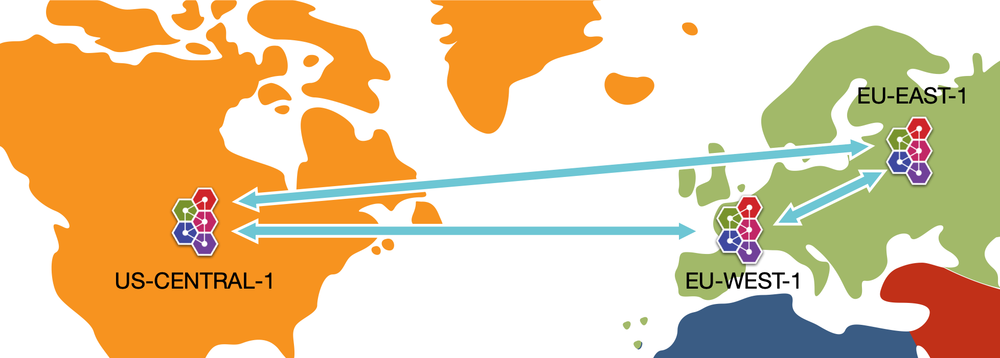

# Federated Queue Example

To run the example, simply type **mvn verify** from this directory, or **mvn -PnoServer verify** if you want to start and create the broker manually.

This example demonstrates a core queue deployed on three different brokers. The three brokers are configured to form a federated queue mesh.

In the example we name the brokers, eu-west, eu-east and us-central to give an idea of the use case.



The following is then carried out:

1. create a consumer on the queue on each node, and we create a producer on only one of the nodes.

2. send some messages via the producer on EU West, and we verify that **only the local** consumer receives the sent messages.

3. Next then verify the same on US Central.

4. Now the consumer on EU West is closed leaving it no local consumers.

5. Send some more messages to server EU West

6. We now consume those messages on EU East demonstrating that messages will **re-route** to the another broker based on upstream priority. You will note, US Central is configured to be -1 priority compared to EU East, 
there for messages should re-route to EU East as it will have a slightly higher priority for its consumers to consume.
If US Central and EU East were even priority then the re-direct would be loaded between the two.

7. Next the consumer on US Central is closed leaving it no local consumers. And we send some more messages to US Cental

8. Again we consume on EU East demonstrating that US Central messages also can **re-route**, if no local-consumer.

9. Now we restart EU West and US Centrals consumers.

10. We produce and consume on US Central, showing that dynamically re-adjusts now local consumers exist and messages delivery by priority to local consumer.

11. And repeat the same on EU West.


In other words, we are showing how with Federated Queues, ActiveMQ Artemis **routes**  sent messages to local consumers as priority, but is able to re-route the sent messages to other distant brokers if consumers are attached to those brokers. Decoupling the location where producers and consumers need to be.

Here's the relevant snippet from the broker configuration, which tells the broker to form a cluster between the two nodes and to load balance the messages between the nodes.

The config that defines the federation you can see in the broker.xml for each broker is within the following tags. You will note upstreams are different in each as well as the federation name, which has to be globally unique.

```
 <federations>
    ...
 </federations>
```


For more information on ActiveMQ Artemis Federation please see the federation section of the user manual.