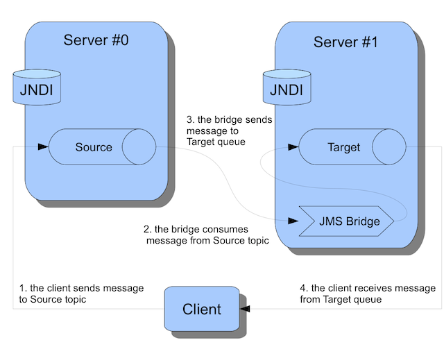

# JMS Bridge Example

To run the example, simply type **mvn verify** from this directory, or **mvn -PnoServer verify** if you want to start and create the broker manually.

This example shows you how to create a JMS Bridge between two ActiveMQ Artemis brokers.

The example will use two ActiveMQ Artemis brokers:

*   Server #0 – the _Source_ broker. It will be configured with a JMS Topic bound to JNDI under `source/topic`
*   Server #1 – the _Target_ broker. It will be configured with a JMS Queue bound to JNDI under `target/queue`

The JMS Bridge will be started in the example code and be configured to bridge messages from the _source_ destination (the topic hosted on broker #0) and the _target_ destination (the queue hosted on broker #1)

The client will check the bridge works by:

1.  sending a message to the _source_ topic
2.  receive a message from the _target_ queue
3.  check that both messages correspond to the same content.

### JMS Bridge Configuration

The JMS Bridge is a POJO that we configure with both source and target JNDI configurations. In the actual example we are programmatically creating the Bridge.